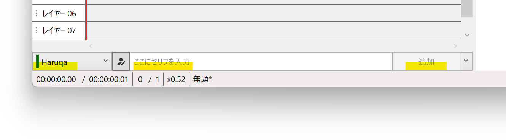

## TALQu3 PROとは

[Haruqa](https://twitter.com/niconicoHaruqa)さんによって[Haruqa｜PixivFANBOX](https://www.fanbox.cc/@haruqa)支援者向けに公開されている音声合成ソフトです。  
外部連携APIを使用し、YMM4から直接音声を生成できます。 
- [Haruqa｜pixivFANBOX](https://www.fanbox.cc/@haruqa)

## 利用方法
1. [Haruqa｜pixivFANBOX](https://www.fanbox.cc/@haruqa)へ支援する
1. [TALQu3PRO](https://haruqa.fanbox.cc/tags/%E3%83%84%E3%83%BC%E3%83%AB%E9%85%8D%E5%B8%83)をダウンロードし、任意の場所に展開する
1. *ファイル(F)*→*設定*→*TALQu3*→*TALQu3PRO.exe*から、*TALQu3PRO.exe*を選択する

1. *ファイル(F)*→*キャラクター設定*→*声質*で、TALQu3 PROの声質を選択する

1. キャラクターを選択後、*ここにセリフを入力*欄にセリフを入力し、*追加*ボタンをクリックする
