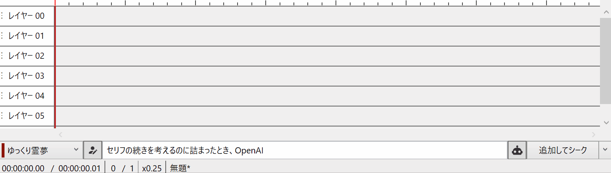
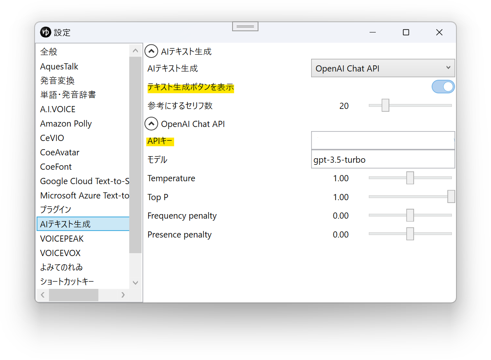

## テキスト補完機能

タイムラインのボイスアイテムの内容を元に、セリフの続きを考えてもらう機能です。
利用にはOpenAIのAPIキーが必要です。

## 初期設定
1. [OpenAIダッシュボード](https://platform.openai.com/overview)を開き、APIキーを取得する
1. ゆっくりMovieMakerを起動し、`ファイル(F)`→`設定`→`AIテキスト生成`を開く
1. `テキスト生成ボタンを表示`を有効化する
1. `APIキー`を設定する

## 使い方
テキスト生成ボタンをクリックすると、AIがセリフの続きを考えてくれます。  
現在の再生位置より前のセリフを元にセリフを生成するため、タイムラインに追加されているボイスアイテムの数が多いほど、より自然なセリフを生成できます。  
`ここにセリフを入力`欄にセリフを入力してからテキスト生成ボタンをクリックすると、入力したセリフの続きが生成されます。