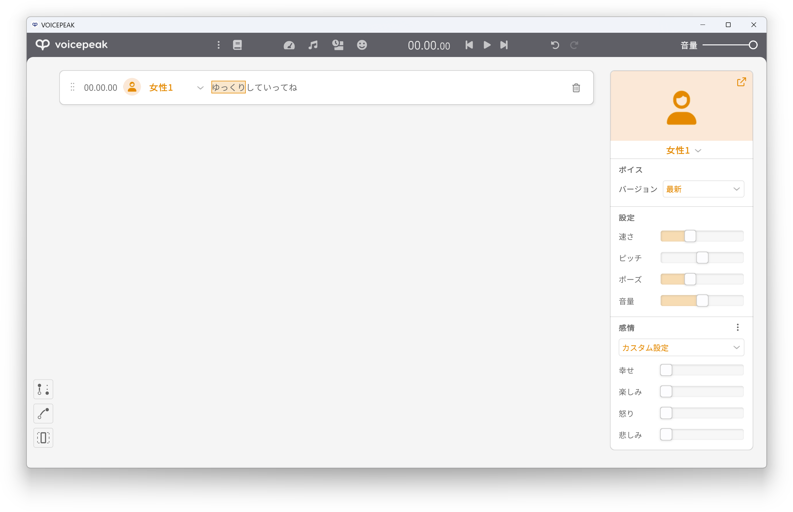
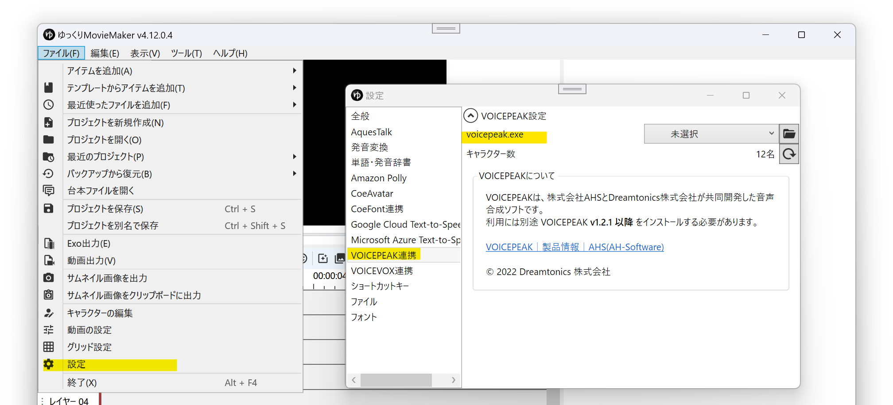
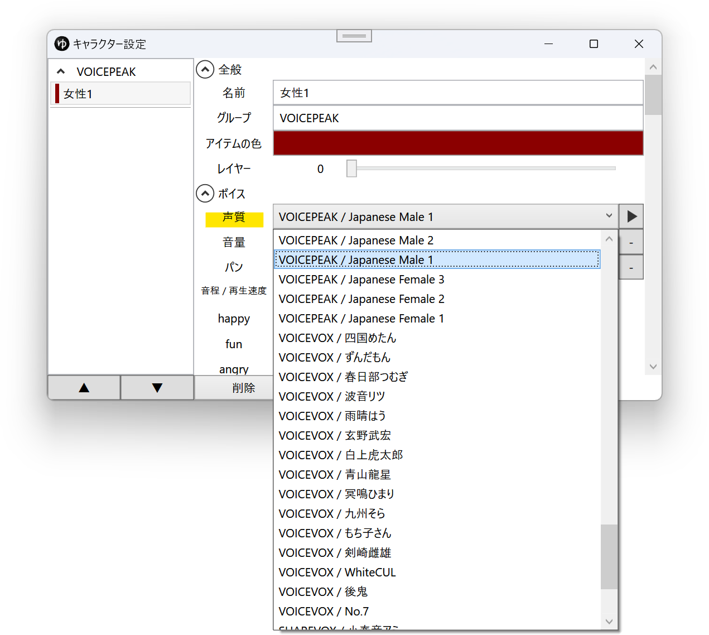
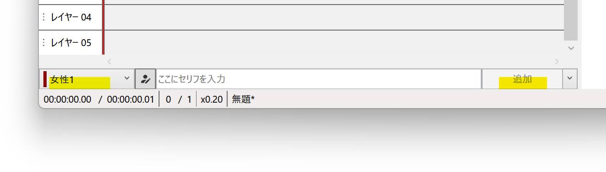

## A.I.VOICEとは

VOICEPEAKは、株式会社AHSとDreamtonics株式会社が共同開発した音声合成ソフトです。  
外部連携APIを使用し、YMM4から直接音声を生成できます。  
- [VOICEPEAK｜製品情報｜AHS(AH-Software)](https://www.ah-soft.com/voice/)

> **Note**
> VOICEPEAKのバージョンをv1.2.1以降に更新する必要があります  
> VOICEPEAK 6ナレーターセット v1.0.1を使用している場合、[AHSマイページ](https://www.ah-soft.com/mypage/)から最新版をダウンロードしてください。（ユーザー登録・製品登録が必要です）

<VOICEPEAKCards limit="10"/>

## 利用方法
1. VOICEPEAKを購入し、お使いのPCにインストールする
1. ゆっくりMovieMaker4を起動する
1. *ファイル(F)*→*設定*→*VOICEPEAK*→*voicepeak.exe*から、VOICEPEAKの実行ファイルを選択する（デフォルトのProgramFilesフォルダ内にVOICEPEAKをインストールしている場合は設定は不要です）

1. *ファイル(F)*→*キャラクターの編集*からキャラクター編集ウィンドウを表示する

1. *ボイス*→*声質*からVOICEPEAKの音声を選択する

1. タイムライン下のキャラクター一覧でキャラクターを選択後、セリフを入力し、追加ボタンをクリックする

## 利用条件等
利用する音声によっては商用利用する場合に別途ライセンス契約が必要なものがあります。  
詳細はVOICEPEAK公式サイトをご確認ください。
- [VOICEPEAK](https://www.ah-soft.com/voice/)