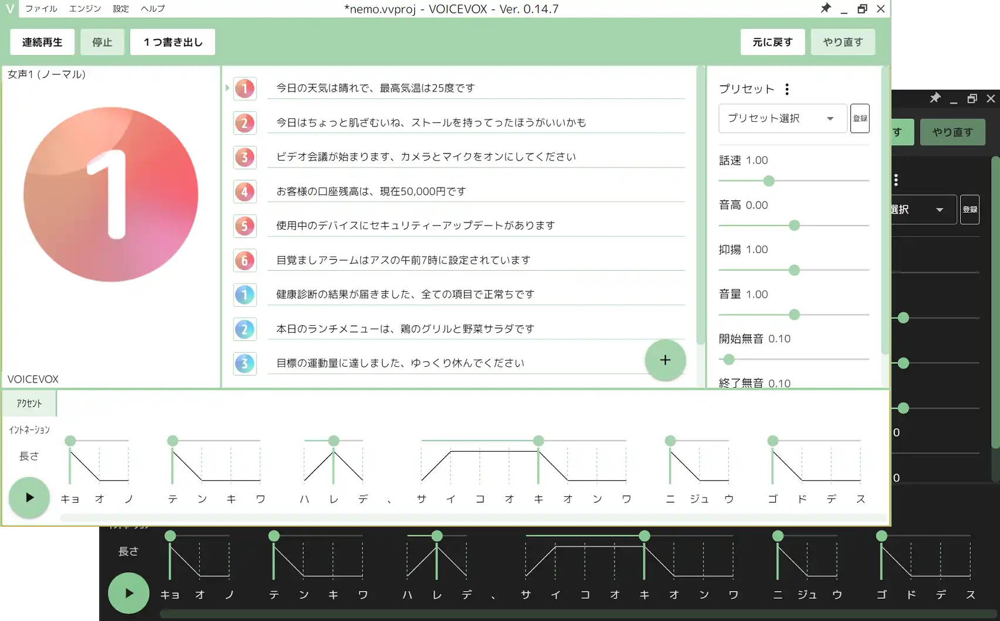
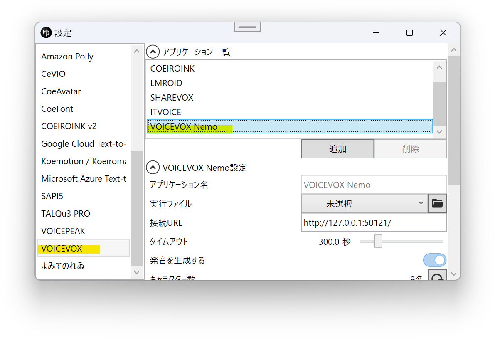

## VOICEVOX Nemo とは

商用・非商用問わず無料（※）で利用できるテキスト読み上げソフトウェアです。  
外部連携APIを使用し、YMM4から直接音声を生成できます。  
利用には別途VOICEVOXとVOICEVOX Nemoのインストールが必要です。
- [VOICEVOX Nemo](https://voicevox.hiroshiba.jp/nemo/)

## 利用方法
1. [VOICEVOX公式サイト](https://voicevox.hiroshiba.jp/)からVOICEVOXをダウンロードします
1. ダウンロードしたファイルを実行し、VOICEVOXをインストールします
1. [VOICEVOX Nemo公式サイト](https://voicevox.hiroshiba.jp/nemo/)からVOICEVOX Nemoをダウンロードします
1. ダウンロードしたファイルを実行し、VOICEVOX Nemoをインストールします。
1. VOICEVOXのインストール場所を変更している場合は以下の設定を行う
   1. ゆっくりMovieMaker4を起動します
   1. *ファイル(F)*→*設定*から設定ウィンドウを開きます
   
   1. *VOICEVOX*→*アプリケーション一覧*で*VOICEVOX Nemo*を選択する
   
   1. *実行ファイル*欄右側のフォルダアイコンボタンをクリックし、*run.exe*のパスを選択する
   
1. セリフ入力欄左側のキャラクター設定ボタンをクリックする

1. *新規作成*ボタンをクリックし、キャラクターを追加する

1. *全般*→*名前*欄に任意の名前を入力する

1. *ボイス*→*声質*欄で、利用する声質を選択する

1. タイムライン下のキャラクター一覧でキャラクターを選択後、セリフを入力し、追加ボタンをクリックする

## 声質一覧を再読み込みする
新しくキャラクターをインストールした場合、YMM4の声質一覧にキャラクターが表示されない場合があります。  
声質一覧を更新するとキャラクターが一覧に表示されるようになります。
1. キャラクター編集ウィンドウを開く
1. 声質一覧右側の更新ボタンをクリックする
1. *VOICEVOXの声質を再読み込み*をクリックする

## 利用条件等
### クレジット表記
*VOICEVOX Nemo*とクレジット表記をする必要があります。  

### 利用規約
VOICEVOXの利用規約と、音声ライブラリに定められている利用規約に従う必要があります。
- [ソフトウェア利用規約](https://voicevox.hiroshiba.jp/term)
- [音声ライブラリ利用規約](https://voicevox.hiroshiba.jp/nemo/term/)
- [Q&A](https://voicevox.hiroshiba.jp/qa)