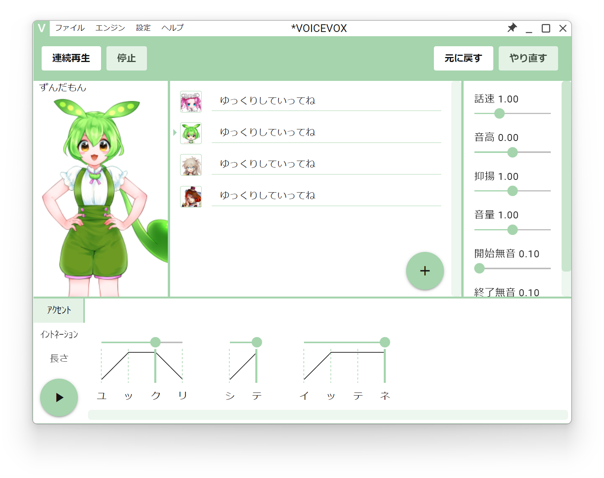
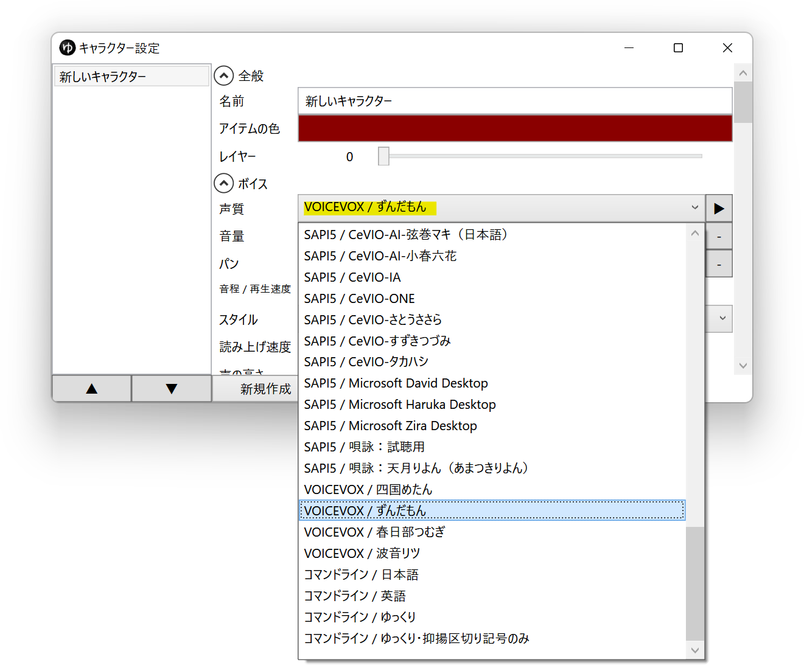
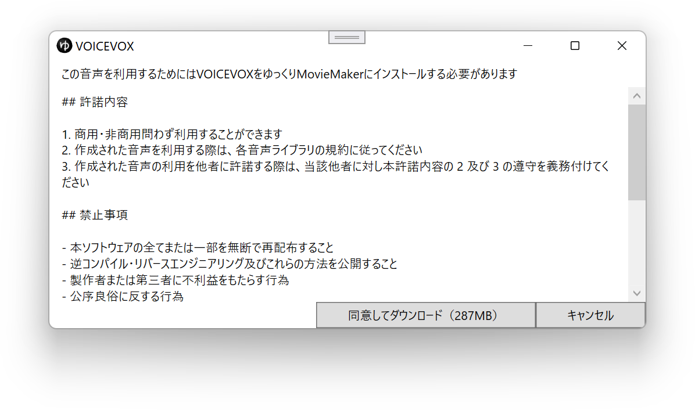
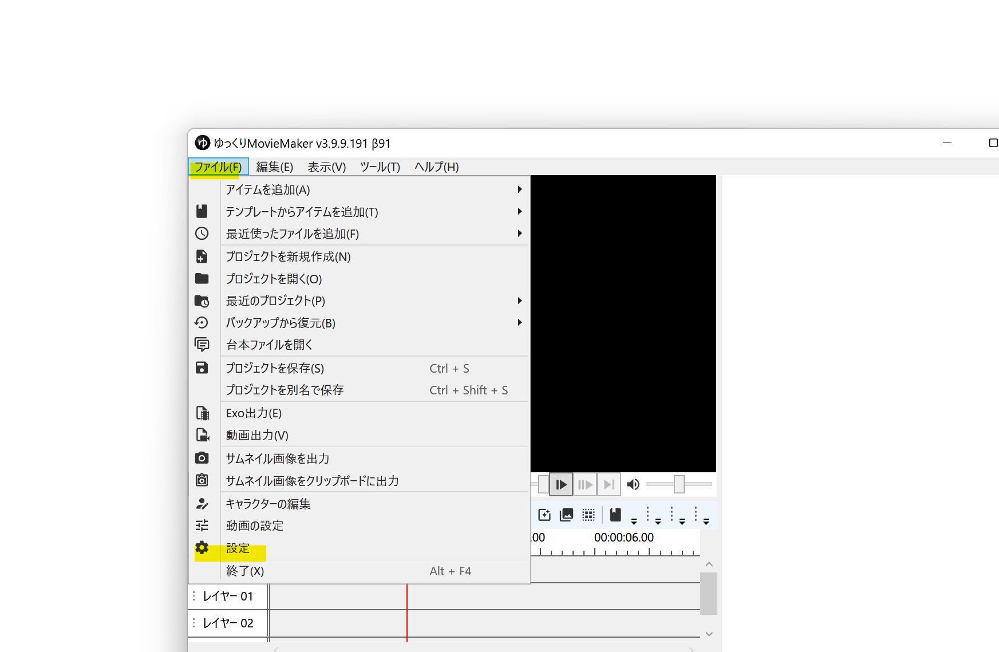
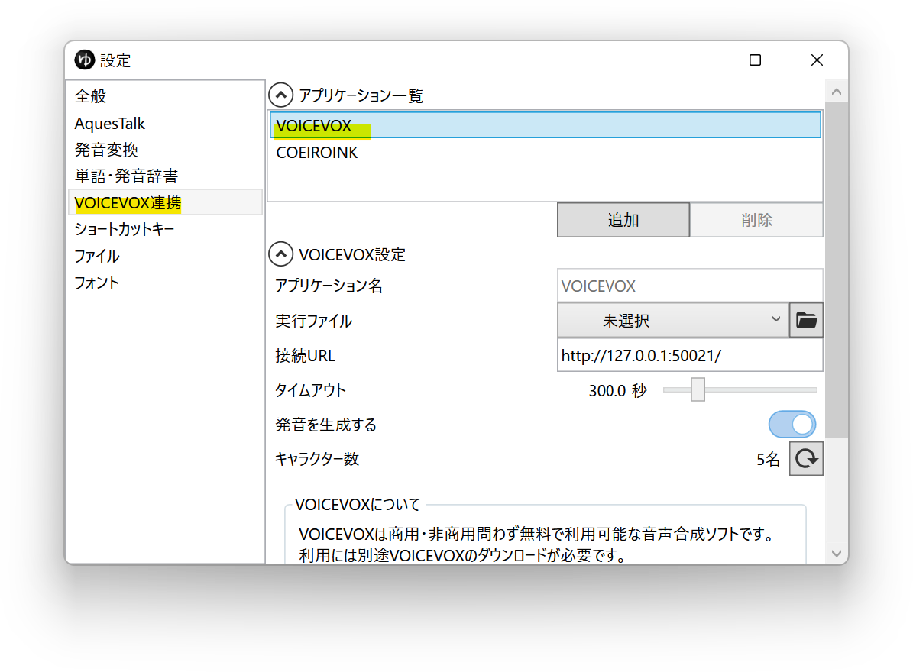
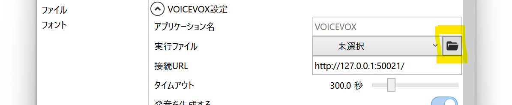
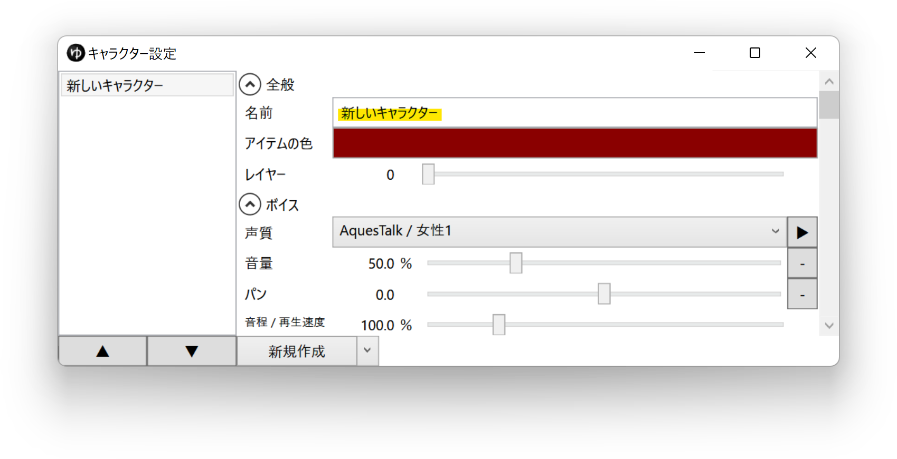
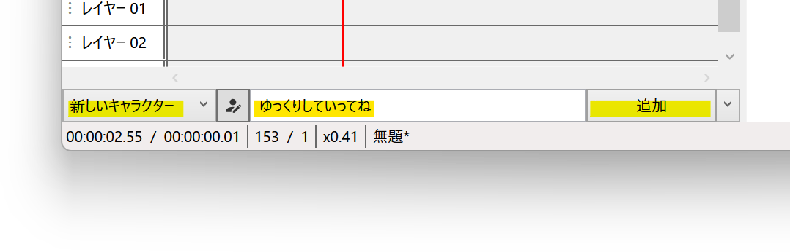
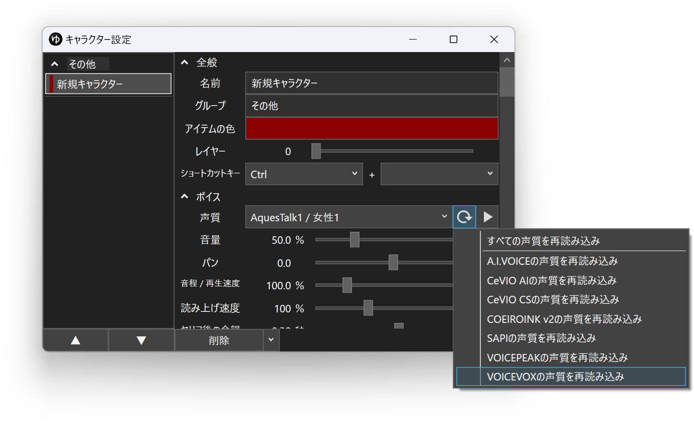

## VOICEVOX とは

商用・非商用問わず無料（※）で利用できるテキスト読み上げソフトウェアです。  
外部連携APIを使用し、YMM4から直接音声を生成できます。  
- [VOICEVOX | 無料で使える中品質なテキスト読み上げソフトウェア](https://voicevox.hiroshiba.jp/)

## 利用方法
### VOICEVOXエンジンのみを利用する場合
1. セリフ入力欄左側のキャラクター設定ボタンをクリックする

1. *ボイス*→*声質*欄で、利用する声質を選択する

1. 利用規約を確認し、*同意してダウンロード*ボタンをクリックする

1. ダウンロードが完了すると、音声が利用できるようになります。

### VOICEVOXアプリを使用する場合
1. [VOICEVOX公式サイト](https://voicevox.hiroshiba.jp/)からVOICEVOXをダウンロードします
1. ダウンロードしたファイルを実行し、VOICEVOXをインストールします
1. ゆっくりMovieMaker4を起動します
1. *ファイル(F)*→*設定*から設定ウィンドウを開きます

1. *VOICEVOX*→*アプリケーション一覧*で*VOICEVOX*を選択する

1. *実行ファイル*欄右側のフォルダアイコンボタンをクリックし、*VOICEVOX.exe*のパスを選択する

   - VOICEVOXをインストーラーを使ってインストールし、インストール場所をデフォルトから変更していない場合、設定する必要はありません。
1. セリフ入力欄左側のキャラクター設定ボタンをクリックする

1. *新規作成*ボタンをクリックし、キャラクターを追加する

1. *全般*→*名前*欄に任意の名前を入力する

1. *ボイス*→*声質*欄で、利用する声質を選択する

1. タイムライン下のキャラクター一覧でキャラクターを選択後、セリフを入力し、追加ボタンをクリックする

## 声質一覧を再読み込みする
新しくキャラクターをインストールした場合、YMM4の声質一覧にキャラクターが表示されない場合があります。  
声質一覧を更新するとキャラクターが一覧に表示されるようになります。
1. キャラクター編集ウィンドウを開く
1. 声質一覧右側の更新ボタンをクリックする
1. *VOICEVOXの声質を再読み込み*をクリックする

## 利用条件等
### クレジット表記
*VOICEVOX:ずんだもん*等、*VOICEVOX:キャラクター名*のフォーマットでクレジット表記をする必要があります。  

### 利用規約
VOICEVOXの利用規約と、音声ライブラリに定められている利用規約に従う必要があります。
- [ソフトウェア利用規約](https://voicevox.hiroshiba.jp/term)
- [音声ライブラリ利用規約](https://voicevox.hiroshiba.jp/#characters)
- [Q&A](https://voicevox.hiroshiba.jp/qa)