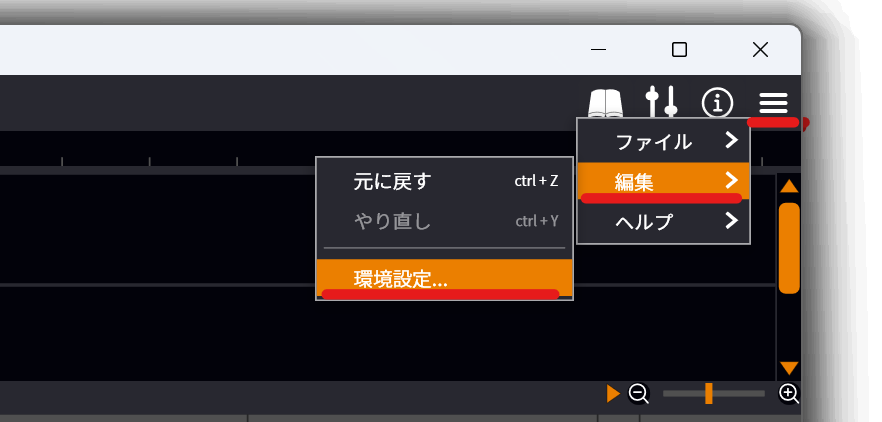
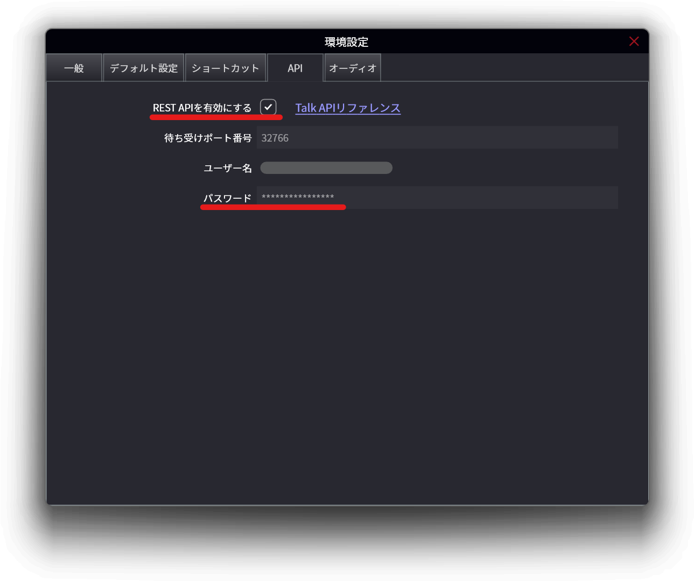
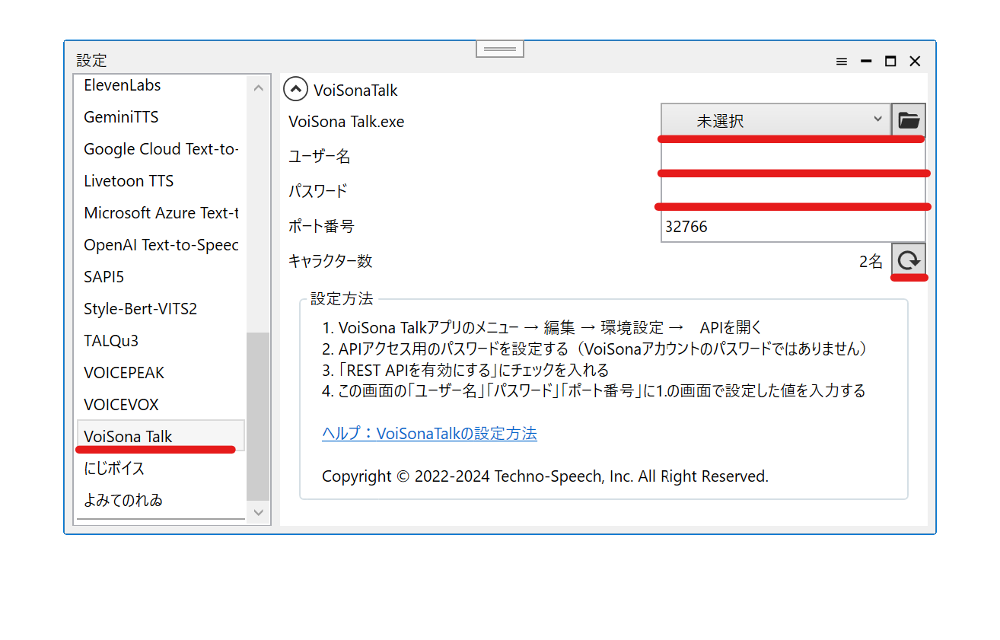
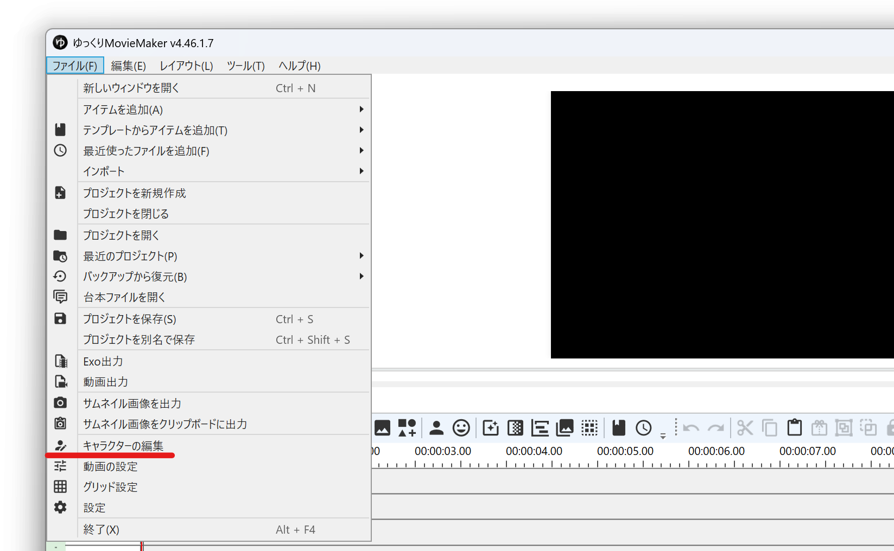
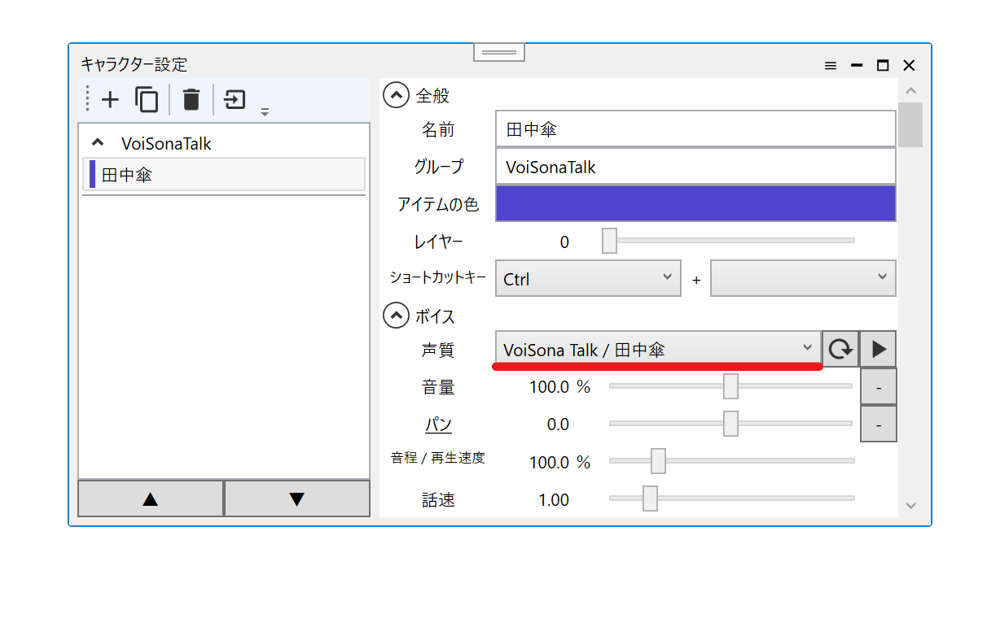
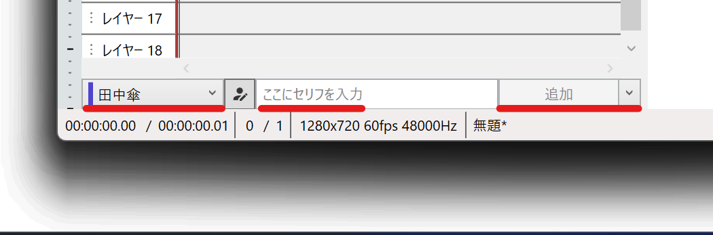
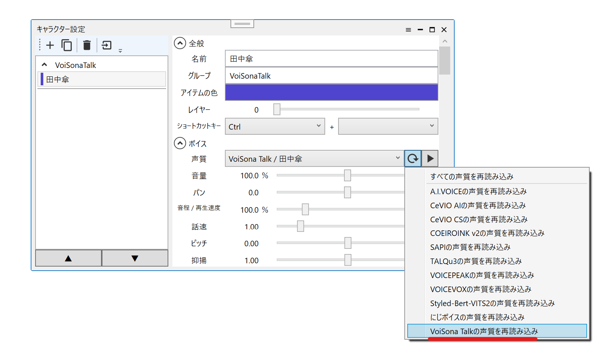

## VoiSona Talkとは

<VoiSonaCards limit="5"/>

VoiSona Talkは、株式会社テクノスピーチが提供する音声合成ソフトです。  
外部連携APIを使用し、YMM4から直接音声を生成できます。
- [VoiSona Talk 公式サイト](https://voisona.com/talk/)

> **Note**
> 利用には別途VoiSona Talk v1.3.4以降のインストールが必要です。

<VoiSonaTalkCards limit="10"/>

## 利用方法
1. VoiSona Talkを購入し、お使いのPCにインストールする
1. VoiSona Talkを起動する
1. 画面右上の*メニュー*→*編集*→*環境設定*をクリックする

1. *API*タブを開く
1. API接続用の任意のパスワードを設定し、*REST APIを有効にする*にチェックを入れる

1. ゆっくりMovieMaker4を起動する
1. *ファイル(F)*→*設定*をクリックする
1. *VoiSona Talk*を選択する
1. *4.*の画面に表示されているユーザー名と設定したパスワードを、*ユーザー名*、*パスワード*欄に入力する
1. *VoiSona Talk.exe*欄で、VoiSona Talkのインストール先にある"VoiSona Talk.exe"を選択する（任意）
   - これを設定することによって、音声合成時、VoiSona Talkを自動的に起動することが出来ます。
   - VoiSona Talkをデフォルトの場所にインストールしている場合はこの設定は不要です。
1. *キャラクター数*欄右側の更新ボタンをクリックする

1. *ファイル(F)*→*キャラクターの編集*からキャラクター編集ウィンドウを表示する

1. *ボイス*→*声質*からVoiSonaTalkの音声を選択する

1. タイムライン下のキャラクター一覧でキャラクターを選択後、セリフを入力し、追加ボタンをクリックする

## 声質一覧を再読み込みする
新しくキャラクターをインストールした場合、YMM4の声質一覧にキャラクターが表示されない場合があります。  
声質一覧を更新するとキャラクターが一覧に表示されるようになります。
1. キャラクター編集ウィンドウを開く
1. 声質一覧右側の更新ボタンをクリックする
1. *VoiSona Talkの声質を再読み込み*をクリックする

## 利用条件等
- [VoiSona Talk 公式サイト](https://voisona.com/talk/)
- [VoiSona Talk 利用規約](https://voisona.com/static/pdf/ja/terms.pdf)