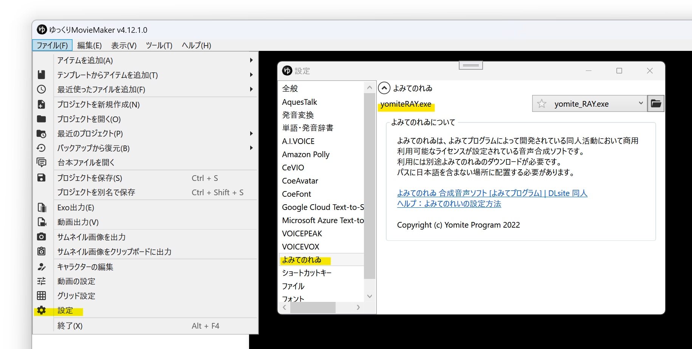
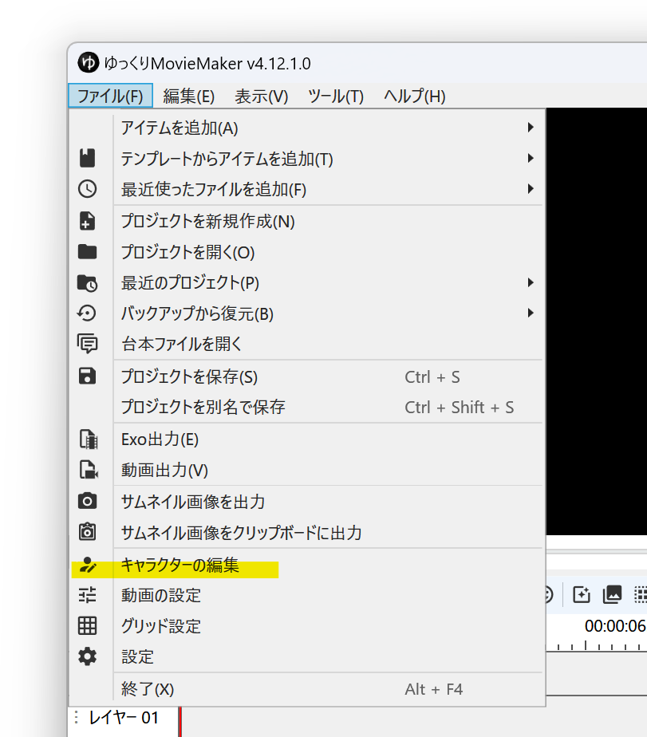
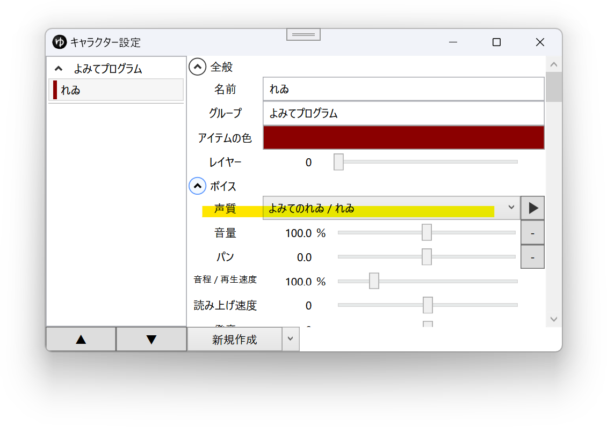
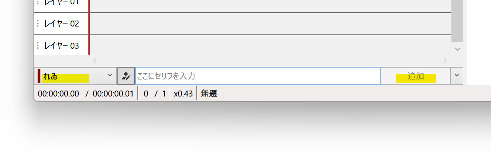

## よみてのれゐとは
<Flex>
    <DLsiteCard store="home" item="RJ376955"/>
</Flex>

よみてのれゐは、よみてプログラムによって開発されている日本の同人活動でのみ商用利用可能な音声合成ソフトです。
- [よみてのれゐ 合成音声ソフト [よみてプログラム] | DLsite 同人](https://www.dlsite.com/home/dlaf/=/t/s/link/work/aid/manju/id/RJ376955.html)

## 利用方法
1. よみてのれゐをファイルパスに日本語を含まない場所にインストールする
1. ゆっくりMovieMaker4を起動する
1. *ファイル(F)*→*設定*→*よみてのれゐ*→*yomiteRAY.exe*から実行ファイルを選択する

1. *ファイル(F)*→*キャラクターの編集*からキャラクター編集ウィンドウを表示する

1. *ボイス*→*声質*からよみてのれゐの音声を選択する

1. タイムライン下のキャラクター一覧でキャラクターを選択後、セリフを入力し、追加ボタンをクリックする

## 利用条件等
よみてのれゐに同梱されている*よみてライセンス.txt*、*れゐライセンス.txt*をご確認ください。