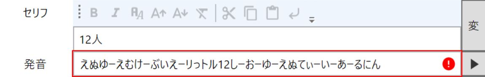

## 発生する問題
数値を含むテキストを読み上げると、エラーが発生して読み上げられない。

## 原因
発音辞書に登録している項目が原因で数値読み上げタグが破壊されています。  

### 問題が発生する発音辞書項目の一例
`<NUMK VAL=1234 COUNTER=にん>`という数値読み上げタグがある場合、以下のような項目が登録されていると数値読み上げタグが破壊されます。
#### 変換前:L 変換後:リットル
`<NUMK VAリットル=1234 COUNTER=にん>`となり、数値読み上げタグが破壊される

#### 変換前:NT 変換後:ニュータイプ
`<NUMK VAL=1234 COUニュータイプER=にん>`となり、数値読み上げタグが破壊される

#### 変換前:Num 変換後:ナンバー
`<ナンバー VAL=1234 COUNTER=にん>`となり、数値読み上げタグが破壊される

## 対処方法
発音辞書に`<NUMK VAL=1234 COUNTER=にん>`にヒットする項目がないかどうかを確認し、該当する項目を削除してください。  
単語の読みは単語辞書に登録してください。
