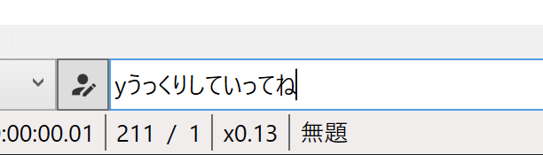

## 発生する症状
`ここにセリフを入力`欄にフォーカスを合わせていない状態でセリフを入力すると、最初の一文字が半角英数になる。

## 原因
Windows10 2004 以降 で Microsoft IME を使用している

## 対策
以下のいずれかの方法で改善します。
### 対策1：Enterキーを押してからセリフを入力する
Enterキーを押すと`ここにセリフを入力`欄にフォーカスが移ります。  
フォーカスを移してからセリフを入力すると、正常に文章を入力できます。

### 対策2：Microsoft IME を 以前のバージョンに戻す
1. 設定アプリを開く（スタートメニュー → 歯車アイコン）
1. 「設定の検索」欄に「IME」と入力する
1. 「日本語IMEの設定」を選択する
1. 「全般」を選択する
1. 「以前のバージョンの Microsoft IME を使う」を「オン」にする

### 対策3：Microsoft IME 以外のIMEを使用する
- Google日本語入力、ATOK等、MicrosoftIME以外のIMEを使用する

### 対策4：YMM4の設定を変更する（非推奨）
1. `ファイル(F)`→`設定`をクリックし、設定ウィンドウを表示する
1. `全般`→`互換性`→`新 Microsoft IME 互換モード`をオフにする

この設定はWin10 2004以降で実装された新MS-IMEに起因する不具合を抑制するためのものです。
将来のWindowsUpdateで改善される可能性がありますが、改善されない状態で設定をオフにすると以下の不具合が発生します。

- 全角モード時にスペースキーで再生・一時停止を切り替えられない
- 全角モード時に一部のショートカットキーが機能しない