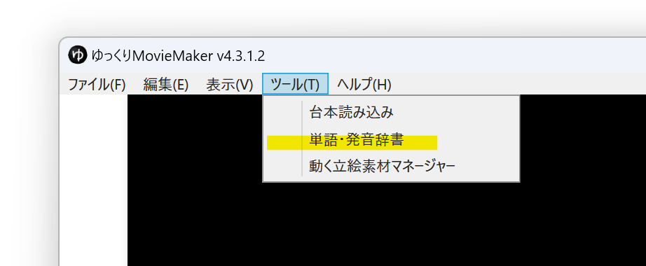
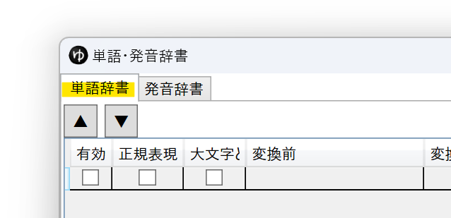
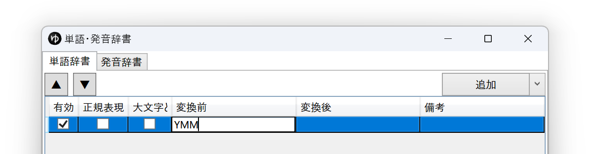
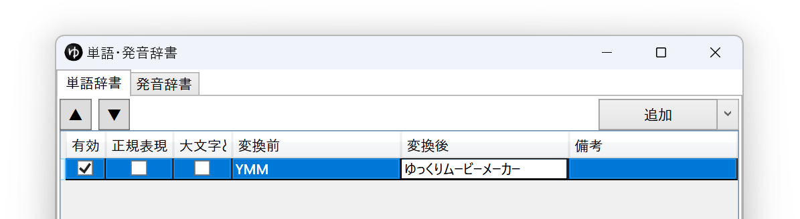
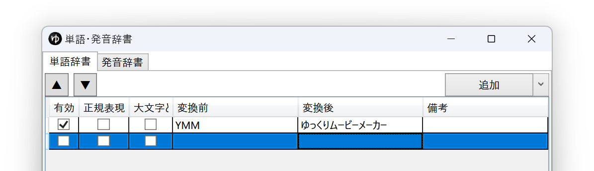
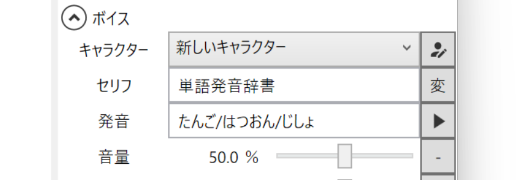
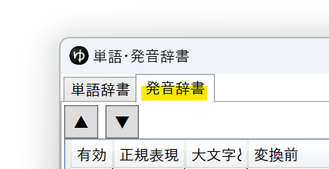
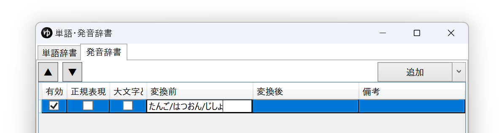
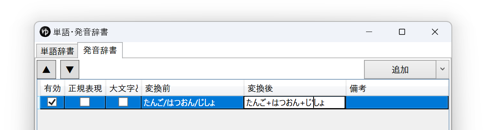
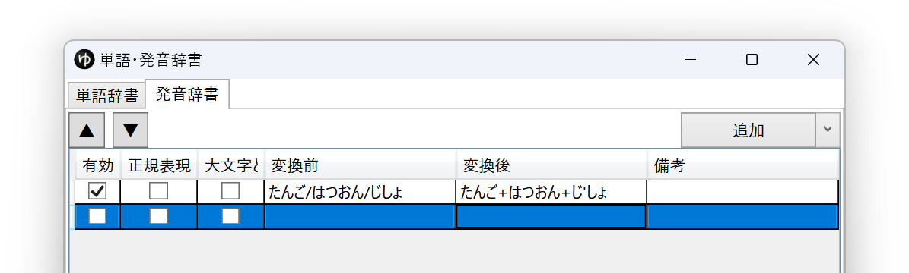

## 単語の読みを登録する
この例では「YMM」の読みを「ゆっくりムービーメーカー」として登録する例を紹介します。

1. *ツール(T)*→*単語・発音辞書*を選択する

1. *単語辞書*タブを選択する

1. *置換前*欄に読み方を登録したい単語を入力する

1. *置換後*欄に単語の読みを入力する

1. Enterキーを押して登録を確定させる

登録が完了すると、最下段に空行が追加されます。

## 単語の発音を登録する
> **Note**
> 発音登録はAquesTalk系のボイスアイテムにのみ適用されます。

この例では「単語発音辞書」の読みを「たんご+はつおん+じ'しょ」として登録する例を紹介します。

1. 発音を登録したい単語を読み上げさせたボイスアイテムを作成する

1. *ツール(T)*→*単語・発音辞書*を選択する

1. *発音辞書*タブを選択する

1. *置換前*欄に*1.*で作成したボイスアイテムの発音を入力する

1. *置換後*欄に単語の発音を入力する

1. Enterキーを押して登録を確定させる

登録が完了すると、最下段に空行が追加されます。