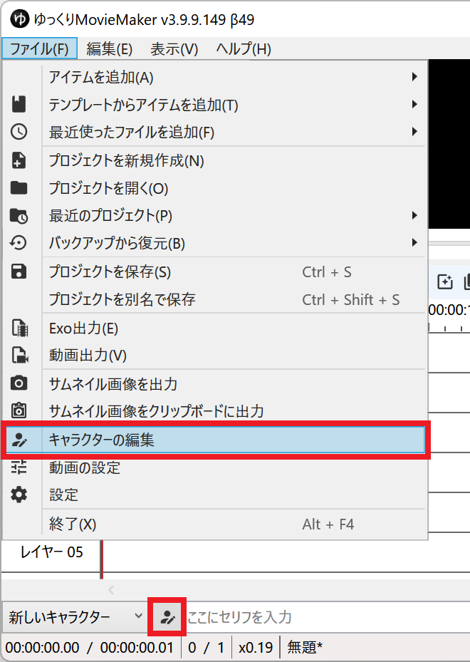
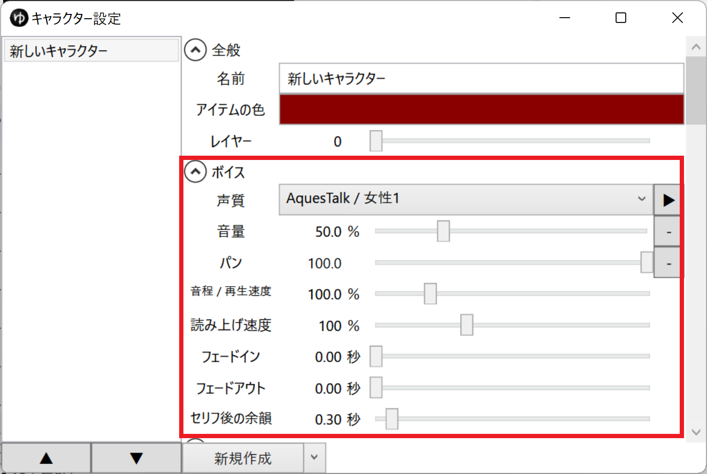

## 音質を変更したい場合
- [音質を変更する](../音質を変更する/)

## 声質を変更する
1. *ファイル(F)* → *キャラクターの編集* または *キャラクター選択コントロール右側のボタン* から キャラクター編集ウィンドウを開く

1. 各種設定項目を変更する

  - *声質*
    - ボイスを生成する音声合成エンジン
  - *音量*
  - *パン*
    - -100に設定すると左側から、100に設定すると右側から音が鳴ります。
  - *音程 / 再生速度*
    - 音程が変わります。音程が上がれば上がるほど、読み上げる速度も上がります。
    - 読み上げ速度を維持したまま音程を変更したい場合、音程の増加分だけ読み上げ速度を下げる必要があります。
  - *読み上げ速度*
    - テキストを読み上げる速度
  - *セリフ後の余韻*
    - セリフの読み上げ後、字幕が消えるまでの秒数
  - その他
    - *声質* 欄で選択した音声合成エンジンによっては追加の設定項目が表示されます。