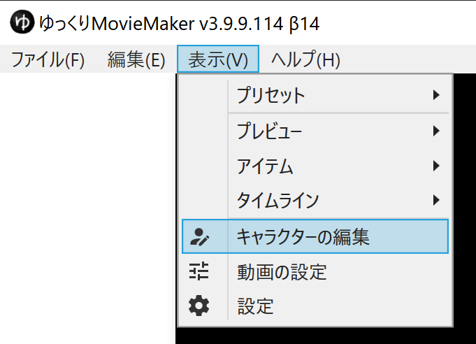
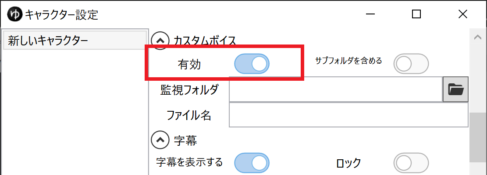
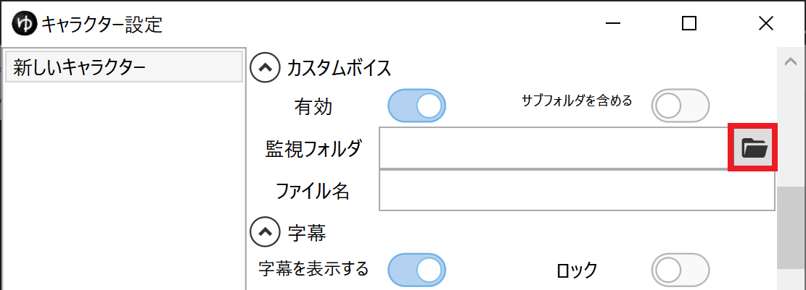

## やりたいこと
外部のアプリケーションで作成した音声ファイルをゆっくりボイスとして使用したい。

## 方法：カスタムボイス機能を使用する
外部のアプリケーションで作成した音声ファイルもゆっくりボイスとして利用可能です。

1. `表示(V)`→`キャラクターの編集`からキャラクター設定ウィンドウを表示する

1. 設定したいキャラクターを選択する
1. カスタムボイスの`有効`欄をONにする

1. `監視フォルダ`欄右側のボタンをクリックし、外部アプリケーションで作成した音声ファイルを保存するフォルダを選択する

1. 外部アプリケーションを使って、`4.`で指定したフォルダに音声ファイルを出力する
1. 自動的にゆっくりボイスとしてタイムラインにアイテムが追加されます

この時、出力した音声ファイルと同名のテキストファイルが存在する場合、そのテキストファイルの内容が字幕用テキストとして読み込まれます。

VOICEROIDシリーズはwavファイルと同名のtxtファイルの書き出しに対応しているため、カスタムボイス機能を使った字幕の生成が可能です。
<Flex>
    <AmazonCard item="B072LN3WM8"/>
    <AmazonCard item="B078213JVP"/>
    <AmazonCard item="B071LJJG9H"/>
    <AmazonCard item="B01MF9A8SM"/>
</Flex>