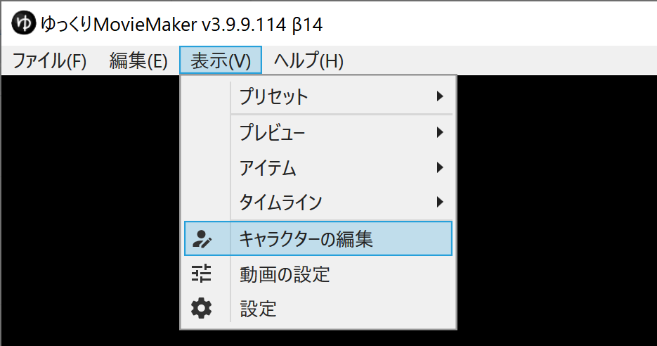
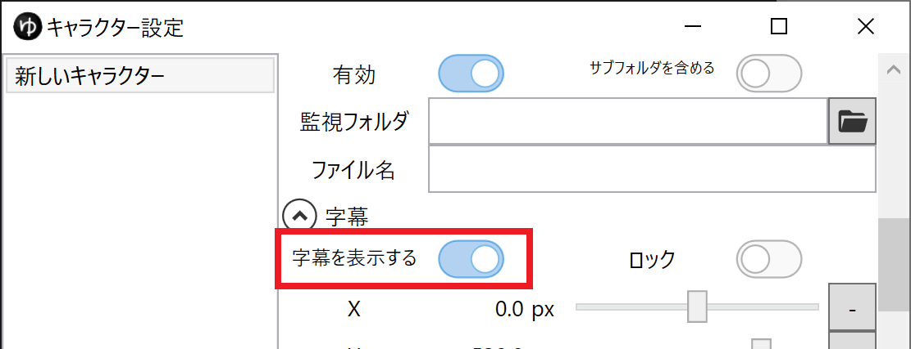
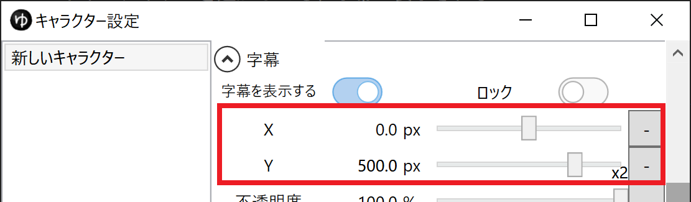
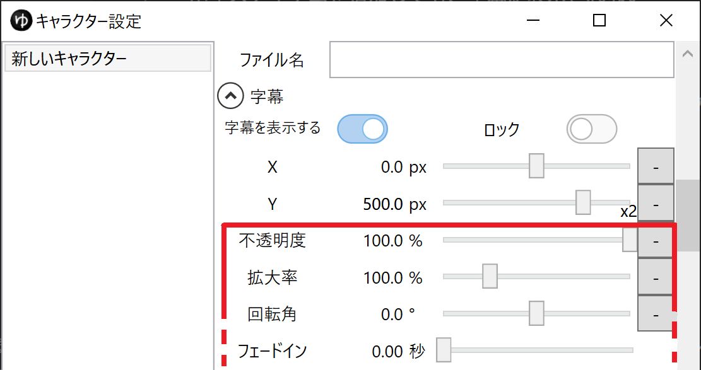
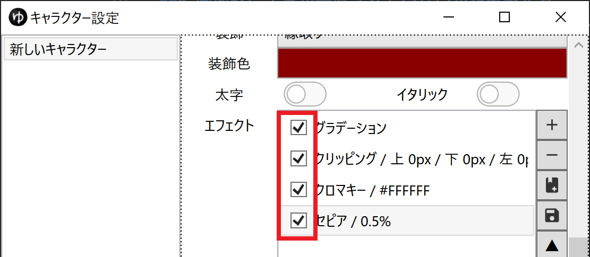
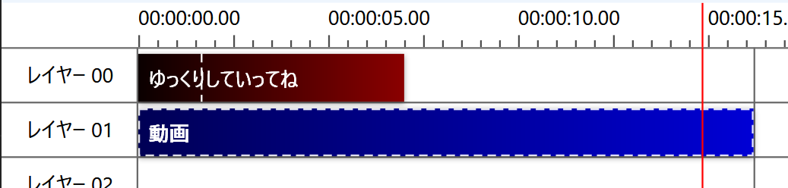
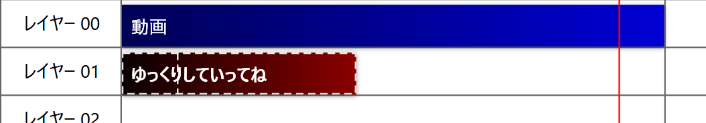
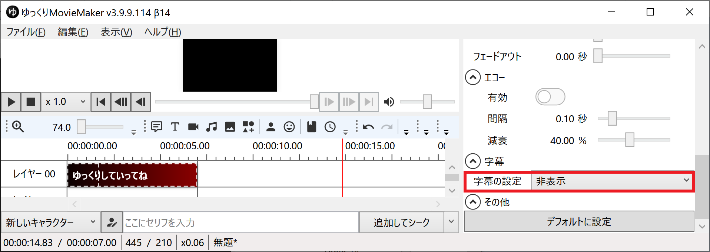
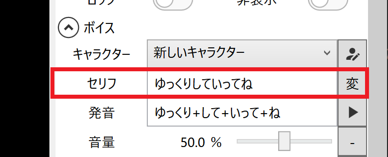

## 発生する問題
ボイスアイテムを追加しても、字幕が表示されない

## 対処法
### 共通：キャラクター設定ウィンドウを開く
1. `表示(V)`→`キャラクターの編集`を選択し、キャラクター設定ウィンドウを開く

1. 字幕を表示させたいキャラクターを選択する

### 「字幕の表示」が有効になっているかを確認する
`字幕`→`字幕を表示する`がオンになっているか確認する。

### 画面外に字幕が配置されていないかを確認する
`字幕`→`X` `Y`が画面外に設定されていないかを確認する。  
画面外になっているかどうかがわからない場合、`X` `Y`それぞれに`0`を設定する。

### 描画系パラメーターの設定を確認する
`字幕`欄の各種パラメーターを確認します。

1. `不透明度`を`100`にする
1. `拡大率`を`100`にする
1. `合成モード`を`通常`にする
1. `サイズ`を`50`など、大きめの数値にする

### すべてのエフェクトを無効にする
字幕を適用している場合、すべての字幕を一時的に無効化してください。  
字幕が表示されるようになった後、一つずつエフェクトを再適用していき、有効すると表示されなくなるものがある場合はそのエフェクトの設定を見直してください。

### 他のアイテムの後ろに配置されていないかを確認する
1. ほかのアイテムの後ろにボイスアイテムが配置されていないかどうかを確認します。

1. 後ろに配置されている場合、ボイスアイテムが手前に来るように配置を変更します。

### ボイスアイテム側で字幕を非表示にしていないかを確認する
1. 字幕が表示されないボイスアイテムを選択する
1. `アイテム編集エリア`→`字幕`→`字幕の設定`が`非表示`または`個別に設定する`になっている場合は`キャラクターの設定に従う`に変更する

### ボイスアイテムのセリフ欄に文字が入力されているかを確認する
1. 字幕が表示されないボイスアイテムを選択する
1. `アイテム編集エリア`→`ボイス`→`セリフ`欄に文字が入力されているかを確認する

1. 文字が入力されていない場合、字幕として表示したい文章を入力する