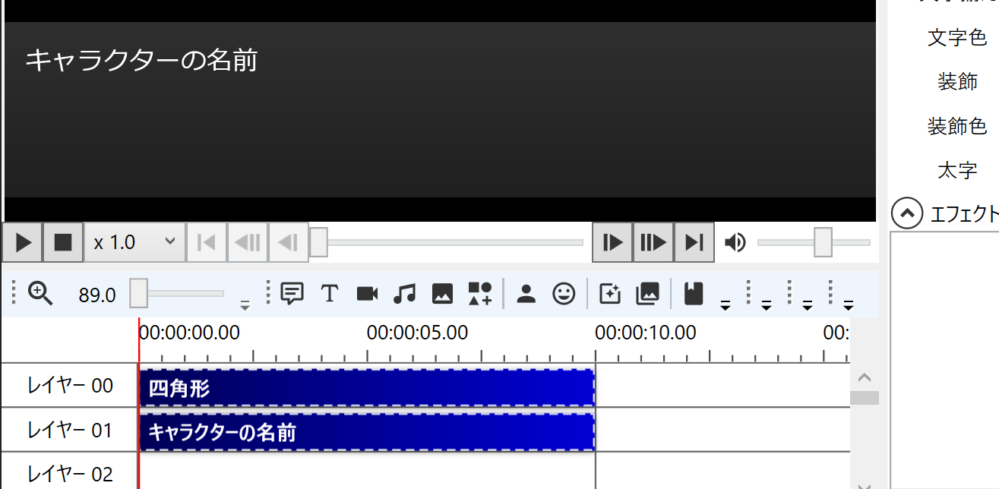
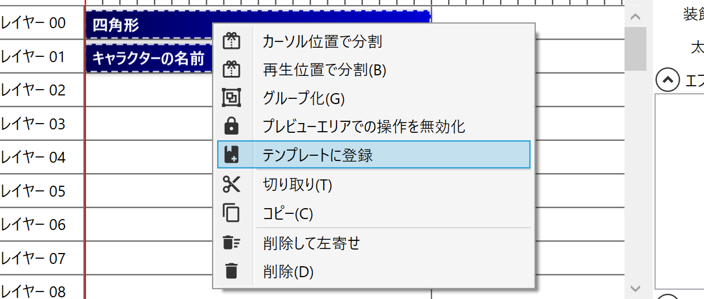
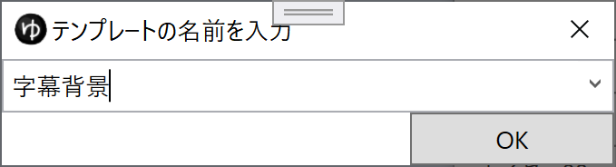
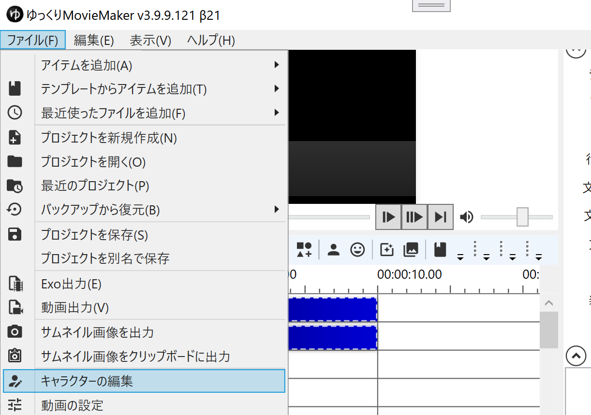
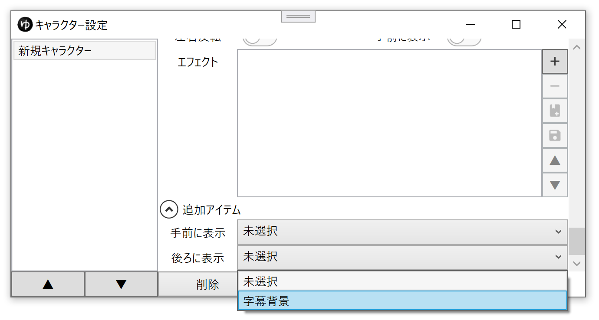

## やりたいこと
字幕と一緒にキャラクターの名前や背景画像を表示したい

## 方法
### 追加アイテムを設定する
1. タイムラインに、字幕と一緒に表示したいアイテムを追加する
1. 表示したいアイテムを選択する（複数ある場合は`Ctrl+クリック`）

1. アイテムを`右クリック`→`テンプレートに登録`をクリックする

1. テンプレートの名前を入力し、`OK`ボタンをクリックする

1. `ファイル(F)`→`キャラクター編集`をクリックする

1. `キャラクター設定ウィンドウ`→`追加アイテム`→`後ろに表示`で`4.`で設定したテンプレートを指定する

1. タイムライン下部の`ここにセリフを入力`欄からゆっくりボイスを追加する
