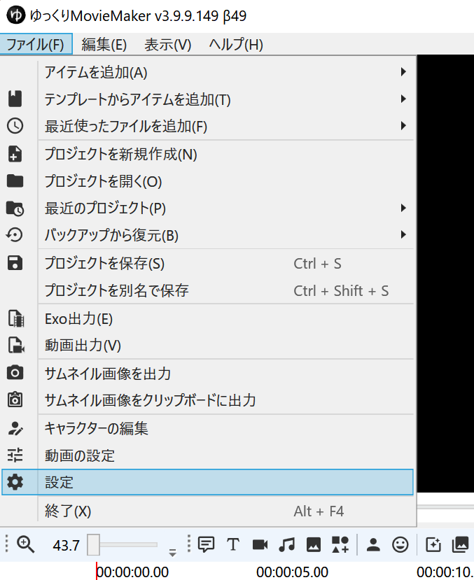
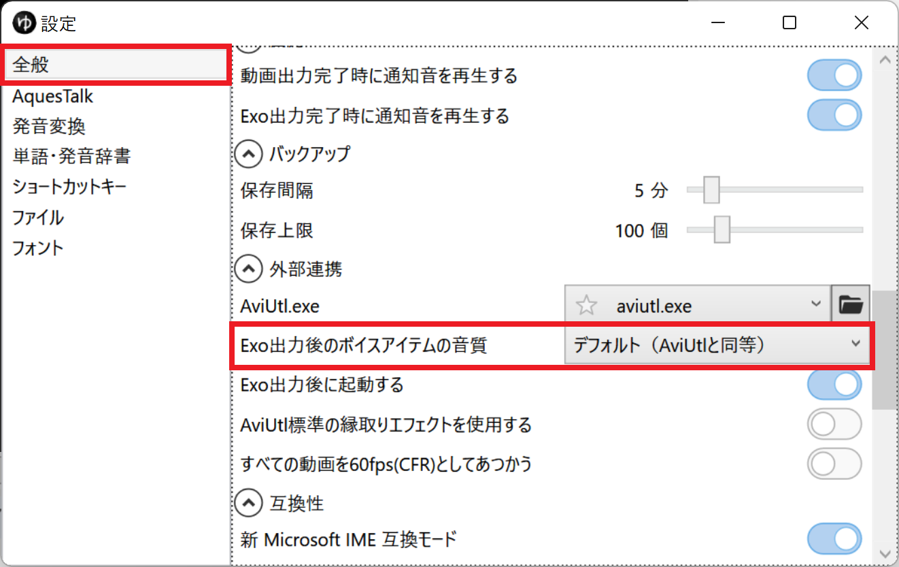

## 話す速さ、音程等を変更したい場合
- [声質を変更する](../声質を変更する/)

## YMM4上での音質を変更する
1. *ファイル(F)* → *設定* から 設定ウィンドウを表示する

1. *全般* → *プレビュー* → *ボイスアイテムの音質* の設定を変更する

※ *くっきり/Linear*を選択すると、AviUtlの音質と近くなります。

## AviUtl上での音質を変更する
1. *ファイル(F)* → *設定* から 設定ウィンドウを表示する

1. *全般* → *外部連携* → *Exo出力後のボイスアイテムの音質* の設定を変更する

