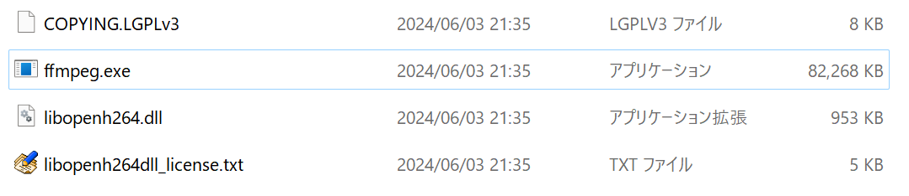

## 発生する症状
動画出力時、動画の出力に必要なファイルのダウンロードに失敗する

## 原因
 - ファイアウォールやセキュリティソフトにより、ダウンロードがブロックされている
 - 使用しているPCがインターネットに接続されていない

## 手動でファイルをダウンロードする
1. ファイルをダウンロードする
<Download url="https://object-storage.tyo1.conoha.io/v1/nc_4fac3ef0e6d843249e0ab2f1fc3e8f85/public/FFmpeg_exe_7_0_0_win64.zip">FFmpeg_exe_7_0_0_win64.zip</Download>
<Download url="http://ciscobinary.openh264.org/openh264-2.4.1-win64.dll.bz2">openh264-2.4.1-win64.dll.bz2</Download>
1. ダウンロードしたファイルを展開（解凍）する（bz2ファイルは[7-zip](https://7-zip.opensource.jp/)等を利用して展開する）
1. 展開したファイルを*YMM4フォルダ\user\resources\ffmpeg*に移動させる
1. *openh264-2.1.1-win64.dll*を*libopenh264.dll*にリネームする

以下のような状態になると完了です。
