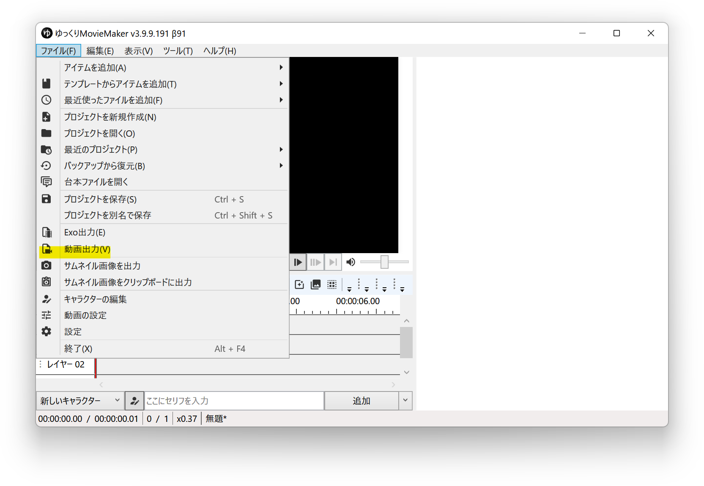
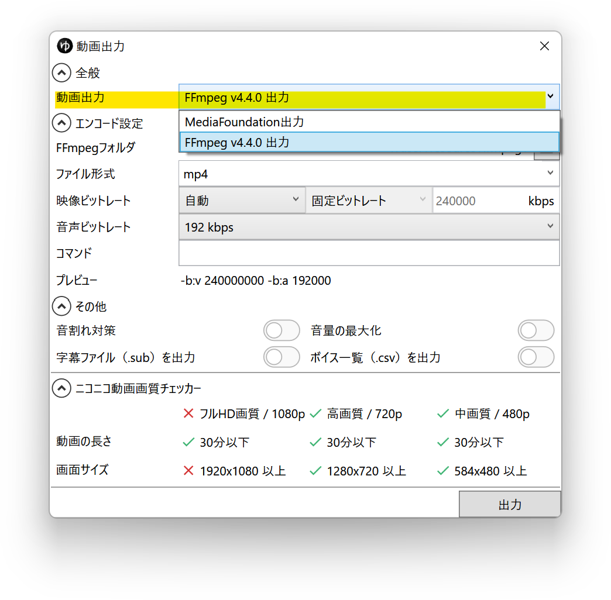

## 発生する症状
- 動画を出力中にエラーが発生する
- 動画の出力が途中で停止し、完了しない
- 出力した動画の映像が乱れる

## 解決策
### FFmpeg動画出力を利用する
1. *ファイル(F)*→*動画出力(V)*から動画出力ウィンドウを開く

1. *全般*→*動画出力*で*FFmpeg vx.x.x 出力*を選択する

1. 出力ボタンをクリックする

### ハードウェアデコード設定を変更する
[プレビュー画面がフリーズする。映像が乱れる。動画出力が完了しない。](../editing/%E3%83%97%E3%83%AC%E3%83%93%E3%83%A5%E3%83%BC%E7%94%BB%E9%9D%A2%E3%81%8C%E3%83%95%E3%83%AA%E3%83%BC%E3%82%BA%E3%81%99%E3%82%8B.md)の内容を参考にし、

- AdvancedVideoProcessing + MediaFoundation出力
- AdvancedVideoProcessing + FFmpeg 出力
- DXVA2 + MediaFoundation出力
- DXVA2 + FFmpeg 出力
- 無効 + MediaFoundation出力
- 無効 + FFmpeg 出力

の組み合わせで動画出力をお試しください。

### AviUtl経由で動画を出力する
上記方法でも症状が改善しない場合、AviUtl経由での動画出力をご検討ください。
- [AviUtl経由で動画を出力する](./AviUtl%E7%B5%8C%E7%94%B1%E3%81%A7%E5%8B%95%E7%94%BB%E3%82%92%E5%87%BA%E5%8A%9B%E3%81%99%E3%82%8B.md)
