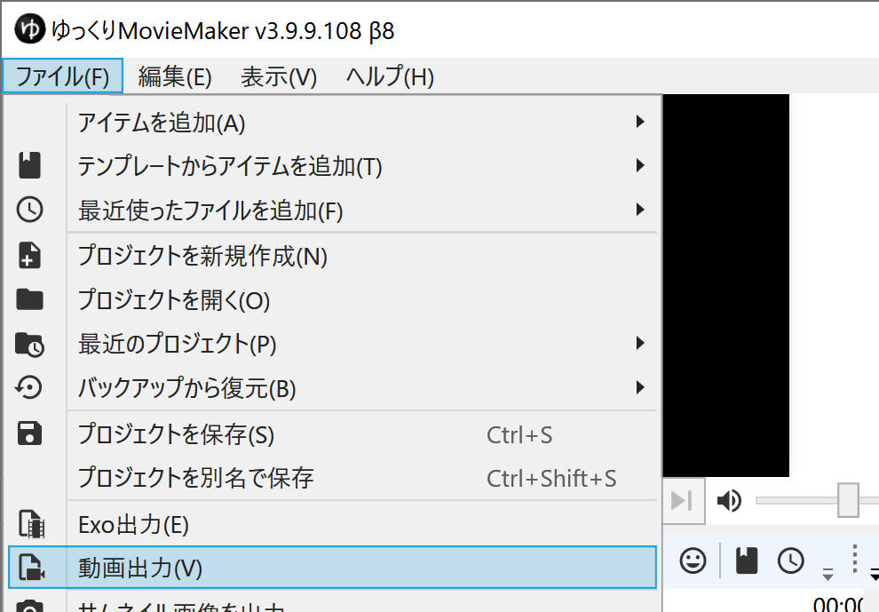
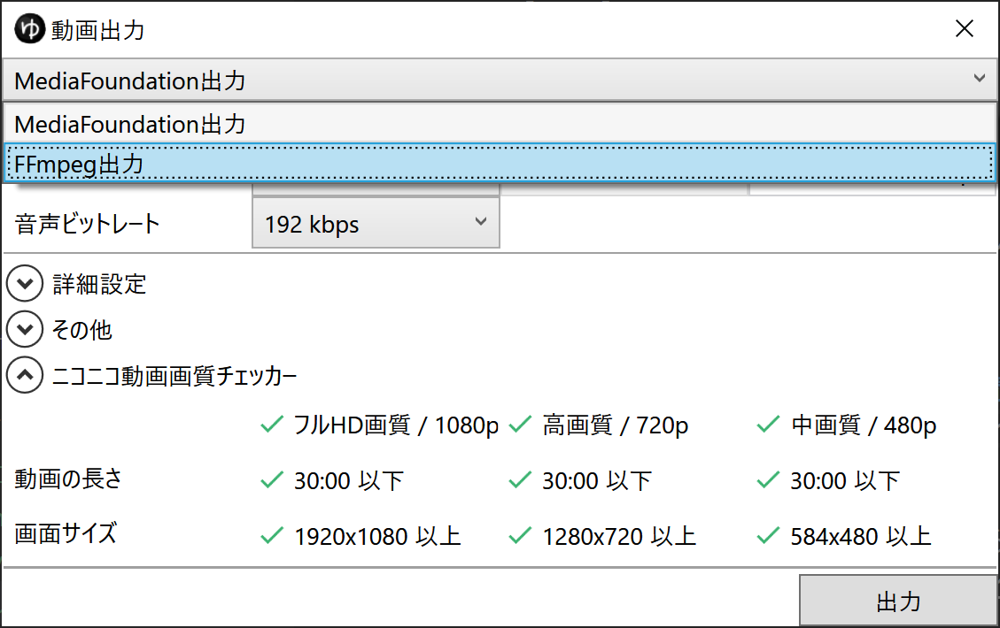

## 発生する症状
*ファイル(F)*→*動画出力*から作成した動画ファイルの音声にノイズが発生する

## 原因
MediaFoundation出力を使用して動画ファイルを出力すると発生します。  
現在原因を調査中です。

## 対策
以下のいずれかの方法で改善します。
### 対策1：ノイズが発生するアイテムの位置をズラす
MediaFoundation出力を使い続けたい場合はこの方法をお試しください。  
ノイズが発生する「動画アイテム」「音声アイテム」「ボイスアイテム」のタイムライン上の位置（時間）を変更することで症状が改善する可能性があります。

### 対策2：FFmpeg出力を使用する
1. *ファイル(F)*→*動画出力(V)*を選択する

1. *MediaFoundation出力*欄をクリックし、*FFmpeg出力*を選択する

1. 出力ボタンをクリックする
1. *出力に必要なファイルをダウンロードします*と表示される場合は*OK*ボタンをクリックする

デフォルトの状態ではエンコード時の設定がBaselineProfileに固定される等の制限があります。  
MainProfile等でエンコードしたい場合、*YMM4配置フォルダ\user\resources\ffmpeg*内のdllを自力でビルドした物に差し替える必要があります。

なお、FFmpegのビルド方法に関してはサポート致しかねます。  
