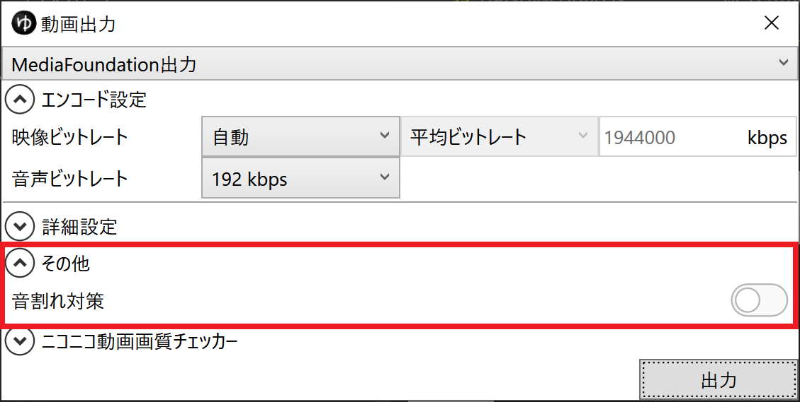

## 発生する症状
*ファイル(F)*→*動画出力(V)*から出力した動画ファイルの音量が小さい

## 原因
音割れ対策機能が原因です。  

## 対策
以下のいずれかの方法で改善します。

### 対策1：極端に大きな音量のアイテムを削除する
音割れを防止するために動画全体の音量が引き下げられています。  
極端に大きな音量のアイテムを削除するか、音量を下げることで症状が改善します。

### 対策2：音割れ対策機能を無効化する
音割れの発生を許容し、動画出力時の音量調節機能を無効化します。

1. *ファイル(F)*→*動画出力(V)*を開く

1. *その他*→*音割れ対策*をオフにする

1. 動画を出力する