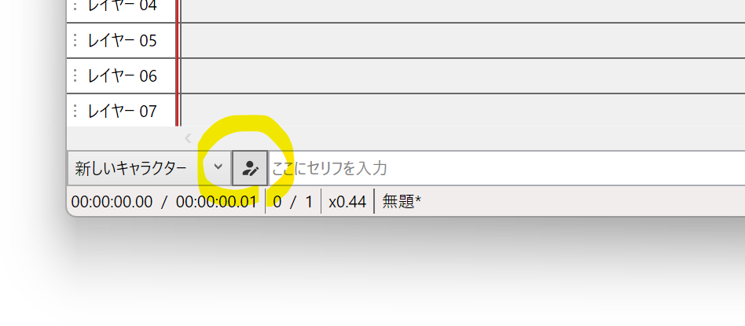
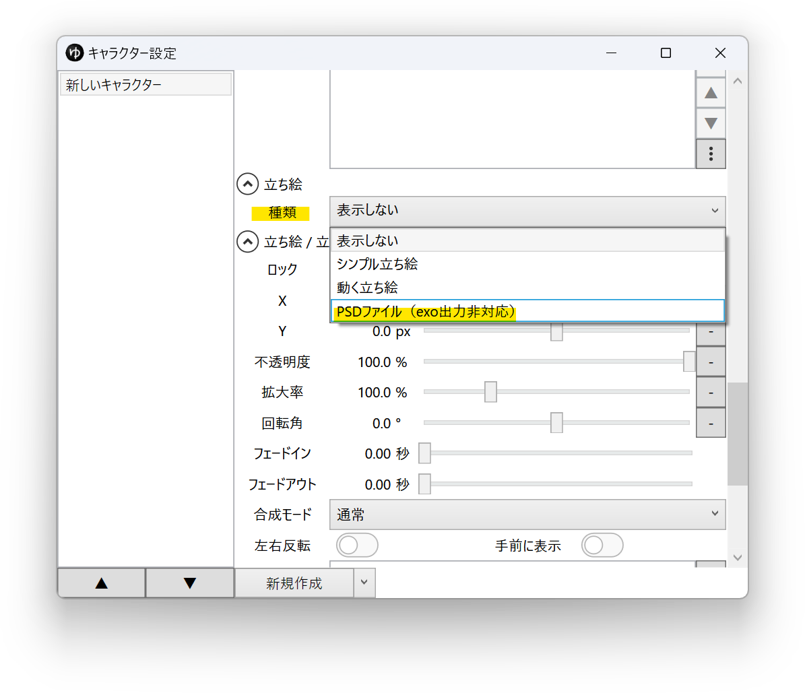
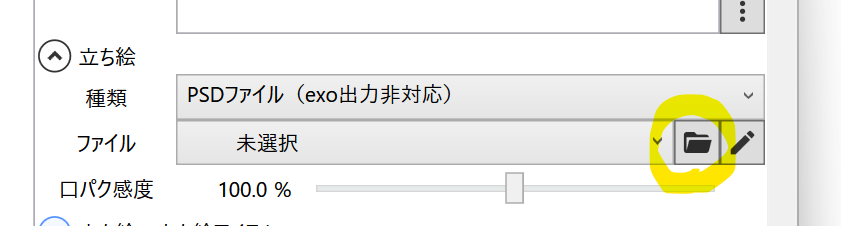
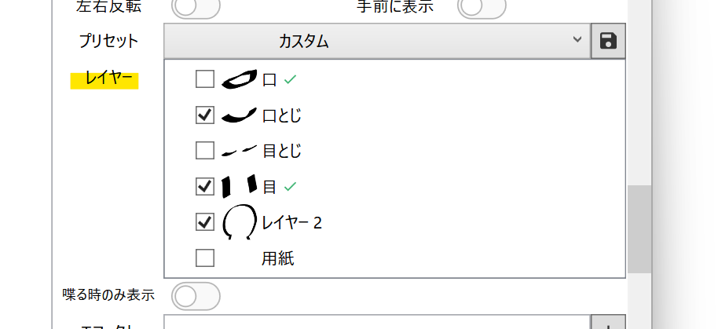
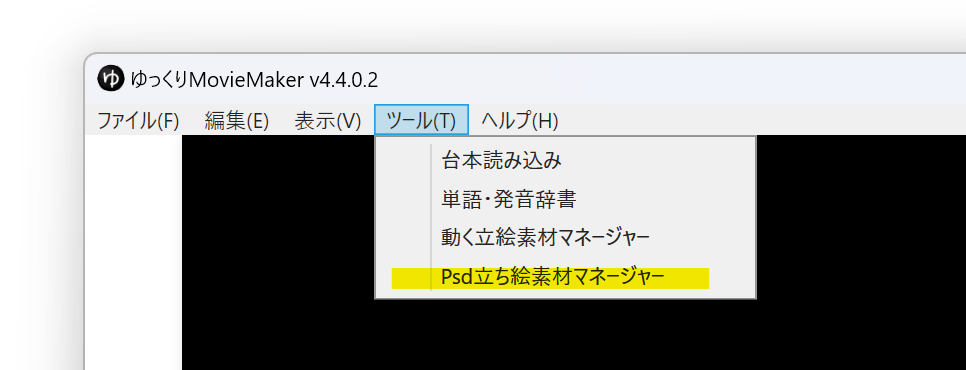
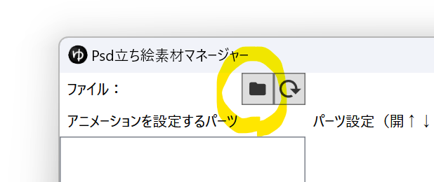
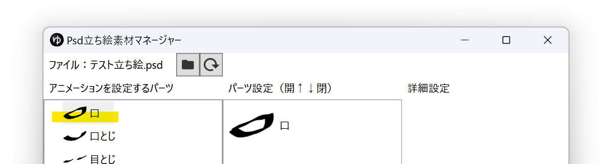
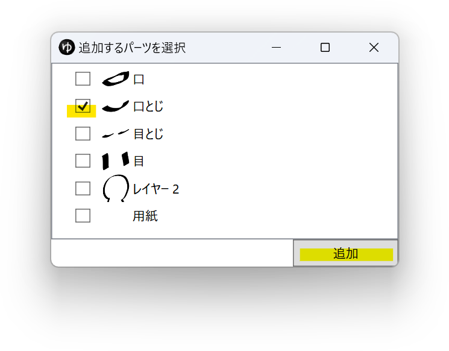
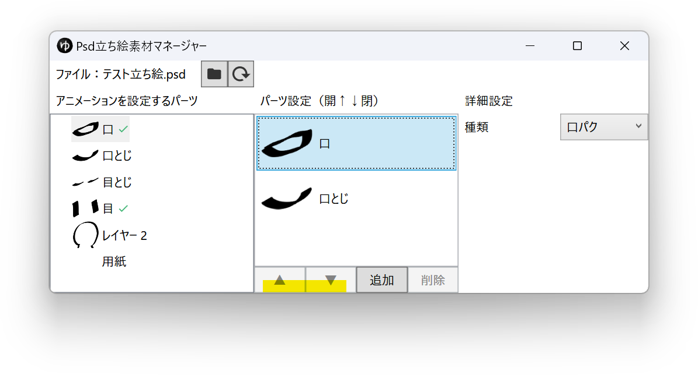
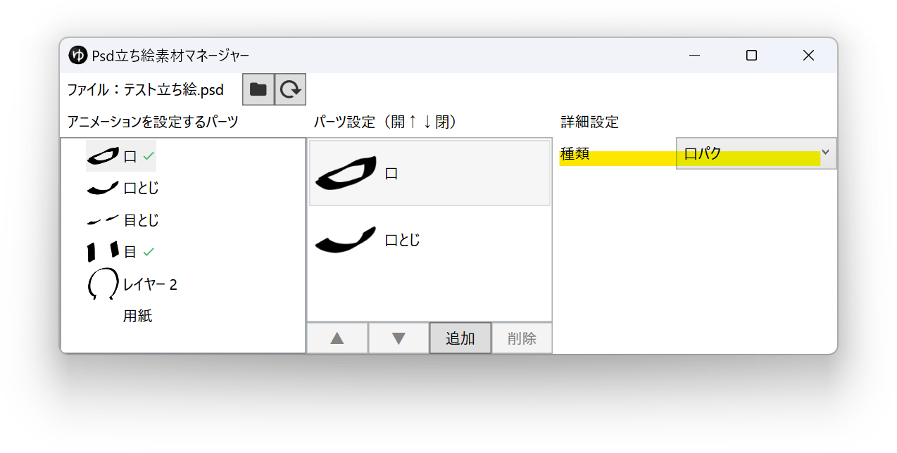

## 素材を用意する
任意の場所にPSDファイルを保存してください。
<Download url="https://object-storage.tyo1.conoha.io/v1/nc_4fac3ef0e6d843249e0ab2f1fc3e8f85/public/PSD%E7%AB%8B%E3%81%A1%E7%B5%B5%E3%82%B5%E3%83%B3%E3%83%97%E3%83%AB%E7%B4%A0%E6%9D%90.zip">サンプル素材をダウンロード</Download>

## キャラクターに設定する
1. タイムライン下のキャラクター編集ウィンドウ表示ボタンをクリックする

1. 立ち絵を設定するキャラクターを選択する
1. *立ち絵*→*種類*欄で*PSDファイル*を選択する

1. ファイル右側のフォルダアイコンをクリックし、立ち絵として利用するPSDファイルを選択する

1. *立ち絵 / 立ち絵アイテム*→*レイヤー*からデフォルトのパーツを選択する

1. *立ち絵 / 表情アイテム*→*レイヤー*から、ボイスアイテム・表情アイテムのデフォルトのパーツを選択する
1. [タイムラインに立ち絵アイテムを追加する](./%E7%AB%8B%E3%81%A1%E7%B5%B5%E6%A9%9F%E8%83%BD%E3%81%AE%E4%BD%BF%E3%81%84%E6%96%B9.md)

## 口パクやまばたきを設定する
1. *ツール(T)*→*Psd立ち絵素材マネージャー*を選択する

1. フォルダアイコンをクリックし、PSDファイルを選択する

1. アニメーションを設定するパーツを選択する

1. 追加ボタンをクリックする

1. アニメーション用のレイヤーにチェックを入れ、*追加*ボタンをクリックする

1. *▲* *▼*ボタンを使い、上が開いている状態、下が閉じている状態になるようパーツを並び替える

1. *詳細設定*→*種類*欄で、アニメーションの種類（口パク・まばたき）を選択する

アニメーションを設定すると、パーツの右側に緑色のチェックマークが表示されます。