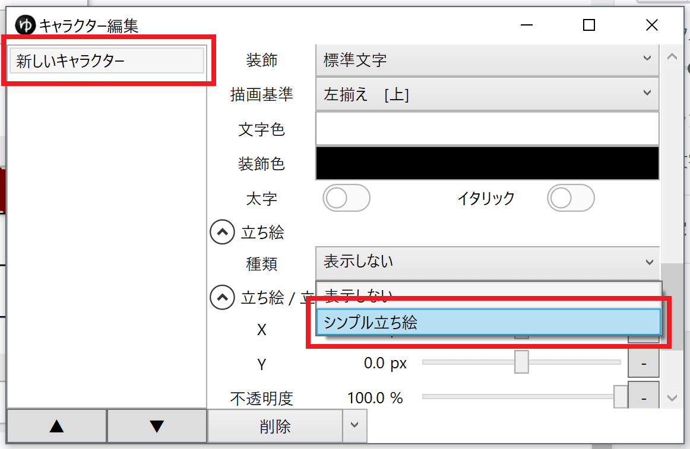
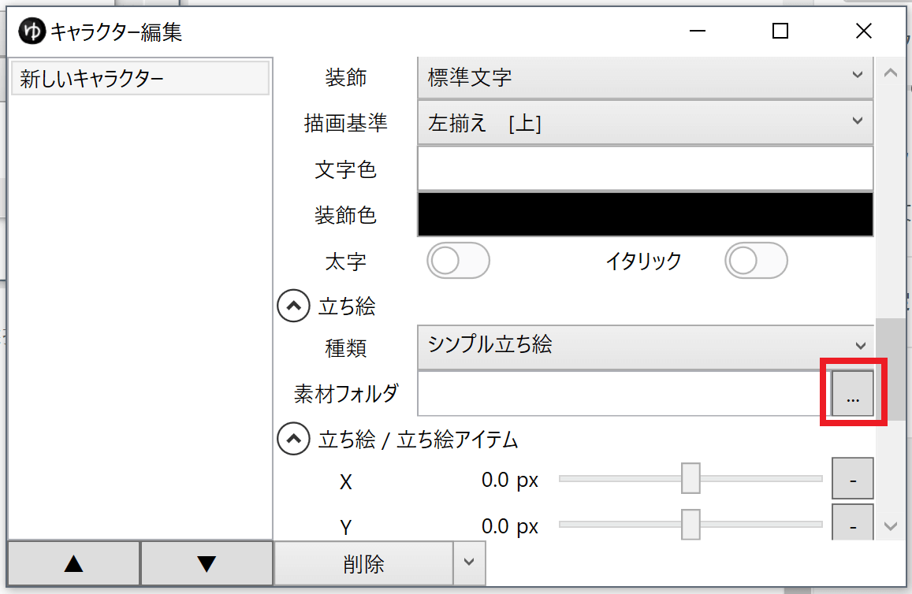
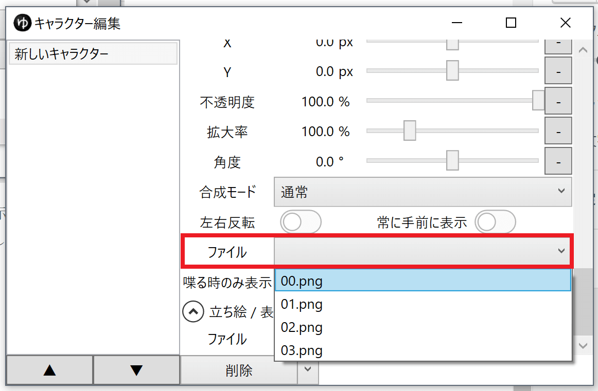
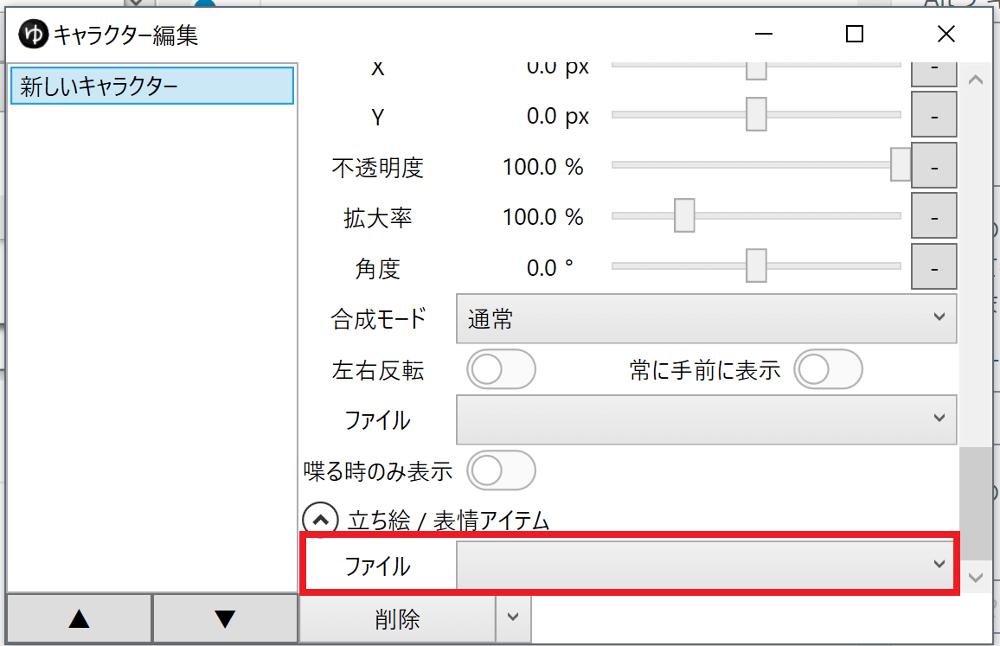
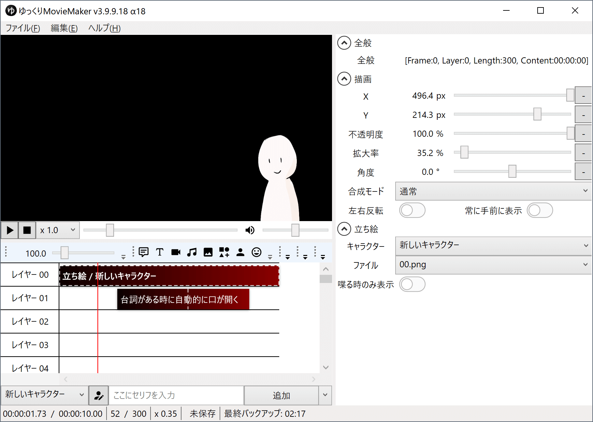
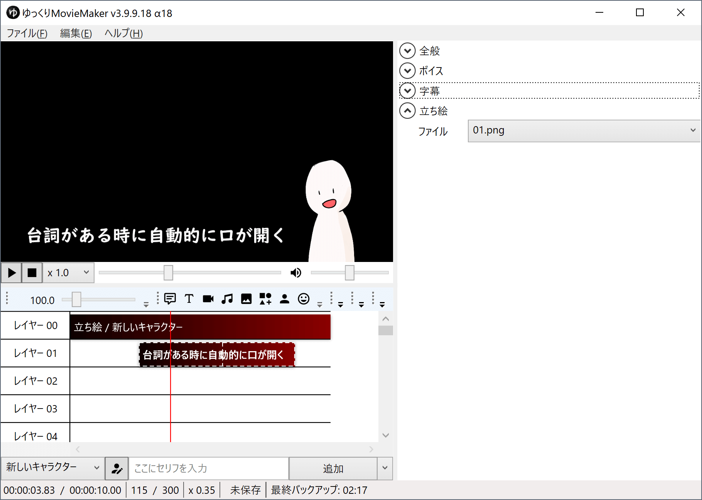

## 素材を用意する
任意の場所にシンプル立ち絵素材を作成します。
- [シンプル立ち絵素材の作り方](../シンプル立ち絵素材の作り方/)

 
## キャラクターに設定する
1. タイムライン下のキャラクター編集ウィンドウ表示ボタンをクリックする

1. キャラクターを選択する
1. 立ち絵 → 種類 で「シンプル立ち絵」を指定する

1. 立ち絵 → 素材フォルダ 欄右のボタンをクリックし、素材フォルダを選択する

1. 立ち絵 / 立ち絵アイテム → ファイル 欄 で、立ち絵アイテムのデフォルトの表情画像を指定する

1. 立ち絵 / 表情アイテム → ファイル 欄で、ボイスアイテム・表情アイテムのデフォルトの表情画像を指定する

<Info>
「デフォルトの立ち絵」に口を閉じた表情、「デフォルトの表情」に口を開けた表情を指定すると、ボイスアイテム追加時に自動的に口を開けた表情になります。
</Info>

セリフがないので口が閉じている

セリフと同時に自動的に口が開く