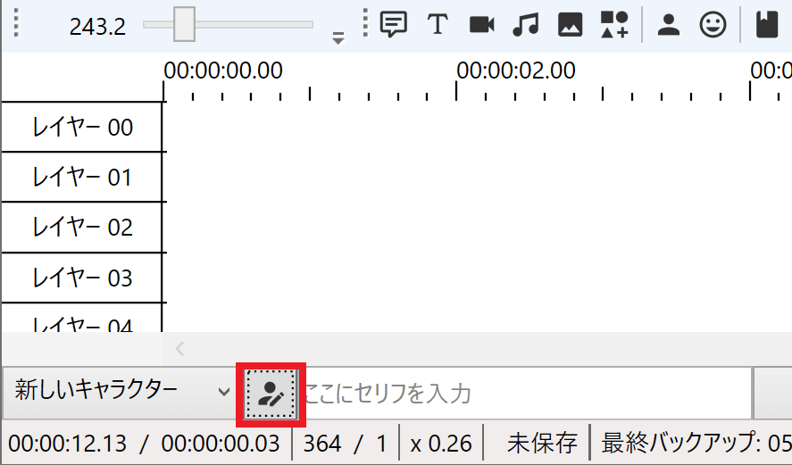
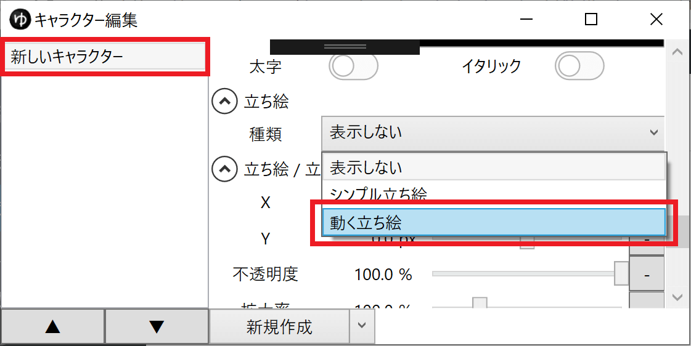
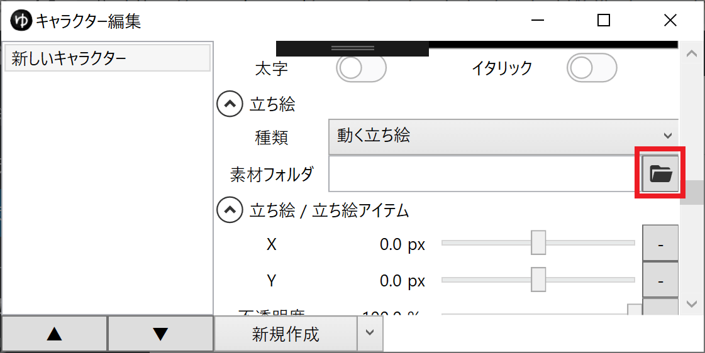
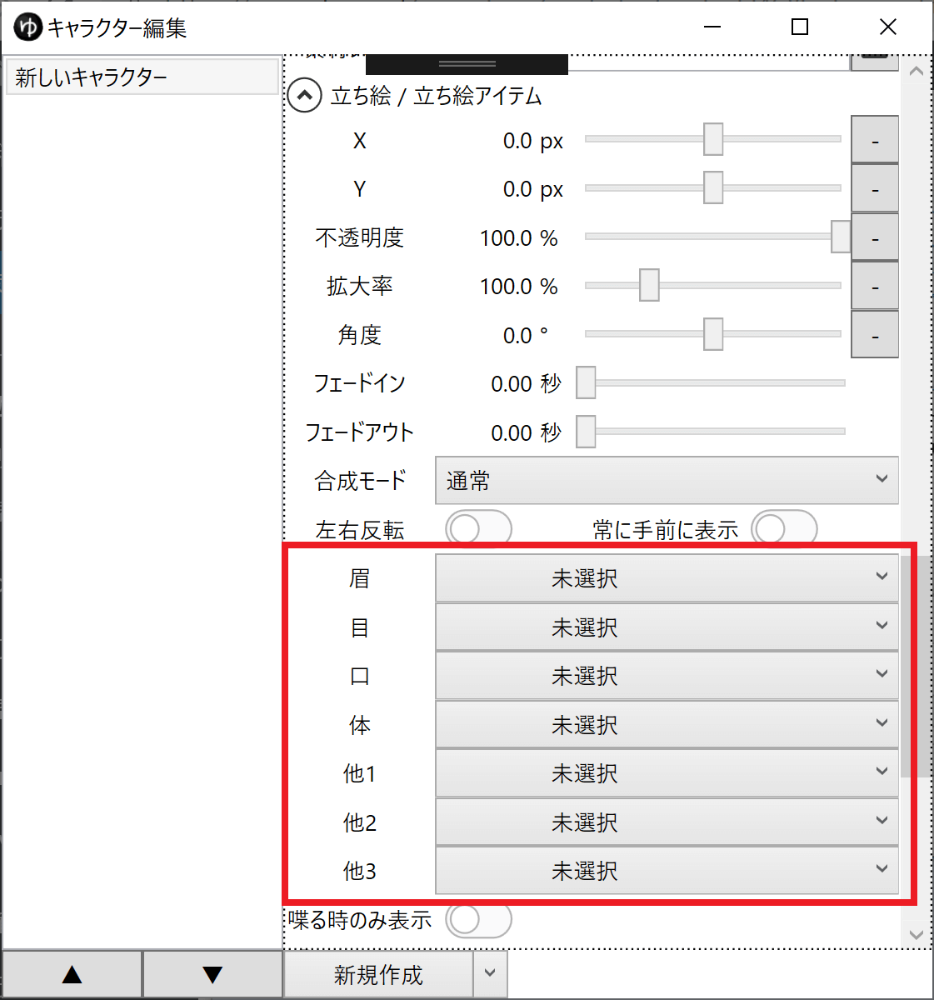
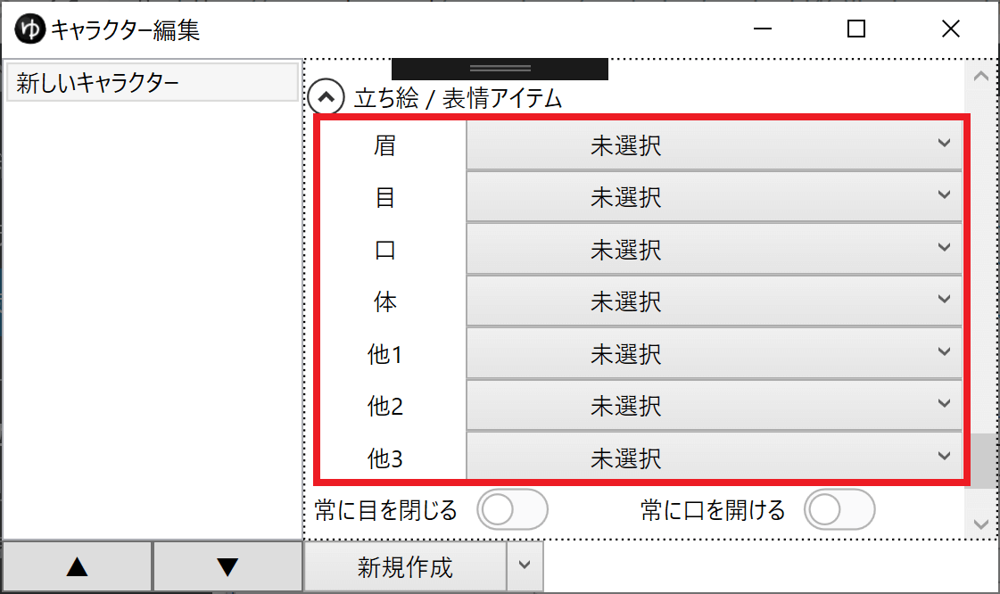

## 素材を用意する
任意の場所に動く立ち絵素材を作成します。
- [動く立ち絵素材の作り方](./%E5%8B%95%E3%81%8F%E7%AB%8B%E3%81%A1%E7%B5%B5%E7%B4%A0%E6%9D%90%E3%81%AE%E4%BD%9C%E3%82%8A%E6%96%B9.md)

## キャラクターに設定する
1. タイムライン下のキャラクター編集ウィンドウ表示ボタンをクリックする

1. 立ち絵を設定するキャラクターを選択する
1. 立ち絵 → 種類 欄で、「動く立ち絵」を選択する

1. 立ち絵 → 素材フォルダ 欄で、素材フォルダを選択する

1. 立ち絵 / 表情アイテム → 「眉」「目」「口」「体」「他」欄で、デフォルトのパーツを選択する

1. 立ち絵 / 表情アイテム → 「眉」「目」「口」「体」「他」欄で、ボイスアイテム・表情アイテムのデフォルトの表情パーツを指定する

