> **Warning**
> 既存の立ち絵素材等を動く立ち絵素材として改変する際、素材の改変方法を素材製作者様へ問い合わせる行為は迷惑となるため、おやめください。

## 対応ファイル形式
画像ファイル・動画ファイルを使用可能です。
- 推奨画像ファイル形式：透過PNG
- 推奨動画ファイル形式：透過GIF / 透過WebP
- 画面サイズ：制限なし

## サンプル素材
zipファイルをダウンロード後、任意の場所に展開（解凍）してお使いください。

### 動く立ち絵 サンプル素材
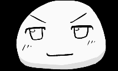

静止画ファイルをメインに作成したサンプル素材です。  
まばたき・口パク・表情差分に対応。一部アクセントとして動画素材を使用しています。

<Download url="https://object-storage.tyo1.conoha.io/v1/nc_4fac3ef0e6d843249e0ab2f1fc3e8f85/public/%E5%8B%95%E3%81%8F%E7%AB%8B%E3%81%A1%E7%B5%B5%E3%82%B5%E3%83%B3%E3%83%97%E3%83%AB%E7%B4%A0%E6%9D%90.zip?d=20260201">動く立ち絵サンプル素材をダウンロード</Download>

### 動く立ち絵 すごく動くサンプル素材
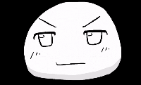

動画ファイルのみで作成したサンプル素材です。  
まばたき・口パク・表情差分に対応。動画ファイルを使用することで、より豊かな表現が可能です。

<Download url="https://object-storage.tyo1.conoha.io/v1/nc_4fac3ef0e6d843249e0ab2f1fc3e8f85/public/%E3%81%99%E3%81%94%E3%81%8F%E5%8B%95%E3%81%8F%E7%AB%8B%E3%81%A1%E7%B5%B5%E3%82%B5%E3%83%B3%E3%83%97%E3%83%AB%E7%B4%A0%E6%9D%90.zip">すごく動く立ち絵サンプル素材をダウンロード</Download>

## 素材フォルダを作成する
任意の場所にフォルダを作成し、その中に「眉」「目」「口」「髪」「顔色」「体」「他」「後」フォルダを作成します
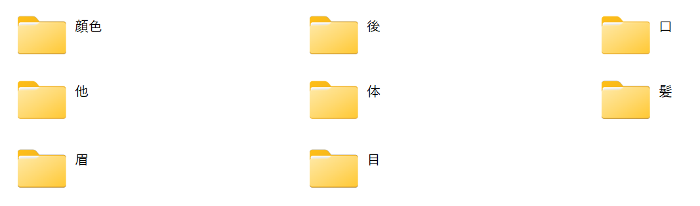

## レイヤーの並び順
*他1*→*他2*→*他3*→*髪（半透明）*→*眉*→*目*→*口*→*髪*→*顔色*→*体*→*後1*→*後2*→*後3*
の順にレイヤーが表示されます。  
各パーツの合成モードが「通常」以外に設定されている場合、他のパーツより手前に描画されます。

## 目パーツを作成する
目パーツを「目」フォルダに作成します。
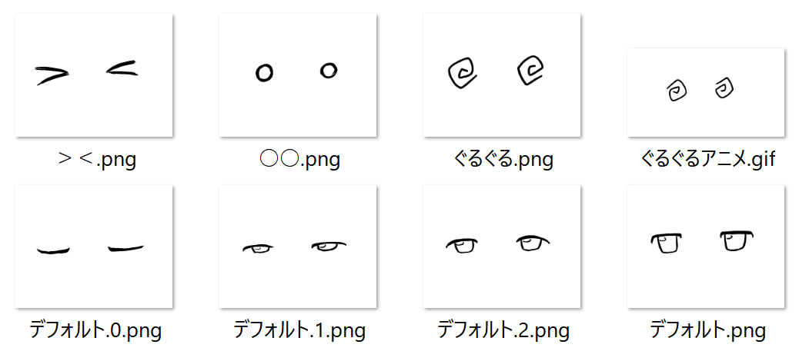

### まばたきに対応する目パーツ
#### 動く立ち絵素材マネージャーで設定する場合
- [動く立ち絵素材マネージャーでアニメーションを設定する](/ymm4/faq/立ち絵機能/動く立ち絵素材マネージャー/#まばたき・口パクアニメーションを設定する)

#### 手動でファイル名を設定する場合
- パーツ名.0.png：目が閉じた状態
- パーツ名.1.png：中間フレーム（任意の枚数）
- パーツ名.2.png：中間フレーム（任意の枚数）
- 　　　︙
- **パーツ名.png**　：目が開いた状態

という名前で作成します。  
目が開いた状態のパーツ末尾には「.0」等の数字がつかない点に注意してください。

### まばたき非対応パーツ
ファイル名は自由です。

## 口パーツを作成する
口パーツを「口」フォルダに作成します。
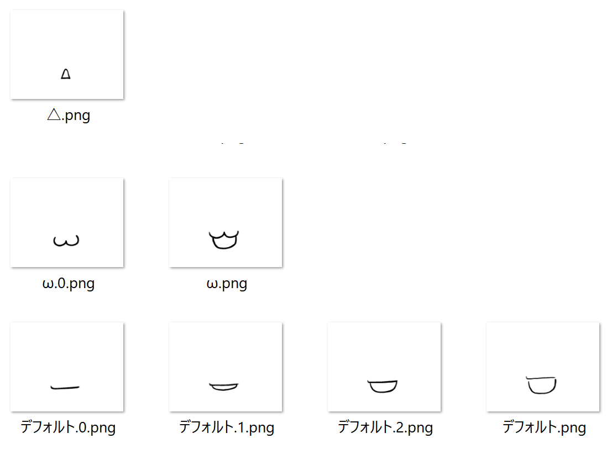

### 口パクに対応する口パーツ
#### 動く立ち絵素材マネージャーで設定する場合
- [動く立ち絵素材マネージャーでアニメーションを設定する](/ymm4/faq/立ち絵機能/動く立ち絵素材マネージャー/#まばたき・口パクアニメーションを設定する)

#### 手動でファイル名を設定する場合（音量口パク）
- パーツ名.0.png：口が閉じた状態  
- パーツ名.1.png：中間フレーム（任意の枚数）  
- パーツ名.2.png：中間フレーム（任意の枚数）  
- 　　　︙  
- **パーツ名.png**　：口が開いた状態

という規則でファイルを作成します。  
口が開いた状態のパーツ末尾には「.0」等の数字がつかない点に注意してください。

#### 手動でファイル名を設定する場合（あいうえお口パク）
- パーツ名.a.png：あの口の形
- パーツ名.i.png：いの口の形
- パーツ名.u.png：うの口の形
- パーツ名.e.png：えの口の形
- パーツ名.o.png：おの口の形
- **パーツ名.0.png**　：口が閉じた状態
- **パーツ名.png**　：口が開いた状態（サムネイル用）
という規則でファイルを作成します。  
「.a～.o」の他に、口が閉じた状態の「.0」が必要な点、口が開いた状態のパーツ末尾には「.0」等の数字がつかない点に注意してください。

### 口パク非対応パーツ
ファイル名は自由です

## 髪パーツを作成する
髪パーツを「髪」フォルダに作成します。  
ファイル名は自由です。

### 前髪を透過させて、後ろに隠れている眉や目を表示させたい場合
#### パーツ名.iniを作成する方法
髪パーツフォルダ内に*パーツ名.ini*の名前で以下の内容を記載したファイルを作成します。
```パーツ名.ini
opacity=0.5
```
数値を小さくするほど前髪が透過され、眉がくっきりと表示されます。

#### YMM4のUI内で設定する方法
1. キャラクター設定ウィンドウを開く
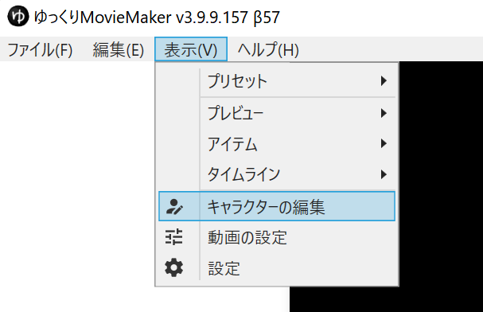
1. *立ち絵*→*種類*欄で*動く立ち絵*を選択し、*素材フォルダ*欄で作成した素材を選択する
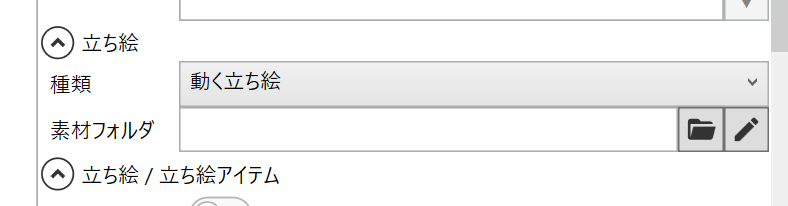
1. *素材フォルダ*欄右側の*鉛筆ボタン*をクリックする
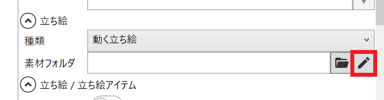
1. 一覧から設定を変更したい髪パーツを選択する
1. *不透明度*欄を変更する
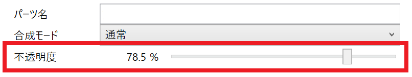
1. 動く立ち絵マネージャーを閉じる

※ プレビューに反映させるためにはF5キーを押して更新するか、タイムラインをシークして一度非表示にする必要があります。

## 顔色パーツを作成する
顔色パーツを「顔色」フォルダ内に作成します。  
ファイル名は自由です。

### 合成モードを変更したい場合
#### パーツ名.iniを作成する方法
顔色パーツフォルダ内にパーツ名.iniの名前で以下の内容を記載したファイルを作成します。
```パーツ名.ini
blend=3
```
設定する数値によって合成モードが変わります。  
0=通常, 1=加算, 2=減算, 3=乗算, 4=スクリーン, 5=オーバーレイ, 6=比較（明）, 7=比較（暗）, 8=輝度, 9=色差, 10=陰影, 11=明暗, 12=差分
#### YMM4のUI内で設定する方法
1. キャラクター設定ウィンドウを開く

1. *立ち絵*→*種類*欄で*動く立ち絵*を選択し、*素材フォルダ*欄で作成した素材を選択する

1. *素材フォルダ*欄右側の*鉛筆ボタン*をクリックする

1. 一覧から設定を変更したい顔色パーツを選択する
1. 合成モード欄を変更する
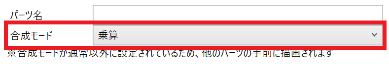
1. 動く立ち絵マネージャーを閉じる

※ プレビューに反映させるためにはF5キーを押して更新するか、タイムラインをシークして一度非表示にする必要があります。

## 眉 / 体 / 後 / 他 パーツを作成する
各フォルダに画像を作成します。
ファイル名は自由です。

## 動画ファイルを使用する
### PNGファイルのみで作成した素材にアクセントとして使用する場合

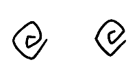

素材名\目\ぐるぐる.gif

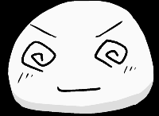

PNGファイルのみで素材を作成する場合でも、動画ファイルをアクセントとして使用できます。

### 動画ファイルのみを使用して素材を作成する場合


各パーツを全て動画ファイルで作成すると、より動きが豊かな立ち絵素材を作成できます。

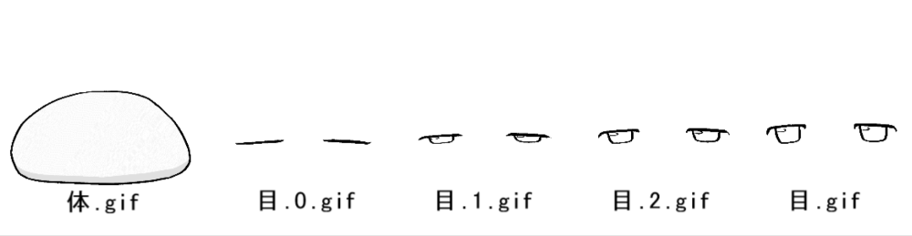

- 同じ画像サイズ
- 同じ動画の長さ
- 同じアニメーションのタイミング

で動画ファイルを作成します。

## よくある質問
### YMM4上で、一覧にパーツが表示されない
アニメーションパーツの場合でも、「パーツ名.0.png」等の他に「パーツ名.png」が必要です。  
また、「パーツ.の名前.png」等、拡張子の他にファイル名に「.」がついているファイルは一覧に表示されません。

### 動画パーツの作り方がわからない
Webpアニメーション画像出力に対応した、2Dアニメーション作成ソフトを利用するのが一般的です。

#### OPTPiX Spritestudio


以下のページで、動く立ち絵素材の作例とサンプルデータが公開されています。
- [OPTPiX Spritestudio Ver.6.6.3 でアニメーションWebPが出力可能になりました！](https://www.webtech.co.jp/blog/products/spritestudio/15630/)