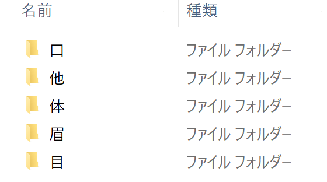
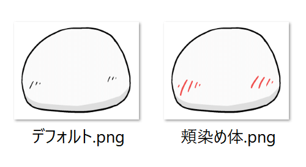

## 対応ファイル形式
画像ファイル・動画ファイルを使用可能です。
- 推奨画像ファイル形式：透過PNG
- 推奨動画ファイル形式：透過GIF / 透過WebP
- 画面サイズ：制限なし

## サンプル素材
zipファイルをダウンロード後、任意の場所に展開（解凍）してお使いください。

### 動く立ち絵 サンプル素材

静止画ファイルをメインに作成したサンプル素材です。  
まばたき・口パク・表情差分に対応。一部アクセントとして動画素材を使用しています。

<Download url="https://object-storage.tyo1.conoha.io/v1/nc_4fac3ef0e6d843249e0ab2f1fc3e8f85/public/%E5%8B%95%E3%81%8F%E7%AB%8B%E3%81%A1%E7%B5%B5%E3%82%B5%E3%83%B3%E3%83%97%E3%83%AB%E7%B4%A0%E6%9D%90.zip">動く立ち絵サンプル素材をダウンロード</Download>

### 動く立ち絵 すごく動くサンプル素材

動画ファイルのみで作成したサンプル素材です。  
まばたき・口パク・表情差分に対応。動画ファイルを使用することで、より豊かな表現が可能です。

<Download url="https://object-storage.tyo1.conoha.io/v1/nc_4fac3ef0e6d843249e0ab2f1fc3e8f85/public/%E3%81%99%E3%81%94%E3%81%8F%E5%8B%95%E3%81%8F%E7%AB%8B%E3%81%A1%E7%B5%B5%E3%82%B5%E3%83%B3%E3%83%97%E3%83%AB%E7%B4%A0%E6%9D%90.zip">すごく動く立ち絵サンプル素材をダウンロード</Download>

## 素材フォルダを作成する
任意の場所にフォルダを作成し、その中に「眉」「目」「口」「体」「他」フォルダを作成します

## レイヤーの並び順
体 → 口 → 目 → 眉 → 他
の順にレイヤーが表示されます。

## 体パーツを作成する
体パーツを「体」フォルダに作成します。
ファイル名は自由です。

## 目パーツを作成する
目パーツを「目」フォルダに作成します。

### まばたきに対応する目パーツ
- パーツ名.0.png：目が閉じた状態
- パーツ名.1.png：中間フレーム（任意の枚数）
- パーツ名.2.png：中間フレーム（任意の枚数）
- 　　　︙
- **パーツ名.png**　：目が開いた状態

という名前で作成します。  
口が開いた状態のパーツ末尾には「.0」等の数字がつかない点に注意してください。

### まばたき非対応パーツ
ファイル名は自由です。

## 口パーツを作成する
口パーツを「口」フォルダに作成します。

### 口パクに対応する口パーツ  
- パーツ名.0.png：目が閉じた状態  
- パーツ名.1.png：中間フレーム（任意の枚数）  
- パーツ名.2.png：中間フレーム（任意の枚数）  
- 　　　︙  
- **パーツ名.png**　：口が開いた状態

という規則でファイルを作成します。  
口が開いた状態のパーツ末尾には「.0」等の数字がつかない点に注意してください。

### 口パク非対応パーツ
ファイル名は自由です

## 眉パーツ / 他パーツを作成する
「眉」フォルダ、「他」フォルダに、眉パーツ、その他のパーツを追加します。
ファイル名は自由です。

## 動画ファイルを使用する
### PNGファイルのみで作成した素材にアクセントとして使用する

素材名\目\ぐるぐる.gif

PNGファイルのみで素材を作成する場合でも、動画ファイルをアクセントとして使用できます。

### 動画ファイルのみを使用して素材を作成する

各パーツを全て動画ファイルで作成すると、より動きが豊かな立ち絵素材を作成できます。

- 同じ画像サイズ
- 同じ動画の長さ
- 同じアニメーションのタイミング

で動画ファイルを作成します。
