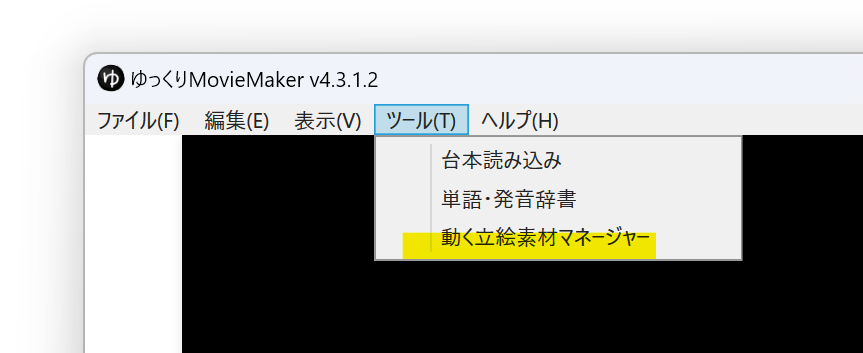
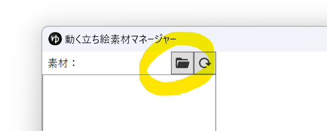
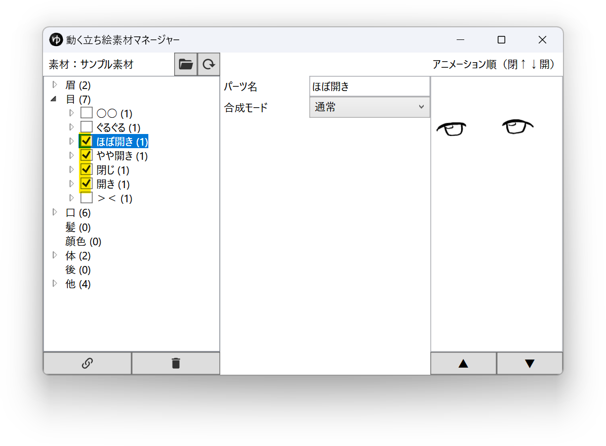
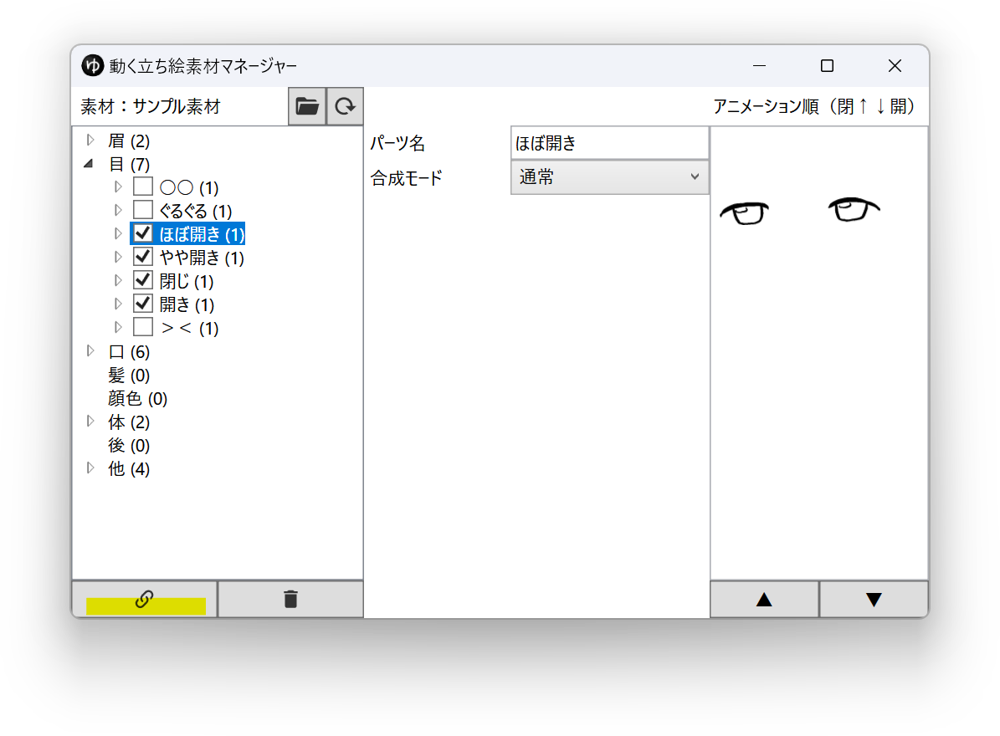
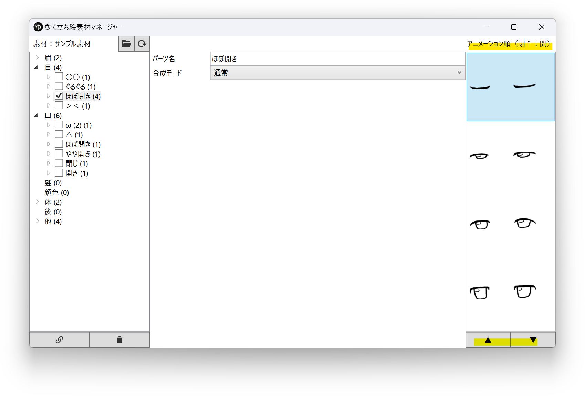
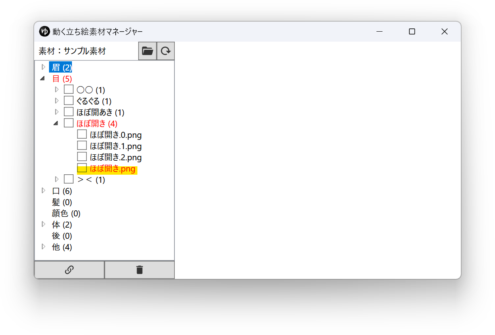
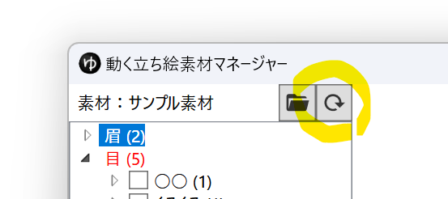

## 動く立ち絵素材マネージャーでできること
- まばたき・口パクアニメーションの設定
- まばたき・口パクアニメーションが正しく設定されているかどうかの確認
- 髪の不透明度の変更
- パーツ名の変更
- 合成モードの変更

## 動く立ち絵素材マネージャーを表示させる
1. [動く立ち絵素材の作り方](./%E5%8B%95%E3%81%8F%E7%AB%8B%E3%81%A1%E7%B5%B5%E7%B4%A0%E6%9D%90%E3%81%AE%E4%BD%9C%E3%82%8A%E6%96%B9.md)を参考にし、「眉」「目」「口」「髪」「顔色」「体」「他」「後」フォルダ内に画像を保存する。
1. *ツール(T)*→*動く立ち絵素材マネージャー*から動く立ち絵素材マネージャーを表示させる。

1. フォルダボタンをクリックし、*1.*で作成した素材フォルダを選択する。

## まばたき・口パクアニメーションを設定する

この操作は**「目」「口」フォルダ内に保存されている画像でのみ利用できます**。

1. [動く立ち絵素材マネージャーを表示し、素材フォルダを読み込む。](#動く立ち絵素材マネージャーを表示させる)
1. 一つのアニメーションとし設定したい画像選択する。

1. クリップボタンをクリックする。

1. *アニメーション順*欄の画像を選択後、*▲* *▼*ボタンをクリックして、上が閉じている状態、下が開いている状態になるように画像を並べ替える。

1. 必要に応じてパーツ名を変更する。

## まばたき・口パクアニメーションが正しく設定されているかどうかを確認する
アニメーションが正しく設定されていないパーツは赤色で表示されます。  
以下の例では「ほぼ開き.png」が不足しているため、「ほぼ開き.png」を追加するか、「ほぼ開き.2.png」を「ほぼ開き.png」にリネームすると正しく設定されます。  
（**ファイル名はエクスプローラー上で変更してください**）

ファイル名の変更後、素材名右側の更新ボタンをクリックすると、ファイル名の変更が反映されます。  
ファイル名が正しく設定されている場合は赤色の表示がなくなります。

## 髪の不透明度を変更する
「眉」を「髪」パーツの手前に表示させたい、眉を半透明で表示させたい場合、「髪」パーツの不透明度を変更します。  
髪の不透明度を0に設定すると眉パーツが髪の手前に表示されます。  
髪の不透明度を0.5等に設定すると、眉パーツが半透明で表示されます。

## パーツ名を変更する
*パーツ名*欄からパーツの名前を変更できます。

## 合成モード欄を変更する
*合成モード*欄から合成モードを変更できます。