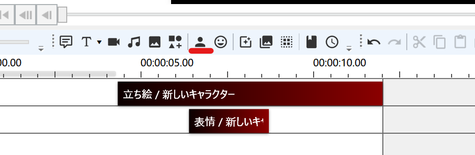

## 症状
キャラクターに立ち絵の設定後、タイムラインにボイスアイテムを追加しても立ち絵が表示されない

## 立ち絵アイテムを追加する
立ち絵を表示するためには、タイムラインに立ち絵アイテムを追加する必要があります。  
ツールバーの「立ち絵アイテム」ボタン（人形アイコン）をクリックし、タイムラインに立ち絵アイテムを追加してください。

## 参考：立ち絵系アイテムの役割
- 立ち絵アイテム（必須）
  - 立ち絵の表示位置や表示タイミングを設定するアイテム
- ボイスアイテムの表情欄
  - 口パクを伴った表情を設定するアイテム
- 表情アイテム
  - 口パクを伴わない表情を設定するアイテム