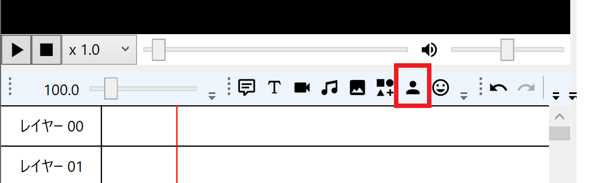
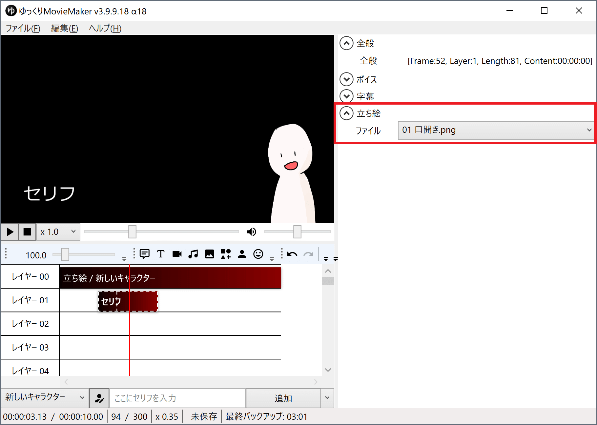
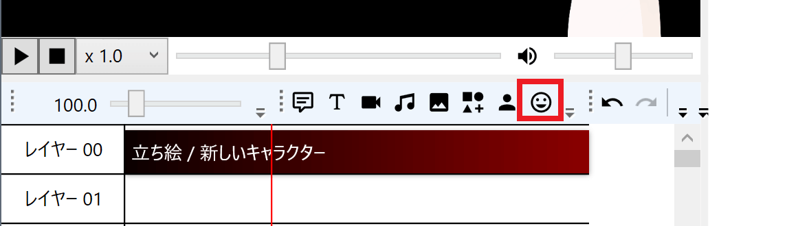
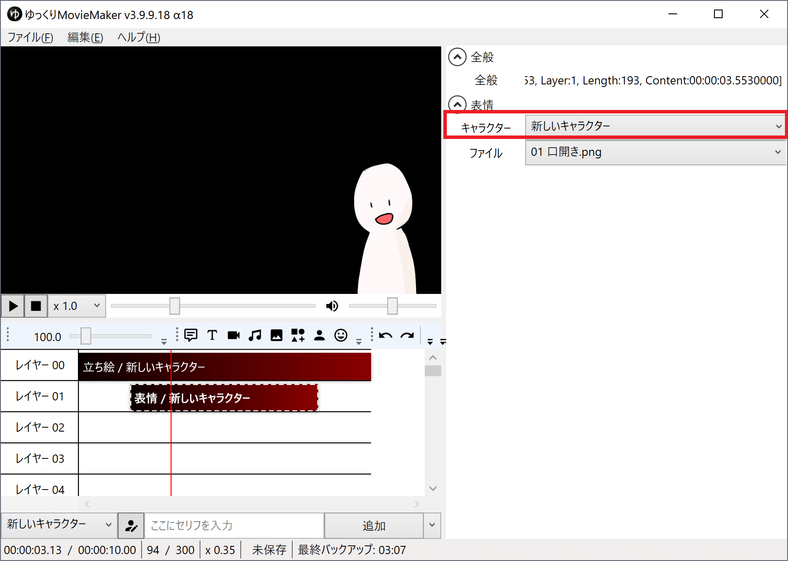
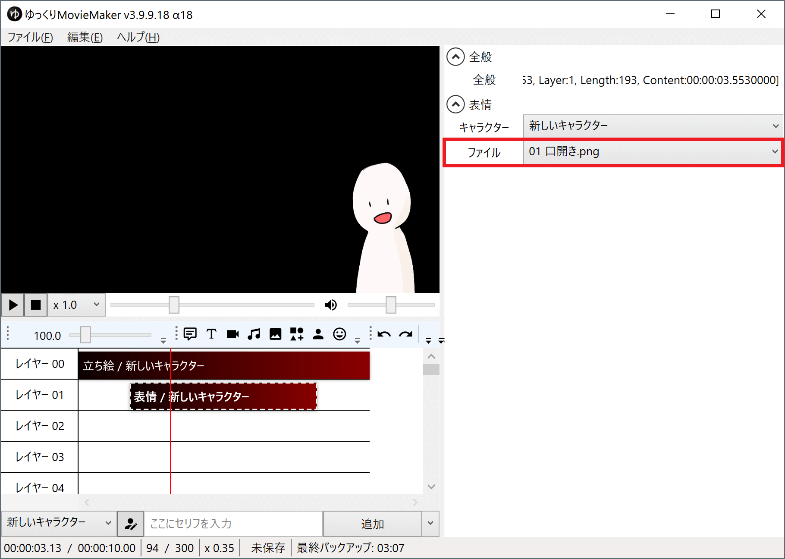

## 立ち絵を設定する
立ち絵機能を使用するために、初期設定する必要があります。

- [シンプル立ち絵の設定方法](../シンプル立ち絵の設定方法/)
- [動く立ち絵の設定方法](../動く立ち絵の設定方法/)

 
## 立ち絵をタイムラインに追加する

立ち絵を表示したい位置に立ち絵アイテムを追加します。

## 立ち絵の表情を変更する
表情の変更方法は２種類あります。
用途によって使い分けしてください。

### 方法１：ボイスアイテム側で指定する
セリフと共に表情を変えたい場合はこちらを使用します。

1. ボイスアイテムを開く
1. 立ち絵欄で表情を指定する

※ シンプル立ち絵を使用した際の表示例。使用する立ち絵の種類によって表示される項目は異なります。

### 方法２：表情アイテム側で指定する
任意のタイミングで表情を変えたい場合はこちらを使用します。

1. 表情アイテムを追加する

1. キャラクターを選択する

1. 表情を指定する

※ シンプル立ち絵を使用した際の表示例。使用する立ち絵の種類によって表示される項目は異なります。