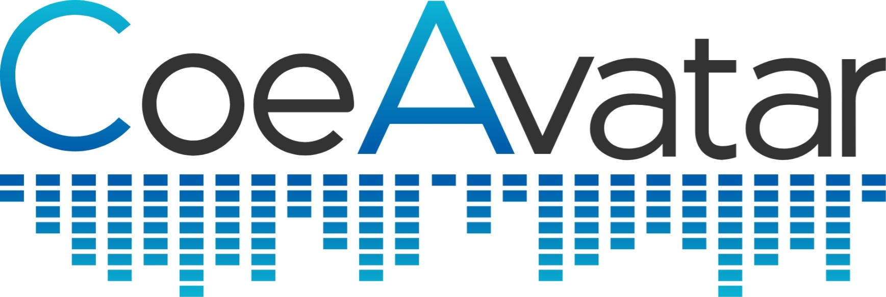
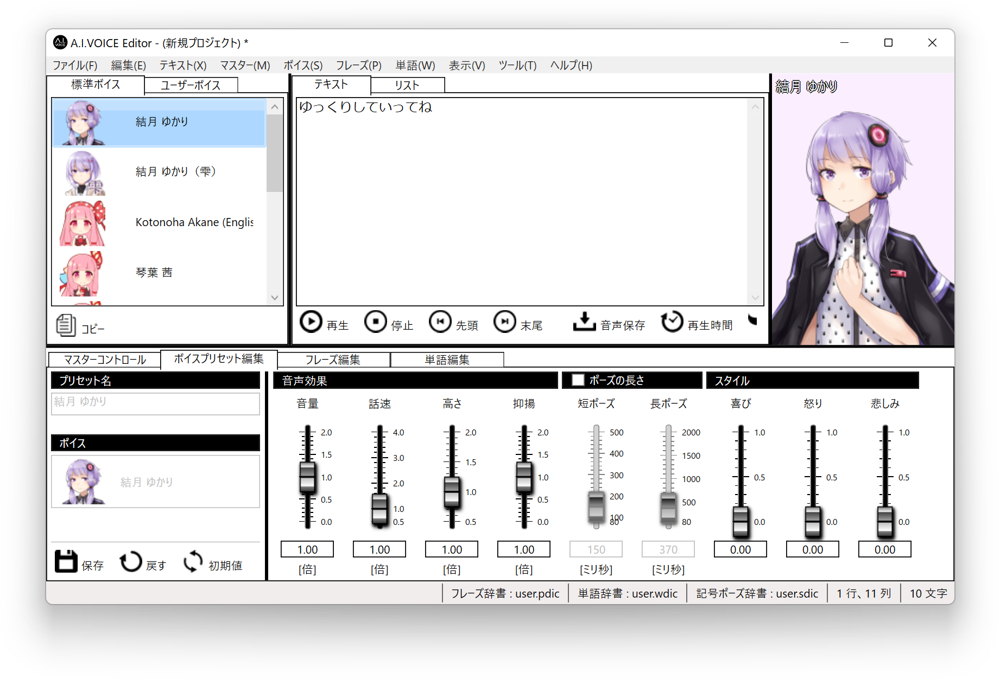
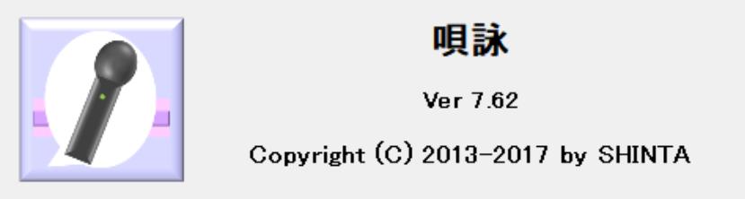

ゆっくり実況プレイ動画用の動画編集ソフト「ゆっくりMovieMaker4」の配布ページです。
YMM3の後継バージョンで、動画出力機能、倍速プレビュー、テンプレート機能等、多くの新機能を実装している他、以前と比べてプレビューの正確性・安定性が向上しています。

## 使用上の注意
- YMM3で作成したプロジェクトファイル（.ymmp）は読み込めません
- Windows 8.1以前、Mac、Linux、ChromeOS、iOS、Android では動作しません
- 本アプリを使用することによって何らかの損害が発生した場合でも、開発者は一切の責任を負わないものとします。自己責任で使用してください。

## 商用利用・広告付き動画について
利用状況によって、別途ライセンスの購入が必要になる場合があります。  
- [商用利用・広告付き動画を投稿したい](./faq/etc/%E5%95%86%E7%94%A8%E5%88%A9%E7%94%A8%E3%83%BB%E5%BA%83%E5%91%8A%E4%BB%98%E3%81%8D%E5%8B%95%E7%94%BB%E3%82%92%E6%8A%95%E7%A8%BF%E3%81%97%E3%81%9F%E3%81%84.md)

## ダウンロード
ニコニコ動画に動画を投稿する場合、動画の親作品に[nc236011](https://commons.nicovideo.jp/material/nc236011)の登録をお願いします。 
- [コンテンツツリーの登録方法](./faq/etc/%E3%82%B3%E3%83%B3%E3%83%86%E3%83%B3%E3%83%84%E3%83%84%E3%83%AA%E3%83%BC%E3%81%AE%E7%99%BB%E9%8C%B2%E6%96%B9%E6%B3%95.md)

<Download url="https://object-storage.tyo1.conoha.io/v1/nc_4fac3ef0e6d843249e0ab2f1fc3e8f85/public/YukkuriMovieMaker4.zip">ゆっくりMovieMaker4をダウンロード</Download>
<Download url="https://object-storage.tyo1.conoha.io/v1/nc_4fac3ef0e6d843249e0ab2f1fc3e8f85/public/YukkuriMovieMaker4_Lite.zip">ゆっくりMovieMaker4 Liteをダウンロード</Download>

- [YMM4 と YMM4Lite の違い](./faq/etc/YMM4Lite.md)
- [「Microsoft Store でアプリを検索しますか？」と表示される](./faq/startup_trouble/%E3%80%8CMicrosoftStore%E3%81%A7%E3%82%A2%E3%83%97%E3%83%AA%E3%82%92%E6%A4%9C%E7%B4%A2%E3%81%97%E3%81%BE%E3%81%99%E3%81%8B%EF%BC%9F%E3%80%8D%E3%81%A8%E8%A1%A8%E7%A4%BA%E3%81%95%E3%82%8C%E3%82%8B.md)
- [「WindowsによってPCが保護されました」と表示される場合](./faq/startup_trouble/%E3%80%8Cwindows%E3%81%AB%E3%82%88%E3%81%A3%E3%81%A6pc%E3%81%8C%E4%BF%9D%E8%AD%B7%E3%81%95%E3%82%8C%E3%81%BE%E3%81%97%E3%81%9F%E3%80%8D%E3%81%A8%E8%A1%A8%E7%A4%BA%E3%81%95%E3%82%8C%E3%82%8B.md)
- [UIの表示が崩れる場合](./faq/ui/ui%e3%81%8c%e6%ad%a3%e3%81%97%e3%81%8f%e8%a1%a8%e7%a4%ba%e3%81%95%e3%82%8c%e3%81%aa%e3%81%84.md)
- [YMM4の過去のバージョンが必要な場合](./%e9%81%8e%e5%8e%bb%e3%81%ae%e3%83%90%e3%83%bc%e3%82%b8%e3%83%a7%e3%83%b3.md)
- [その他、よくある質問](./faq/index.md)

## 不具合を見つけた場合
アプリ内のフィードバックボタン または [お問い合わせページ](../%E3%81%8A%E5%95%8F%E3%81%84%E5%90%88%E3%82%8F%E3%81%9B.md) からご報告をお願いします。

## 外部アプリケーション
YMM4と連携して利用可能な外部アプリの一覧です。
- 利用方法や不具合に関しては各アプリの開発者へお問い合わせください。
- [掲載に関するご連絡はこちら](../%E3%81%8A%E5%95%8F%E3%81%84%E5%90%88%E3%82%8F%E3%81%9B.md)

### ITVOICE

[いたほび](https://twitter.com/iTahobi)さんによって開発されている、フリーの音声合成ソフトです。
VOICEVOX互換の外部連携APIを使用し、YMM4から直接音声を生成できます。  
※細かい利用規約は[ITVOICE公式サイト](http://itvoice.starfree.jp/index.html)をご確認ください。
- [ゆっくりMovieMaker4でITVOICEを使用する](./faq/ゆっくりボイス/ITVOICE.md)

### SHAREVOX

[Yちゃん](https://twitter.com/y_chan_dev)によって開発されている、フリーの音声合成ソフトです。
VOICEVOX互換の外部連携APIを使用し、YMM4から直接音声を生成できます。  
※細かい利用規約は[SHAREVOX公式サイト](https://www.sharevox.app/)をご確認ください。
- [ゆっくりMovieMaker4でSHAREVOXを使用する](./faq/ゆっくりボイス/SHAREVOX.md)

### KuchiPaku

[いぬいぬGames](https://twitter.com/InuInuGames)さんによって開発されている、.labファイルを元にあいうえお口パクを作成するツールです。
- [KuchiPaku](https://github.com/InuInu2022/KuchiPaku)
- [ダウンロードページ](https://github.com/InuInu2022/KuchiPaku/releases)

### f2ft

[うにくま](https://twitter.com/unikuma_sub)さんによって開発されている、YMM4から出力されるexoファイルの縁取りエフェクトをAviUtlスクリプトの縁取りTに置換するプログラムです。  
- [f2ft](https://github.com/unikuma/f2ft)
- [ダウンロードページ](https://github.com/unikuma/f2ft/releases)

### LMROID

LMROIDは[のほしお](https://twitter.com/ssohsn)さんが個人で開発されている、金銭の発生しない趣味の領域で利用可能なフリーの音声合成ソフトです。  
VOICEVOX互換の外部連携APIを使用し、YMM4から直接音声を生成できます。  
※細かい利用規約は[LMROID公式サイト](https://lmroidsoftware.wixsite.com/nhoshio/terms)をご確認ください。
- [ゆっくりMovieMaker4でLMROIDを使用する](./faq/ゆっくりボイス/LMROID.md)

### CoeAvatar

コエステ株式会社の提供するクラウド音声合成サービスです。
外部連携APIを使用し、YMM4から直接音声を生成できます。
- [ゆっくりMovieMaker4でCoeAvatarを使用する](./faq/%E3%82%86%E3%81%A3%E3%81%8F%E3%82%8A%E3%83%9C%E3%82%A4%E3%82%B9/CoeAvatar.md)

### CoeFont

3000種類以上の音声が利用可能なAI音声合成サービスです。  
外部連携APIを使用し、YMM4から直接音声を生成できます。  
「アリアル（通常、喜、怒、哀、楽）」「ミリアル（通常）」を無料でご利用いただけます。  
その他の音声を利用する場合はEnterprise（法人・個人事業主向け）プラン以上の契約が必要となります。
- [ゆっくりMovieMaker4でCoeFontを利用する](./faq/%E3%82%86%E3%81%A3%E3%81%8F%E3%82%8A%E3%83%9C%E3%82%A4%E3%82%B9/CoeFont%E3%82%92%E5%88%A9%E7%94%A8%E3%81%99%E3%82%8B.md)

### A.I.VOICE

A.I.VOICE™は音声合成AITalk®5 の技術を応用した個人利用者向けソフトです。  
外部連携APIを使用し、YMM4から直接音声を生成できます。
- [ゆっくりMovieMaker4でA.I.VOICEを使用する](./faq/ゆっくりボイス/AIVOICE.md)

### COEIROINK

[シロワニさん](https://twitter.com/shirowanisan)によって開発されているフリーの音声合成ソフトです。  
VOICEVOX互換の外部連携APIを使用し、YMM4から直接音声を生成できます。  
※細かい利用規約は[COEIROINK公式サイト](https://coeiroink.com/terms)をご確認ください。
- [ゆっくりMovieMaker4でCOEIROINKを使用する](./faq/ゆっくりボイス/COEIROINK.md)

### OPTPiX SpriteStudio

[動く立ち絵素材](./faq/立ち絵機能/%E5%8B%95%E3%81%8F%E7%AB%8B%E3%81%A1%E7%B5%B5%E7%B4%A0%E6%9D%90%E3%81%AE%E4%BD%9C%E3%82%8A%E6%96%B9.md)で利用可能なwebpアニメーション画像の出力に対応した、無料（※）で利用できる2Dアニメーション制作ツールです。  
※ Starterライセンスの場合。ライセンス条件等は[公式サイト](https://www.webtech.co.jp/spritestudio/purchase.html)をご確認ください。
- [OPTPiX SpriteStudio | ウェブテクノロジ](https://www.webtech.co.jp/spritestudio/index.html)

以下のページで[動く立ち絵素材](./faq/立ち絵機能/%E5%8B%95%E3%81%8F%E7%AB%8B%E3%81%A1%E7%B5%B5%E7%B4%A0%E6%9D%90%E3%81%AE%E4%BD%9C%E3%82%8A%E6%96%B9.md)の作例と、サンプルデータが公開されています。
- [OPTPiX Spritestudio Ver.6.6.3 でアニメーションWebPが出力可能になりました！](https://www.webtech.co.jp/blog/products/spritestudio/15630/)

### VOICEVOX

[ヒホ](https://twitter.com/hiho_karuta)さんが主導して開発されている、商用・非商用問わず無料（※）で利用できるテキスト読み上げソフトウェアです。  
外部連携APIを使用し、YMM4から直接音声を生成できます。  
※細かい利用規約は[VOICEVOX公式サイト](https://voicevox.hiroshiba.jp/)をご確認ください。
- [ゆっくりMovieMaker4でVOICEVOXを使用する](./faq/ゆっくりボイス/VOICEVOX%E3%82%92%E4%BD%BF%E7%94%A8%E3%81%99%E3%82%8B.md)

### CeVIO AI / CeVIO Creative Studio 7

外部連携APIを使用し、YMM4から直接音声を生成できます。
- [ゆっくりMovieMaker4でCeVIOを使用する](./faq/ゆっくりボイス/CeVIO%E3%82%92%E4%BD%BF%E7%94%A8%E3%81%99%E3%82%8B.md)

### 唄詠

[SHINTA](https://twitter.com/shinta0806)さんによって開発されている、UTAU音源を使用したテキスト音声合成ソフトウェアです。  
外部連携APIを使用し、YMM4から直接音声を生成できます。
- [唄詠 | 翔星ワールド](http://shinta.coresv.com/software/utayomi_jpn/)

### その他クラウド系音声合成サービス
 - [Google Cloud Text-to-Speech](./faq/ゆっくりボイス/GoogleCloudTTS.md)
 - [Amazon Polly](./faq/ゆっくりボイス/AmazonPolly.md)
 - [Microsoft Azure Text-to-Speech](./faq/ゆっくりボイス/MicrosoftAzureTTS.md)

### その他
- [過去掲載していた開発終了済みの外部ツールはこちら](#謝辞)

## 動作環境
- Windows 10, Windows 11
- .NET Framework 4.7.2 以上
- DirectX 11 / Shader Model 5.0 対応GPU
  - [※ DirectX10世代のGPUでは一部のエフェクトが機能しません](./faq/effect/2769-2.md)

## 対応ファイル形式
- 動画ファイル
  - .avi .mp4 .wmv .mov [他](https://docs.microsoft.com/en-us/windows/win32/medfound/supported-media-formats-in-media-foundation?redirectedfrom=MSDN)
- アニメーション画像ファイル
  - .gif .webp ※.webpはWin10 1809以降
- 画像ファイル
  - .bmp .jpg .png .gif [他](https://docs.microsoft.com/en-us/windows/win32/wic/-wic-about-windows-imaging-codec?redirectedfrom=MSDN#wpfc_codecs)
- 音声ファイル
  - .wav .mp3 [他](https://docs.microsoft.com/en-us/windows/win32/medfound/supported-media-formats-in-media-foundation?redirectedfrom=MSDN)
- 立ち絵
  - [シンプル立ち絵](./faq/立ち絵機能/%E3%82%B7%E3%83%B3%E3%83%97%E3%83%AB%E7%AB%8B%E3%81%A1%E7%B5%B5%E3%81%AE%E8%A8%AD%E5%AE%9A%E6%96%B9%E6%B3%95.md)
  - [動く立ち絵](./faq/立ち絵機能/%E5%8B%95%E3%81%8F%E7%AB%8B%E3%81%A1%E7%B5%B5%E3%81%AE%E8%A8%AD%E5%AE%9A%E6%96%B9%E6%B3%95.md)
- サードパーティー製音声合成ソフト
  - [A.I.VOICE](./faq/ゆっくりボイス/AIVOICE.md)
  - [CeVIO CS7 / CeVIO AI](./faq/ゆっくりボイス/CeVIO%E3%82%92%E4%BD%BF%E7%94%A8%E3%81%99%E3%82%8B.md)
  - [CoeAvatar](./faq/ゆっくりボイス/CoeAvatar.md)
  - [CoeFont](./faq/ゆっくりボイス/CoeFont%E3%82%92%E5%88%A9%E7%94%A8%E3%81%99%E3%82%8B.md)
  - [COEIROINK](./faq/ゆっくりボイス/COEIROINK.md)
  - [LMROID](./faq/ゆっくりボイス/LMROID.md)
  - [SHAREVOX](./faq/ゆっくりボイス/SHAREVOX.md)
  - [VOICEVOX](./faq/ゆっくりボイス/VOICEVOX%E3%82%92%E4%BD%BF%E7%94%A8%E3%81%99%E3%82%8B.md)
  - [唄詠](http://shinta.coresv.com/software/utayomi_jpn/)
  - [Google Cloud Text-to-Speech](./faq/ゆっくりボイス/GoogleCloudTTS.md)
  - [Amazon Polly](./faq/ゆっくりボイス/AmazonPolly.md)
  - [Microsoft Azure Text-to-Speech](./faq/ゆっくりボイス/MicrosoftAzureTTS.md)
  - その他SAPI系音声合成エンジン
- 利用可能なアドオン
  - [AV1 Video Extension](https://www.microsoft.com/ja-jp/p/av1-video-extension-beta/9mvzqvxjbq9v)
  - [HEVC ビデオ拡張機能](https://www.microsoft.com/ja-jp/p/hevc-video-extensions-from-device-manufacturer/9n4wgh0z6vhq)
  - [MPEG-2 ビデオ拡張機能](https://www.microsoft.com/ja-jp/p/mpeg-2-%E3%83%93%E3%83%87%E3%82%AA%E6%8B%A1%E5%BC%B5%E6%A9%9F%E8%83%BD/9n95q1zzpmh4)
  - [VP9 ビデオ拡張機能](https://www.microsoft.com/ja-jp/p/vp9-%E3%83%93%E3%83%87%E3%82%AA%E6%8B%A1%E5%BC%B5%E6%A9%9F%E8%83%BD/9n4d0msmp0pt)
  - [Web メディア拡張機能](https://www.microsoft.com/ja-jp/p/web-%E3%83%A1%E3%83%87%E3%82%A3%E3%82%A2%E6%8B%A1%E5%BC%B5%E6%A9%9F%E8%83%BD/9n5tdp8vcmhs)
  - [HEIF 画像拡張機能](https://www.microsoft.com/ja-jp/p/heif-%E7%94%BB%E5%83%8F%E6%8B%A1%E5%BC%B5%E6%A9%9F%E8%83%BD/9pmmsr1cgpwg)
  - [Raw Image Extension](https://www.microsoft.com/ja-jp/p/raw-image-extension/9nctdw2w1bh8)
  - [Webp 画像拡張機能](https://www.microsoft.com/ja-jp/p/webp-%E7%94%BB%E5%83%8F%E6%8B%A1%E5%BC%B5%E6%A9%9F%E8%83%BD/9pg2dk419drg)

## 使用ライブラリ等
### AquesTalk1 / AquesTalk2 / AquesTalk10
ゆっくりMovieMakerは、(株)アクエストの音声合成ライブラリAquesTalkを使用しており、その著作権は同社に帰属します。  
営利目的での使用は当該ライブラリの使用ライセンスが必要になります。  
https://www.a-quest.com/  

### AI.Talk.Editor.Api
Copyright (c) AI Inc.  
利用には別途 A.I.VOICE の購入が必要です。  
https://aivoice.jp/

### AviUtl
Copyright (c) KENくん  
利用には別途 AviUtl 及び 拡張編集プラグイン のインストールが必要です。  
http://spring-fragrance.mints.ne.jp/aviutl/

### CeVIO.Talk.RemoteService.Talker
Copyright (c) CeVIO  
利用には別途 CeVIO CS7 または CeVIO AI の購入が必要です。  
http://cevio.jp/  
  
音声データやキャラクターの利用について  
http://cevio.jp/commercial/

### CoeAvatar 外部連携API
Copyright (c) 2022 Coestation Inc.  
https://coeavatar.com/

### CoeFont 外部連携API
Copyright (c) 2021 CoeFont Co.,Ltd.All Rights Reserved.  
動画を公開する際は、「Voiced by [https://CoeFont.cloud](https://CoeFont.cloud)」というライセンス表記が必要です。  
差別目的、誹謗中傷目的、公序良俗に反する目的での利用は禁じられています。  
https://coefont.cloud/

### COEIROINK 外部連携API
Copyright (c) 2021 shirowanisan  
利用には別途COEIROINKのインストールが必要です。  
利用条件等に関してはCOEIROINKアプリ内のヘルプをご確認ください。  
https://coeiroink.com/

### ITVOICE 外部連携API
Copyright (c) 2022 いたほび  
利用には別途ITVOICEのインストールが必要です。  
利用条件等に関してはITVOICEアプリ内のヘルプをご確認ください。  
http://itvoice.starfree.jp/

### LMROID 外部連携API
Copyright (c) 2022 nohoshio  
利用には別途LMROIDのインストールが必要です。  
利用条件等に関してLMROIDアプリ内のヘルプをご確認ください  
https://lmroidsoftware.wixsite.com/nhoshio/%E5%88%A9%E7%94%A8%E8%A6%8F%E7%B4%84

### SHAREVOX 外部連携API
Copyright (c) 2022 y-chan  
利用には別途SHAREVOXのインストールが必要です。  
利用条件等に関してSHAREVOXアプリ内のヘルプをご確認ください  
https://www.sharevox.app/

### VOICEVOX 外部連携API
Copyright (c) 2021 Hiroshiba Kazuyuki  
利用には別途VOICEVOXのインストールが必要です。  
利用条件等に関してはVOICEVOXアプリ内のヘルプをご確認ください。  
https://voicevox.hiroshiba.jp/

### .NET Runtime / MIT License
Copyright (c) .NET Foundation and Contributors  
https://github.com/dotnet/runtime

### AWSSDK.Polly / Apache 2.0
© 2022, Amazon Web Services, Inc. or its affiliates.All rights reserved.  
https://github.com/aws/aws-sdk-net/

### CsvHelper / MS-PL
© 2009-2021 Josh Close
https://joshclose.github.io/CsvHelper/

### CsWin32 / MIT License
Copyright (c) Microsoft Corporation  
https://github.com/microsoft/CsWin32

### DynamicAero2 / MIT License
Copyright (c) ManjuSummoner.  
Theme styles and templates was converted based on dotnet / wpf repository.  
Copyright (c) .NET Foundation and Contributors.  
https://github.com/manju-summoner/DynamicAero2

### FFmpeg / LGPL v3
(c) 2000-2020 the FFmpeg developers  
https://ffmpeg.org/

### FFmpeg.AutoGen / LGPL v3
Copyright © Ruslan Balanukhin 2020 All rights reserved.  
https://github.com/Ruslan-B/FFmpeg.AutoGen

### Google.Cloud.TextToSpeech.V1 / Apache 2.0
© 2020 Google LLC All rights reserved.  
https://github.com/googleapis/google-cloud-dotnet

### IPADic
Copyright 2000, 2001, 2002, 2003 Nara Institute of Science and Technology. All Rights Reserved.  
http://taku910.github.io/mecab/

### Json.NET / MIT License
Copyright (c) 2007 James Newton-King  
https://www.newtonsoft.com/json

### LZMA SDK / Public domain
https://www.7-zip.org/sdk.html

### Material Design Icons / SIL Open Font License, Version 1.1
Copyright (c) 2014, Austin Andrews (http://materialdesignicons.com/), with Reserved Font Name Material Design Icons.  
Copyright (c) 2014, Google (http://www.google.com/design/) uses the license at https://github.com/google/material-design-icons/blob/master/LICENSE  
https://materialdesignicons.com/

### Math.NET Numerics / MIT License
Copyright (c) 2002-2021 Math.NET  
https://github.com/mathnet/mathnet-numerics

### Microsoft.CognitiveServices.Speech
Copyright (c) Microsoft Corporation. All rights reserved.
https://www.nuget.org/packages/Microsoft.CognitiveServices.Speech/

### NMeCab / LGPL v2.1
NMeCab / Copyright(C) Tsuyoshi Komuta  
MeCab / Copyright(C) Taku Kudo and Nippon Telegraph and Telephone Corporation  
MeCab.DotNet / Copyright(C) Kouji Matsui  
https://ja.osdn.net/projects/nmecab/  
http://taku910.github.io/mecab/

### ReactiveProperty / MIT License
Copyright (c) 2018 neuecc, xin9le, okazuki  
https://github.com/runceel/ReactiveProperty

### SharpCompress / MIT License
Copyright (c) 2014  Adam Hathcock  
https://github.com/adamhathcock/sharpcompress

### SharpGenTools / MIT License
Copyright (c) 2010-2017 Alexandre Mutel, 2017 Jeremy Koritzinsky  
https://github.com/SharpGenTools/SharpGenTools

### UniDic / BSD
Copyright (c) 2011-2017, The UniDic Consortium All rights reserved.  
https://unidic.ninjal.ac.jp/

### Vortice.Windows / MIT License
Copyright (c) 2019 Amer Koleci and Vortice contributors.  
https://github.com/amerkoleci/Vortice.Windows

## 謝辞
過去、以下の方々にYMM4用の外部ツールを公開していただいていました。  

- 台本読み込み機能を提供する外部ツール「コピペイラーズ」 / [Programer-D](https://twitter.com/Programer_D) 様
- 台本読み込み機能を提供するVBAを用いたExcelマクロ / [ゆっくり亭](https://twitter.com/Tamaji1234) 様

長期間におよぶ外部ツールの公開・開発ありがとうございました。