<YMM4Screenshot/>

ゆっくり実況プレイ動画用の動画編集ソフト「ゆっくりMovieMaker4」の配布ページです。
YMM3の後継バージョンで、動画出力機能、倍速プレビュー、テンプレート機能等、多くの新機能を実装している他、以前と比べてプレビューの正確性・安定性が向上しています。

## 使用上の注意
- YMM3で作成したプロジェクトファイル（.ymmp）は読み込めません
- Windows 8.1以前、Mac、Linux、ChromeOS、iOS、Android では動作しません
- 本アプリ、外部ツール及びプラグインを使用することによって何らかの損害が発生した場合でも、開発者は一切の責任を負わないものとします。自己責任で使用してください。

## 商用利用・広告付き動画について
利用状況によって、別途ライセンスの購入が必要になる場合があります。  
- [商用利用・広告付き動画を投稿したい](./faq/etc/%E5%95%86%E7%94%A8%E5%88%A9%E7%94%A8%E3%83%BB%E5%BA%83%E5%91%8A%E4%BB%98%E3%81%8D%E5%8B%95%E7%94%BB%E3%82%92%E6%8A%95%E7%A8%BF%E3%81%97%E3%81%9F%E3%81%84.md)

## 学校の授業や部活動での利用について
利用状況によって、別途ライセンスの購入が必要になる場合があります。  
- [学校の授業や部活動で利用したい](./faq/etc/%E5%AD%A6%E6%A0%A1%E3%81%AE%E6%8E%88%E6%A5%AD%E3%82%84%E9%83%A8%E6%B4%BB%E5%8B%95%E3%81%A7%E5%88%A9%E7%94%A8%E3%81%97%E3%81%9F%E3%81%84.md)

## ダウンロード
ニコニコ動画に動画を投稿する場合、動画の親作品に[nc236011](https://commons.nicovideo.jp/material/nc236011)の登録をお願いします。 
- [コンテンツツリーの登録方法](./faq/etc/%E3%82%B3%E3%83%B3%E3%83%86%E3%83%B3%E3%83%84%E3%83%84%E3%83%AA%E3%83%BC%E3%81%AE%E7%99%BB%E9%8C%B2%E6%96%B9%E6%B3%95.md)

<Download url="https://object-storage.tyo1.conoha.io/v1/nc_4fac3ef0e6d843249e0ab2f1fc3e8f85/public/YukkuriMovieMaker_v4.zip">ゆっくりMovieMaker4をダウンロード</Download>
<Download url="https://object-storage.tyo1.conoha.io/v1/nc_4fac3ef0e6d843249e0ab2f1fc3e8f85/public/YukkuriMovieMaker_v4_Lite.zip">ゆっくりMovieMaker4 Liteをダウンロード</Download>

- [YMM4 と YMM4Lite の違い](./faq/etc/YMM4Lite.md)
- [「スマート アプリ コントロールが安全出ない可能性のアプリをブロックしました」と表示される](./faq/startup_trouble/SmartAppControl.md)
- [「Microsoft Store でアプリを検索しますか？」と表示される](./faq/startup_trouble/%E3%80%8CMicrosoftStore%E3%81%A7%E3%82%A2%E3%83%97%E3%83%AA%E3%82%92%E6%A4%9C%E7%B4%A2%E3%81%97%E3%81%BE%E3%81%99%E3%81%8B%EF%BC%9F%E3%80%8D%E3%81%A8%E8%A1%A8%E7%A4%BA%E3%81%95%E3%82%8C%E3%82%8B.md)
- [「WindowsによってPCが保護されました」と表示される場合](./faq/startup_trouble/%E3%80%8Cwindows%E3%81%AB%E3%82%88%E3%81%A3%E3%81%A6pc%E3%81%8C%E4%BF%9D%E8%AD%B7%E3%81%95%E3%82%8C%E3%81%BE%E3%81%97%E3%81%9F%E3%80%8D%E3%81%A8%E8%A1%A8%E7%A4%BA%E3%81%95%E3%82%8C%E3%82%8B.md)
- [WindowsセキュリティによってYMM4の起動がブロックされる場合](./faq/startup_trouble/WindowsセキュリティによってYMM4の起動がブロックされる.md)
- [YMM4の過去のバージョンが必要な場合](./%e9%81%8e%e5%8e%bb%e3%81%ae%e3%83%90%e3%83%bc%e3%82%b8%e3%83%a7%e3%83%b3.md)
- [その他、よくある質問](./faq/index.md)

## 不具合を見つけた場合
アプリ内のフィードバックボタン または [お問い合わせページ](../%E3%81%8A%E5%95%8F%E3%81%84%E5%90%88%E3%82%8F%E3%81%9B.md) からご報告をお願いします。

## 対応している音声合成ソフト・サービス
### A.I.VOICE
<AIVOICECards limit="5"/>

A.I.VOICE™は音声合成AITalk®5 の技術を応用した個人利用者向けソフトです。  
- [ゆっくりMovieMaker4でA.I.VOICEを使用する](./faq/ゆっくりボイス/AIVOICE.md)

### AivisSpeech
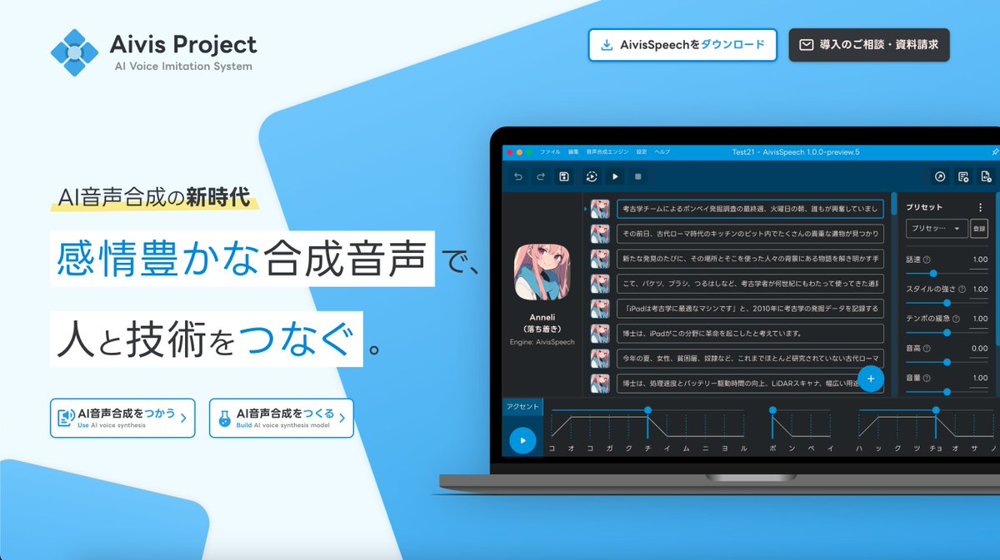
JPchain社によって提供されている、フリーの音声合成ソフトです。
- [ゆっくりMovieMaker4でAivisSpeechを使用する](./faq/%E3%82%86%E3%81%A3%E3%81%8F%E3%82%8A%E3%83%9C%E3%82%A4%E3%82%B9/AivisSpeech.md)

### Amazon Polly
Amazonが提供するクラウド音声合成サービスです。  
- [ゆっくりMovieMaker4でAmazon Pollyを使用する](./faq/ゆっくりボイス/AmazonPolly.md)

### AquesTalk1 / AquesTalk2 / AquesTalk10
ゆっくりボイスで知られる株式会社アクエストが提供する音声合成ライブラリです。  
YMM4にデフォルトで組み込まれており、YMM4Liteではプラグインとして利用可能です。   
営利目的での使用は当該ライブラリの使用ライセンスが必要になります。  
- [商用利用・広告付き動画を投稿したい](./faq/etc/%E5%95%86%E7%94%A8%E5%88%A9%E7%94%A8%E3%83%BB%E5%BA%83%E5%91%8A%E4%BB%98%E3%81%8D%E5%8B%95%E7%94%BB%E3%82%92%E6%8A%95%E7%A8%BF%E3%81%97%E3%81%9F%E3%81%84/)

### CeVIO AI / CeVIO Creative Studio 7
<CeVIOCards limit="5"/>

CeVIOプロジェクトが開発する音声合成ソフトです。  
- [ゆっくりMovieMaker4でCeVIOを使用する](./faq/ゆっくりボイス/CeVIO%E3%82%92%E4%BD%BF%E7%94%A8%E3%81%99%E3%82%8B.md)

### CoeFont
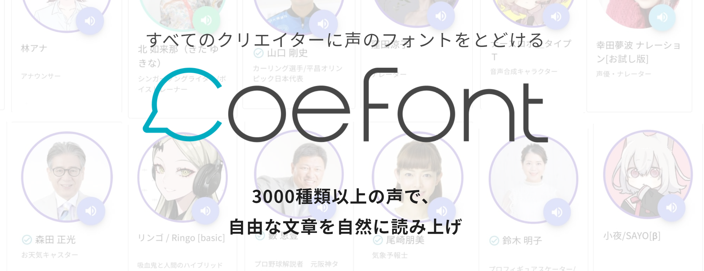
3000種類以上の音声が利用可能なAI音声合成サービスです。  
「アリアル（通常、喜、怒、哀、楽）」「ミリアル（通常）」を無料でご利用いただけます。  
その他の音声を利用する場合はEnterprise（法人・個人事業主向け）プラン以上の契約が必要となります。
- [ゆっくりMovieMaker4でCoeFontを利用する](./faq/%E3%82%86%E3%81%A3%E3%81%8F%E3%82%8A%E3%83%9C%E3%82%A4%E3%82%B9/CoeFont%E3%82%92%E5%88%A9%E7%94%A8%E3%81%99%E3%82%8B.md)

### COEIROINK

[シロワニさん](https://twitter.com/shirowanisan)によって開発されているフリーの音声合成ソフトです。  
※細かい利用規約は[COEIROINK公式サイト](https://coeiroink.com/terms)をご確認ください。
- [ゆっくりMovieMaker4でCOEIROINKを使用する](./faq/ゆっくりボイス/COEIROINK.md)

### Google Cloud Text-to-Speech
Googleが提供するクラウド音声合成サービスです。  
- [ゆっくりMovieMaker4でGoogle Cloud Text-to-Speechを使用する](./faq/ゆっくりボイス/GoogleCloudTTS.md)

### ITVOICE

[いたほび](https://twitter.com/iTahobi)さんによって開発されている、フリーの音声合成ソフトです。  
※細かい利用規約は[ITVOICE公式サイト](http://itvoice.starfree.jp/index.html)をご確認ください。
- [ゆっくりMovieMaker4でITVOICEを使用する](./faq/ゆっくりボイス/ITVOICE.md)

### Koemotion / Koeiromap
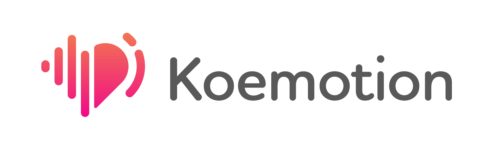
rinna株式会社によって提供されている、音声合成サービスです。  
利用には別途APIキーの取得が必要です。  
- [ゆっくりMovieMaker4でKoemotion / Koeiromapを使用する](./faq/ゆっくりボイス/Koemotion.md)

### LMROID

LMROIDは[のほしお](https://twitter.com/ssohsn)さんが個人で開発されている、金銭の発生しない趣味の領域で利用可能なフリーの音声合成ソフトです。  
※細かい利用規約は[LMROID公式サイト](https://lmroidsoftware.wixsite.com/nhoshio/terms)をご確認ください。
- [ゆっくりMovieMaker4でLMROIDを使用する](./faq/ゆっくりボイス/LMROID.md)

### Microsoft Azure Text-to-Speech
Microsoftが提供するクラウド音声合成サービスです。  
- [ゆっくりMovieMaker4でMicrosoft Azure Text-to-Speechを使用する](./faq/ゆっくりボイス/MicrosoftAzureTTS.md)

### OpenAI Text-to-Speech
OpenAI社によって提供されている、音声合成サービスです。  
利用には別途APIキーが必要です。  
- [ゆっくりMovieMaker4でOpenAI TTSを使用する](./faq/ゆっくりボイス/OpenAI_TTS.md)

### SAPI
SAPIに対応している音声合成エンジンを利用可能です。  
Windowsにデフォルトで搭載されています。  
- [SAPIの声質を追加する](./faq/ゆっくりボイス/SAPI5の声質を追加する.md)

### SHAREVOX

[Yちゃん](https://twitter.com/y_chan_dev)によって開発されている、フリーの音声合成ソフトです。  
※細かい利用規約は[SHAREVOX公式サイト](https://www.sharevox.app/)をご確認ください。
- [ゆっくりMovieMaker4でSHAREVOXを使用する](./faq/ゆっくりボイス/SHAREVOX.md)

### Style-Bert-VITS2
Style-Bert-VITS2は、[litagin02](https://github.com/litagin02)さんによって開発されている音声合成ソフトです。
外部連携APIを使用し、YMM4から直接音声を生成できます。
- [Style-Bert-VITS2の音声を利用する](./faq/ゆっくりボイス/Style-Bert-VITS2.md)

### TALQu3 PRO
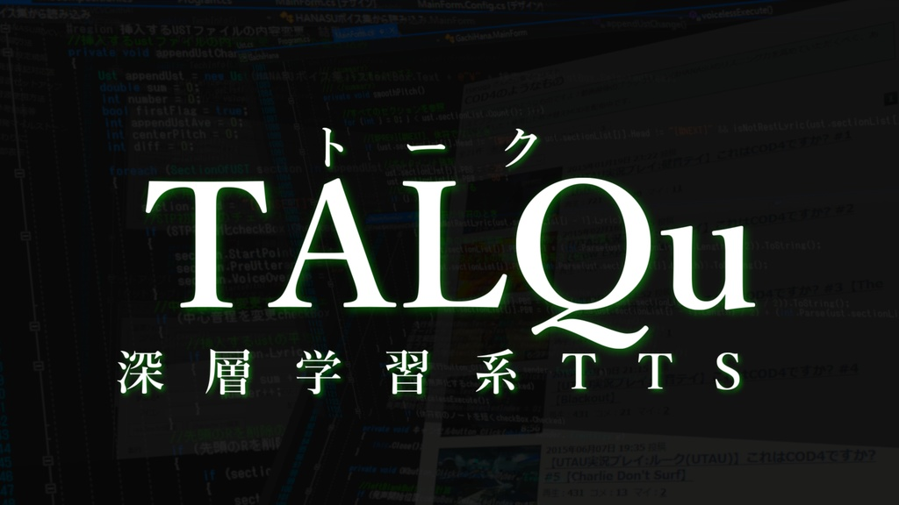
[Haruqa](https://twitter.com/niconicoHaruqa)さんによって[Haruqa｜PixivFANBOX](https://www.fanbox.cc/@haruqa)支援者向けに公開されている音声合成ソフトです。  
- [ゆっくりMovieMaker4でTALQu3 PROを使用する](./faq/ゆっくりボイス/TALQu.md)

### VOICEPEAK
<VOICEPEAKCards limit="5"/>

株式会社AHSとDreamtonics株式会社によって共同開発された、音声合成ソフトです。  
- [ゆっくりMovieMaker4でVOICEPEAKを使用する](./faq/ゆっくりボイス/VOICEPEAK.md)

### VOICEVOX
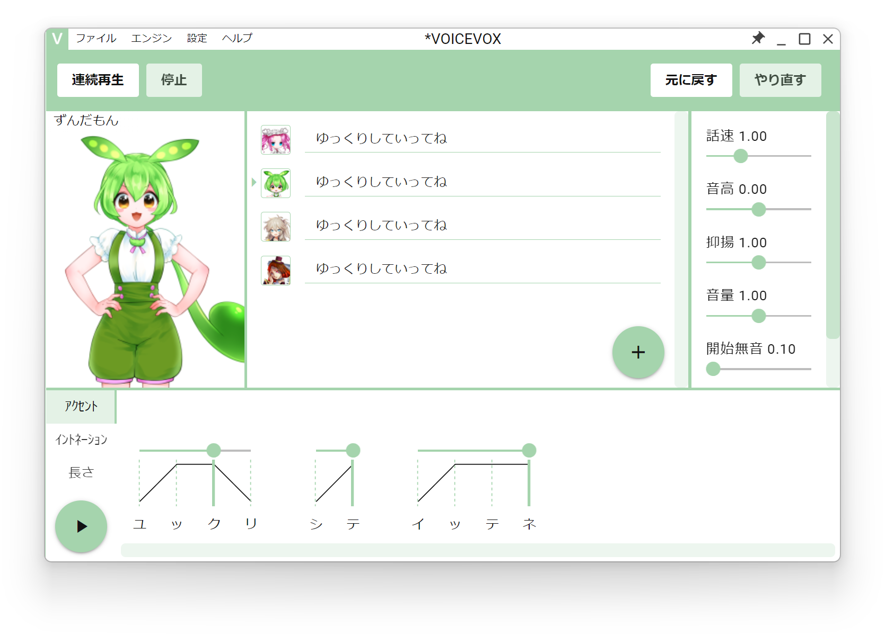
[ヒホ](https://twitter.com/hiho_karuta)さんが主導して開発されている、商用・非商用問わず無料（※）で利用できるテキスト読み上げソフトウェアです。  
※細かい利用規約は[VOICEVOX公式サイト](https://voicevox.hiroshiba.jp/)をご確認ください。
- [ゆっくりMovieMaker4でVOICEVOXを使用する](./faq/ゆっくりボイス/VOICEVOX%E3%82%92%E4%BD%BF%E7%94%A8%E3%81%99%E3%82%8B.md)

### VOICEVOX Nemo
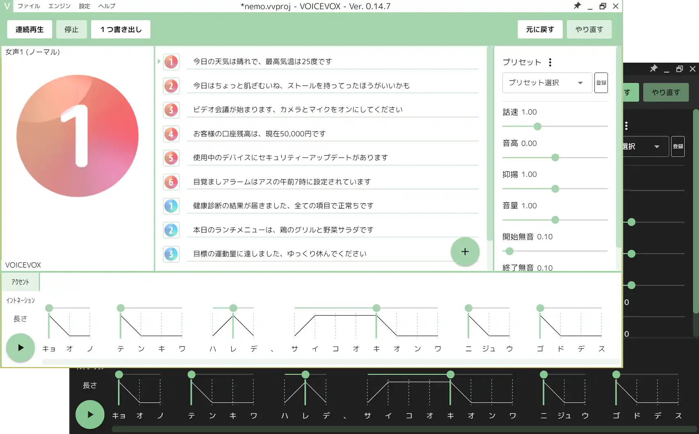
[ヒホ](https://twitter.com/hiho_karuta)さんが主導して開発されている、商用・非商用問わず無料（※）で利用できるテキスト読み上げソフトウェアです。  
※細かい利用規約は[VOICEVOX Nemo公式サイト](https://voicevox.hiroshiba.jp/nemo/)をご確認ください。
- [ゆっくりMovieMaker4でVOICEVOX Nemoを使用する](./faq/ゆっくりボイス/VOICEVOXNemo.md)

### にじボイス
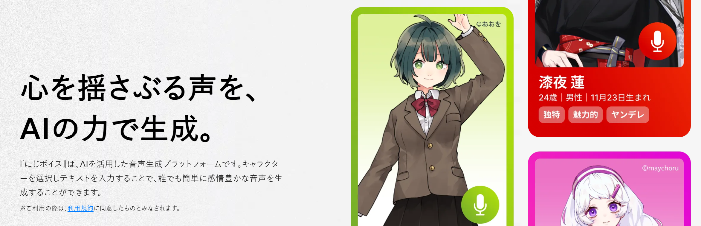
[にじボイス](https://nijivoice.com/)は株式会社Algomaticによって開発されている音声合成サービスです。  
外部連携APIを使用し、YMM4から直接音声を生成できます。  
利用には別途アカウントの作成とクレジットの購入が必要です。（初回5000文字無料）  
※細かい利用規約は[にじボイス公式サイト](https://nijivoice.com/terms)をご確認ください。
- [ゆっくりMovieMaker4でにじボイスを使用する](./faq/ゆっくりボイス/NijiVoice.md)

### よみてのれゐ
<Flex>
    <DLsiteCard store="home" item="RJ376955"/>
</Flex>

よみてプログラムによって開発された音声合成ソフトです。  
日本の同人活動でのみ商用利用可能なライセンスが設定されています。  
- [ゆっくりMovieMaker4でよみてのれゐを使用する](./faq/ゆっくりボイス/YomiteProgram.md)

### 唄詠２
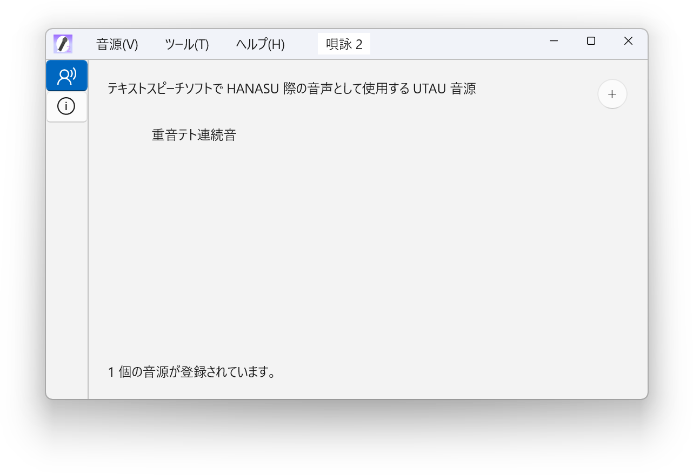
[SHINTA](https://twitter.com/shinta0806)さんによって開発されている、UTAU音源を使用したテキスト音声合成ソフトウェアです。  
- [唄詠 | 翔星ワールド](https://shinta.coresv.com/software/utayomi2-ja-jp/)

## 外部アプリケーション
YMM4と連携して利用可能な外部アプリ・サービスの一覧です。

### 字幕翻訳効率化
[hiroチャンネル](https://x.com/hiro15409443_2)によって開発されている、字幕翻訳ツールです。  
YMM4が出力するexoファイルをsbv形式の字幕ファイルに変換することができるほか、自動翻訳機能で動画を多言語字幕に対応させることが可能です。
- [字幕翻訳効率化](https://www.hirochhep.com/contentpage.php?ID=SO007)

### MaterialFinder
[けやき依音](https://twitter.com/Keyaki_Ion)さんによって開発されているツールです。  
YMM4のプロジェクトファイルから使用している素材ファイルのパスを一括で取得することができます。
- [Material_Finder](https://github.com/KeyakiIon/Material_Finder)

### RPPtoEXO v2.0
[がれっく](https://twitter.com/Garec_)さんによって開発されている音MAD補助用プログラムです。  
REAPERのプロジェクトファイル上のメディアアイテムの位置やMIDIファイルの音符情報をもとにYMM4用のテンプレートを生成する機能が実装されています。  
- [RPPtoEXO v2.0](https://scrapbox.io/Garech/RPPtoEXO_v2.0)

### AoiSupport
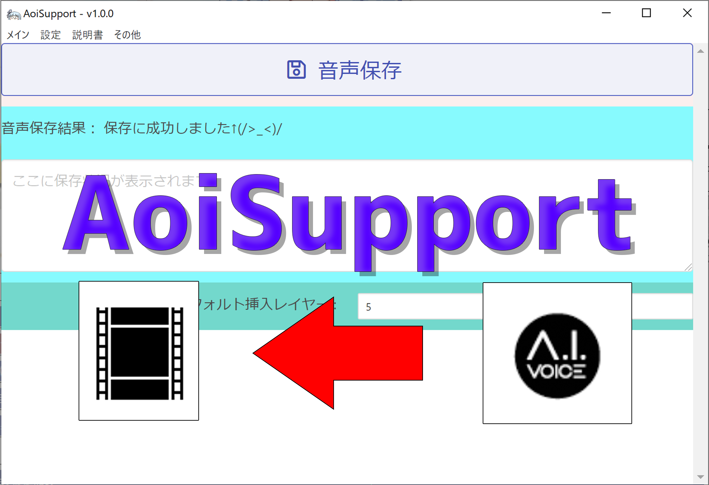
[Mrs.ニードルマウス](https://twitter.com/Mrs_NeedleMouse)さんによって開発されている、動画制作支援ツールです。  
各種音声合成ソフトでの音声を生成し、YMM4へ自動的に読み込ませることが可能です。
- [AoiSupport](https://aoi-chan.moe/aoisupport/)

### DisNOTE
[ろじろじ](https://twitter.com/roji2)さんによって開発されている、Discordの録音データからセリフを書き出す+書き起こしできるツールです。  
YMM4用のプロジェクトファイルの出力機能も実装されています。
- [DisNOTE](https://roji3.jpn.org/disnote/)

### AutoYukkuri
[akaz](https://twitter.com/akazdayo)さんによって開発されている、プロジェクトファイル生成ツールです。  
録音した音声ファイルを元に音声認識してプロジェクトファイルを生成することができます。
- [AutoYukkuri](https://github.com/akazdayo/AutoYukkuri)
- [ダウンロードページ](https://github.com/akazdayo/AutoYukkuri/releases/)

### YMovieHelper
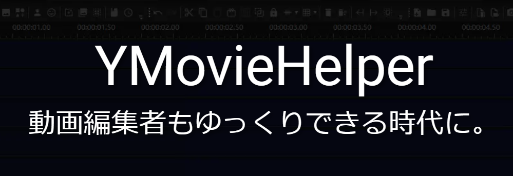
[だんご](https://twitter.com/progra_dango)さんによって提供されている、プロジェクトファイル生成ツールです。  
csv形式の台本ファイルを元に、YMM4用のプロジェクトファイルを生成することが出来ます。  
立ち絵の表情や動画の切り替えにも対応しています。
- [YMovieHelper](https://github.com/itkmaingit/YMovieHelperLocal)

### KuchiPaku
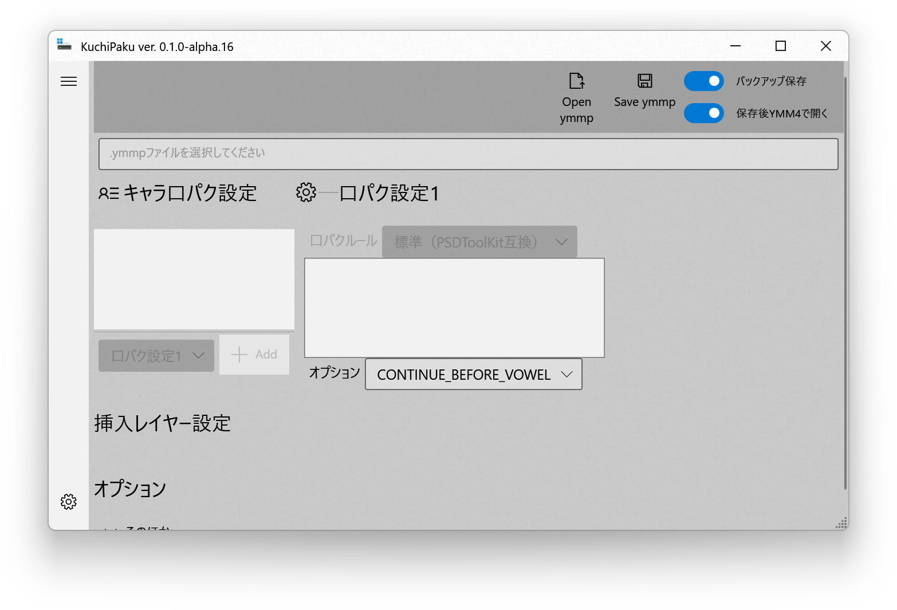
[いぬいぬGames](https://twitter.com/InuInuGames)さんによって開発されている、.labファイルを元にあいうえお口パクを作成するツールです。
- [KuchiPaku](https://github.com/InuInu2022/KuchiPaku)
- [ダウンロードページ](https://github.com/InuInu2022/KuchiPaku/releases)

### f2ft
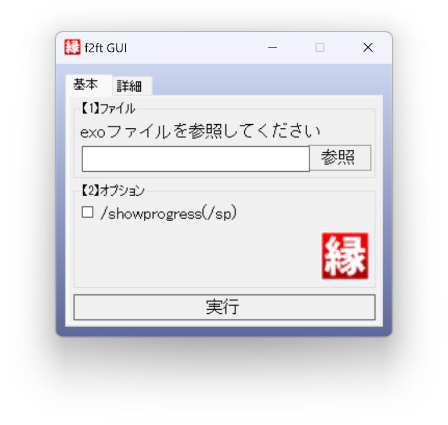
[うにくま](https://twitter.com/unikuma_sub)さんによって開発されている、YMM4から出力されるexoファイルの縁取りエフェクトをAviUtlスクリプトの縁取りTに置換するプログラムです。  
- [f2ft](https://github.com/unikuma/f2ft)
- [ダウンロードページ](https://github.com/unikuma/f2ft/releases)

### OPTPiX SpriteStudio

[動く立ち絵素材](./faq/立ち絵機能/%E5%8B%95%E3%81%8F%E7%AB%8B%E3%81%A1%E7%B5%B5%E7%B4%A0%E6%9D%90%E3%81%AE%E4%BD%9C%E3%82%8A%E6%96%B9.md)で利用可能なwebpアニメーション画像の出力に対応した、無料（※）で利用できる2Dアニメーション制作ツールです。  
※ Starterライセンスの場合。ライセンス条件等は[公式サイト](https://www.webtech.co.jp/spritestudio/purchase.html)をご確認ください。
- [OPTPiX SpriteStudio | ウェブテクノロジ](https://www.webtech.co.jp/spritestudio/index.html)

以下のページで[動く立ち絵素材](./faq/立ち絵機能/%E5%8B%95%E3%81%8F%E7%AB%8B%E3%81%A1%E7%B5%B5%E7%B4%A0%E6%9D%90%E3%81%AE%E4%BD%9C%E3%82%8A%E6%96%B9.md)の作例と、サンプルデータが公開されています。
- [OPTPiX Spritestudio Ver.6.6.3 でアニメーションWebPが出力可能になりました！](https://www.webtech.co.jp/blog/products/spritestudio/15630/)

### その他
- [過去掲載していた開発終了済みの外部ツールはこちら](#謝辞)

## プラグイン
YMM4に機能を追加するプラグインの一覧です。
- [プラグインの使い方](./faq/plugin/how_to_use.md)
- [プラグインの作り方](./faq/plugin/how_to_make.md)
- プラグインを探す
  - [X (旧Twitter)](https://twitter.com/search?q=%23YMM4Plugin&f=live)
  - [GitHub](https://github.com/topics/ymm4-plugin)
  - [BOOTH](https://booth.pm/ja/items?tags%5B%5D=YMM4Plugin)

<YMM4Plugins max="9999" />

## テンプレート
複数のアイテムやエフェクトをまとめたテンプレートの配布サイト一覧です。

<YMM4Templates max="20" />

## Windows拡張機能
Windowsの拡張機能をインストールすると、より多くのファイルを読み込めるようになります。

| 名前・配布元 | 読み込めるようになるファイル形式 |
| --- | --- |
| [AV1 Video Extension](https://www.microsoft.com/ja-jp/p/av1-video-extension-beta/9mvzqvxjbq9v) | AV1形式の動画ファイル |
| [HEVC ビデオ拡張機能](https://www.microsoft.com/ja-jp/p/hevc-video-extensions-from-device-manufacturer/9n4wgh0z6vhq) | HEVC形式の動画ファイル |
| [MPEG-2 ビデオ拡張機能](https://www.microsoft.com/ja-jp/p/mpeg-2-%E3%83%93%E3%83%87%E3%82%AA%E6%8B%A1%E5%BC%B5%E6%A9%9F%E8%83%BD/9n95q1zzpmh4) | MPEG-2形式の動画ファイル |
| [VP9 ビデオ拡張機能](https://www.microsoft.com/ja-jp/p/vp9-%E3%83%93%E3%83%87%E3%82%AA%E6%8B%A1%E5%BC%B5%E6%A9%9F%E8%83%BD/9n4d0msmp0pt) | VP9形式の動画ファイル |
| [Web メディア拡張機能](https://www.microsoft.com/ja-jp/p/web-%E3%83%A1%E3%83%87%E3%82%A3%E3%82%A2%E6%8B%A1%E5%BC%B5%E6%A9%9F%E8%83%BD/9n5tdp8vcmhs) | VorbisまたはTheoraでエンコードされたOggファイル |
| [HEIF 画像拡張機能](https://www.microsoft.com/ja-jp/p/heif-%E7%94%BB%E5%83%8F%E6%8B%A1%E5%BC%B5%E6%A9%9F%E8%83%BD/9pmmsr1cgpwg) | HEIF形式の画像ファイル |
| [Raw Image Extension](https://www.microsoft.com/ja-jp/p/raw-image-extension/9nctdw2w1bh8) | RAW形式の画像ファイル |
| [Webp 画像拡張機能](https://www.microsoft.com/ja-jp/p/webp-%E7%94%BB%E5%83%8F%E6%8B%A1%E5%BC%B5%E6%A9%9F%E8%83%BD/9pg2dk419drg) | Webp形式の画像ファイル |

## 動作環境
- Windows 10 バージョン2004以降, Windows 11
- .NET Framework 4.7.2 以上
- DirectX 11 / Shader Model 5.0 対応GPU
  - [※ DirectX10世代のGPUでは一部のエフェクトが機能しません](./faq/effect/2769-2.md)

## 対応ファイル形式
- 動画ファイル
  - .avi .mp4 .wmv .mov [他](https://docs.microsoft.com/en-us/windows/win32/medfound/supported-media-formats-in-media-foundation?redirectedfrom=MSDN)
- アニメーション画像ファイル
  - .gif .webp ※.webpはWin10 1809以降
- 画像ファイル
  - .bmp .jpg .png .gif [他](https://docs.microsoft.com/en-us/windows/win32/wic/-wic-about-windows-imaging-codec?redirectedfrom=MSDN#wpfc_codecs)
- 音声ファイル
  - .wav .mp3 [他](https://docs.microsoft.com/en-us/windows/win32/medfound/supported-media-formats-in-media-foundation?redirectedfrom=MSDN)
- 立ち絵
  - [シンプル立ち絵](./faq/立ち絵機能/%E3%82%B7%E3%83%B3%E3%83%97%E3%83%AB%E7%AB%8B%E3%81%A1%E7%B5%B5%E3%81%AE%E8%A8%AD%E5%AE%9A%E6%96%B9%E6%B3%95.md)
  - [動く立ち絵](./faq/立ち絵機能/%E5%8B%95%E3%81%8F%E7%AB%8B%E3%81%A1%E7%B5%B5%E3%81%AE%E8%A8%AD%E5%AE%9A%E6%96%B9%E6%B3%95.md)
- [利用可能な音声合成ソフト・サービス](./#対応している音声合成ソフトサービス)
- [プラグイン](./#プラグイン)
- [Windows拡張機能](./#Windows拡張機能)

## 使用ライブラリ等
### AquesTalk1 / AquesTalk2 / AquesTalk10
ゆっくりMovieMakerは、(株)アクエストの音声合成ライブラリAquesTalkを使用しており、その著作権は同社に帰属します。  
営利目的での使用は当該ライブラリの使用ライセンスが必要になります。  
https://www.a-quest.com/  

### AI.Talk.Editor.Api
Copyright (c) AI Inc.  
利用には別途 A.I.VOICE の購入が必要です。  
https://aivoice.jp/

### AivisSpeech 外部連携API
Copyright (c) 2024 JPchain Inc.
https://aivis-project.com/

利用には別途AivisSpeechのダウンロードが必要です。
利用条件等に関してはAivisSpeechアプリ内のヘルプをご確認ください。

### AviUtl
Copyright (c) KENくん  
利用には別途 AviUtl 及び 拡張編集プラグイン のインストールが必要です。  
http://spring-fragrance.mints.ne.jp/aviutl/

### CeVIO.Talk.RemoteService.Talker
Copyright (c) CeVIO  
利用には別途 CeVIO CS7 または CeVIO AI の購入が必要です。  
http://cevio.jp/  
  
音声データやキャラクターの利用について  
http://cevio.jp/commercial/

### CoeFont 外部連携API
Copyright (c) 2021 CoeFont Co.,Ltd.All Rights Reserved.  
動画を公開する際は、「Voiced by [https://CoeFont.cloud](https://CoeFont.cloud)」というライセンス表記が必要です。（※Business、Enterpriseプランは除く）  
差別目的、誹謗中傷目的、公序良俗に反する目的での利用は禁じられています。  
https://coefont.cloud/

### COEIROINK 外部連携API
Copyright (c) 2021 shirowanisan  
利用には別途COEIROINKのインストールが必要です。  
利用条件等に関してはCOEIROINKアプリ内のヘルプをご確認ください。  
https://coeiroink.com/

### ITVOICE 外部連携API
Copyright (c) 2022 いたほび  
利用には別途ITVOICEのインストールが必要です。  
利用条件等に関してはITVOICEアプリ内のヘルプをご確認ください。  
http://itvoice.starfree.jp/

### Koemotion / Koeiromap 外部連携API
Copyright © 2022 rinna株式会社 - All Rights Reserved.  
利用には別途Koemotion / KoeiromapのAPIキーが必要です。  
利用条件等に関しては[Koemotion公式サイト](https://koemotion.rinna.co.jp/)をご確認ください。  
https://koemotion.rinna.co.jp/

### LMROID 外部連携API
Copyright (c) 2022 nohoshio  
利用には別途LMROIDのインストールが必要です。  
利用条件等に関してLMROIDアプリ内のヘルプをご確認ください  
https://lmroidsoftware.wixsite.com/nhoshio/%E5%88%A9%E7%94%A8%E8%A6%8F%E7%B4%84

### OpenAI TTS 外部連携API
Copyright (c) OpenAI  
利用には別途APIキーが必要です。  
利用条件等に関しては[Usage policies](https://openai.com/policies/usage-policies)をご確認ください。  
https://openai.com/

### SHAREVOX 外部連携API
Copyright (c) 2022 y-chan  
利用には別途SHAREVOXのインストールが必要です。  
利用条件等に関してSHAREVOXアプリ内のヘルプをご確認ください  
https://www.sharevox.app/

### Style-Bert-VITS2 外部連携API
Style-Bert-VITS2 Copyright (c) litagin02  
Bert-VITS2 Copyright (c) fishaudio  
利用には別途Style-Bert-VITS2のインストールが必要です。  
https://github.com/fishaudio/Bert-VITS2

### TALQu3 PRO 外部連携API
Copyright (c) Haruqa  
利用には別途TALQu3 PROのインストールが必要です。  
利用条件等に関してはTALQu3 PROアプリ内のヘルプをご確認ください。  
https://haruqa.github.io/TALQu/

### VOICEPEAK コマンドラインAPI
Copyright (c) 2022 Dreamtonics 株式会社  
利用には別途VOICEPEAKのインストールが必要です。  
利用条件等に関してはVOICEPEAK公式サイトをご確認ください。  
https://www.ah-soft.com/voice/

### VOICEVOX 外部連携API
Copyright (c) 2021 Hiroshiba Kazuyuki  
利用には別途VOICEVOXのインストールが必要です。  
利用条件等に関してはVOICEVOXアプリ内のヘルプをご確認ください。  
https://voicevox.hiroshiba.jp/

### VOICEVOX Nemo 外部連携API
Copyright (c) 2021 Hiroshiba Kazuyuki  
利用には別途VOICEVOXとVOICEVOX Nemoのインストールが必要です。  
利用条件等に関してはVOICEVOXアプリ内のヘルプをご確認ください。  
https://voicevox.hiroshiba.jp/nemo/

### にじボイス 外部連携API
© Algomatic Inc. All Rights Reserved  
利用には別途アカウントの作成とクレジットの購入が必要です。（初回5000文字無料）  
コンテンツ内、もしくは、コンテンツ概要欄のいずれかに「にじボイス」または「NIJI Voice」が含まれるクレジットを記載してください。  
SNSの場合はコンテンツが含まれるツイートのリプ欄にクレジットを表記しても問題ありません。  
音声作品で概要欄がない場合は、クレジットの読み上げが必要となります。  
【クレジット表記例】「使用サービス: にじボイス」「Voiced by NIJI Voice」   
https://nijivoice.com/

### よみてのれゐ 外部連携API
Copyright (c) 2022 Yomite Program  
利用には別途よみてのれゐのインストールが必要です。  
利用条件に関しては同梱のテキストファイルをご確認ください。  
https://www.dlsite.com/home/dlaf/=/t/s/link/work/aid/manju/id/RJ376955.html

### .NET Runtime, Libraries / MIT License
 - Microsoft.Xaml.Behaviors.Wpf
 - NETStandard.Library
 - System.Linq.Expressions
 - System.Management
 - System.ServiceProcess.ServiceController
 - System.Text.Encoding.CodePages

Copyright (c) .NET Foundation and Contributors  
https://github.com/dotnet/runtime

### AvalonEdit / MIT License
Copyright (c) AvalonEdit Contributors
https://github.com/icsharpcode/AvalonEdit

### AWSSDK.Polly / Apache 2.0
© 2022, Amazon Web Services, Inc. or its affiliates.All rights reserved.  
https://github.com/aws/aws-sdk-net/

### BraceFoldingStrategy / MIT License
Copyright (c) 2009 Daniel Grunwald
https://github.com/icsharpcode/AvalonEdit/blob/master/ICSharpCode.AvalonEdit.Sample/BraceFoldingStrategy.cs

### CsvHelper / MS-PL
© 2009-2021 Josh Close  
https://joshclose.github.io/CsvHelper/

### CsWin32 / MIT License
Copyright (c) Microsoft Corporation  
https://github.com/microsoft/CsWin32

### DynamicAero2 / MIT License
Copyright (c) ManjuSummoner.  
Theme styles and templates was converted based on dotnet / wpf repository.  
Copyright (c) .NET Foundation and Contributors.  
https://github.com/manju-summoner/DynamicAero2

### FFmpeg / LGPL v3
(c) 2000-2020 the FFmpeg developers  
https://ffmpeg.org/

### Google.Cloud.TextToSpeech.V1 / Apache 2.0
© 2020 Google LLC All rights reserved.  
https://github.com/googleapis/google-cloud-dotnet

### Hash without Sine / MIT License
Copyright (c)2014 David Hoskins.  
https://www.shadertoy.com/view/4djSRW

### IbukiHash / CC0
Created by Andante (https://twitter.com/andanteyk)  
This work is marked with CC0 1.0. To view a copy of this license, visit https://creativecommons.org/publicdomain/zero/1.0/  
https://gist.github.com/andanteyk/7581e025cc7e9af796b10032c61015a8  

### IPADic
Copyright 2000, 2001, 2002, 2003 Nara Institute of Science and Technology. All Rights Reserved.  
http://taku910.github.io/mecab/

### Json.NET / MIT License
Copyright (c) 2007 James Newton-King  
https://www.newtonsoft.com/json

### KawaiiLogos
Copyright (c) 2024 さわらつき
https://twitter.com/sawaratsuki1004
https://github.com/SAWARATSUKI/KawaiiLogos

### LZMA SDK / Public domain
https://www.7-zip.org/sdk.html

### Material Design Icons
#### Icons / Apache 2.0
#### Fonts / Apache 2.0
#### Code / Apache 2.0
Copyright (c) 2024 Pictogrammers
https://materialdesignicons.com/

### Math.NET Numerics / MIT License
Copyright (c) 2002-2021 Math.NET  
https://github.com/mathnet/mathnet-numerics

### Microsoft.CognitiveServices.Speech
Copyright (c) Microsoft Corporation. All rights reserved.  
https://www.nuget.org/packages/Microsoft.CognitiveServices.Speech/

### MP3Sharp / LGPL v3
Copyright (c) ZaneDubya  
Copyright (c) Nihlus  
https://github.com/Nihlus/MP3Sharp

### NAudio / MIT License
Copyright 2020 Mark Heath  
https://github.com/naudio/NAudio

### NCalcSync / MIT License
Copyright (c) 2011 Sebastien Ros  
https://github.com/ncalc/ncalc

### NMeCab / LGPL v2.1
NMeCab / Copyright(C) Tsuyoshi Komuta  
MeCab / Copyright(C) Taku Kudo and Nippon Telegraph and Telephone Corporation  
MeCab.DotNet / Copyright(C) Kouji Matsui  
https://ja.osdn.net/projects/nmecab/  
http://taku910.github.io/mecab/

### NWaves / MIT License
Copyright (c) 2017 Tim  
https://github.com/ar1st0crat/NWaves

### OpenCV / Apache License 2.0
Copyright (c) OpenCV team  
https://opencv.org/

### OpenCVSharp / Apache License 2.0
Copyright 2008 shimat  
https://github.com/shimat/opencvsharp

### PsdParse / MIT License
Copyright (c) 2022 ManjuSummoner  
https://github.com/manju-summoner/PsdParser

### ReactiveProperty / MIT License
Copyright (c) 2018 neuecc, xin9le, okazuki  
https://github.com/runceel/ReactiveProperty

### SharpCompress / MIT License
Copyright (c) 2014 Adam Hathcock  
https://github.com/adamhathcock/sharpcompress

### SoundTouch.net / LGPL v2.1
Copyright (c) 2001-2024 Olli Parviainen
Copyright (c) owoudenberg
https://www.surina.net/soundtouch/
https://github.com/owoudenberg/soundtouch.net

### SharpGenTools / MIT License
Copyright (c) 2010-2017 Alexandre Mutel, 2017 Jeremy Koritzinsky  
https://github.com/SharpGenTools/SharpGenTools

### UniDic / BSD
Copyright (c) 2011-2017, The UniDic Consortium All rights reserved.  
https://unidic.ninjal.ac.jp/

### Vortice.Windows / MIT License
Copyright (c) 2019 Amer Koleci and Vortice contributors.  
https://github.com/amerkoleci/Vortice.Windows

### うずらフォント
(C) 2005 AZUSA_H ALL RIGHTS RESERVED.  
http://azukifont.com/index.html  
YMM4のロゴに使用しています。

## 謝辞
過去、以下の方々にYMM4用の外部ツールを公開していただいていました。  

- 台本読み込み機能を提供する外部ツール「コピペイラーズ」 / [Programer-D](https://twitter.com/Programer_D) 様
- 台本読み込み機能を提供するVBAを用いたExcelマクロ / [ゆっくり亭](https://twitter.com/Tamaji1234) 様

長期間におよぶ外部ツールの公開・開発ありがとうございました。