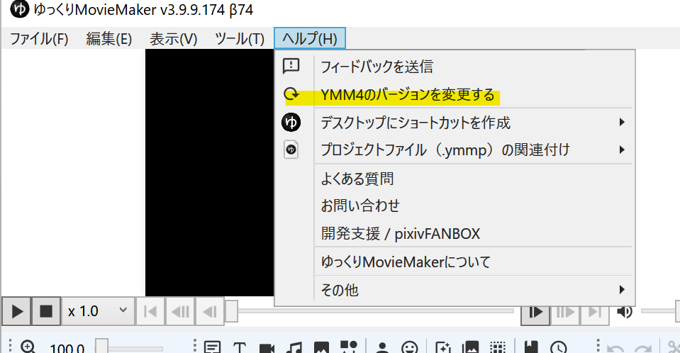
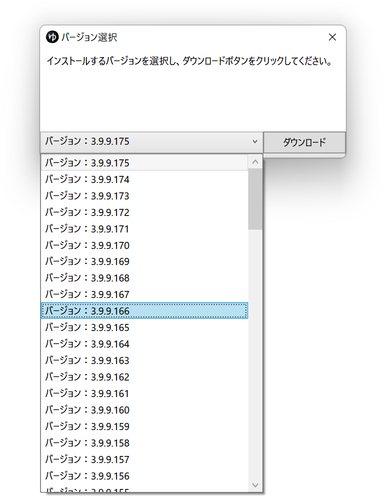

以下の方法で過去のバージョンを利用可能です。

## 現在使用中のYMM4のバージョンを変更する
1. *ヘルプ(H)*→*YMM4のバージョンを変更する*を選択する

1. バージョンを選択してダウンロードボタンをクリックする

## 過去のバージョンをダウンロードする
[過去のバージョンをダウンロード](https://github.com/manju-summoner/YukkuriMovieMaker4/releases)