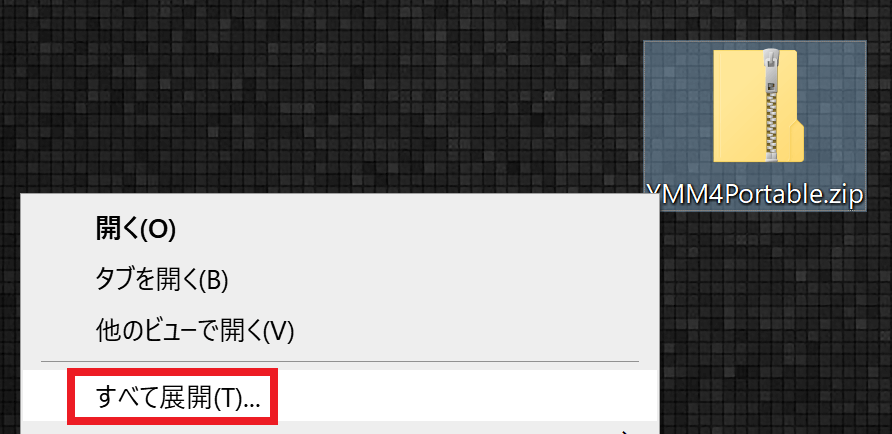
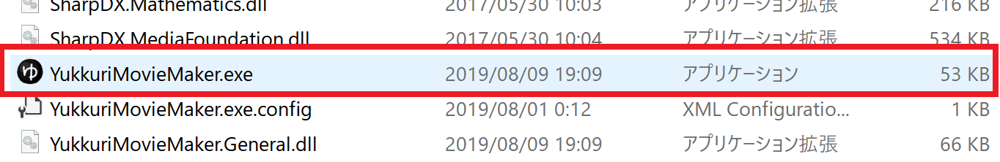

以下の方法で過去のバージョンを利用可能です。

1. ゆっくりMovieMaker4をダウンロードする
<Download url="https://object-storage.tyo1.conoha.io/v1/nc_4fac3ef0e6d843249e0ab2f1fc3e8f85/public/YukkuriMovieMaker4.zip">ゆっくりMovieMaker4をダウンロード</Download>
2. ファイルを展開する（ファイルを右クリック→すべて展開(T)）

3. YukkuriMovieMaker.exeを起動する

4. ダウンロードしたいバージョンを選択し、ダウンロードボタンをクリックする

